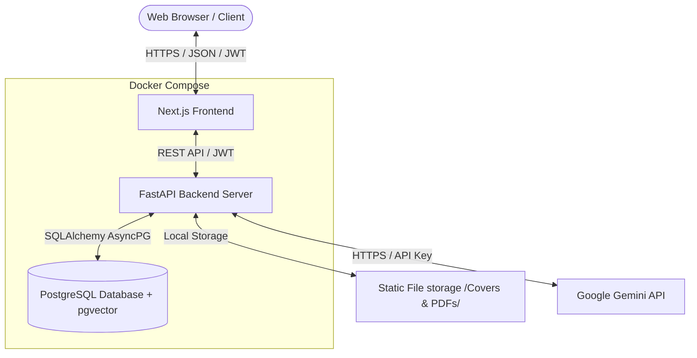

# 🏫 UniResearch: ระบบคลังจัดเก็บและเผยแพร่ผลงานวิชาการส่วนกลาง

ยินดีต้อนรับสู่ **UniResearch** แพลตฟอร์มเว็บแอปพลิเคชันและคลังข้อมูลระดับองค์กรที่ออกแบบมาเพื่อจัดเก็บ ค้นหา จัดหมวดหมู่ และบริหารจัดการผลงานวิชาการทั้งหมด (รวมถึงโครงงานนักศึกษา การศึกษาอิสระ วิทยานิพนธ์ สารนิพนธ์ และผลงานวิจัยของอาจารย์)

โปรเจกต์นี้ประกอบด้วยระบบหลังบ้านแบบไม่ประสานเวลา (**FastAPI backend**) และหน้าบ้านสไตล์โมเดิร์น (**Next.js frontend**)

---

## 🗺️ ภาพรวมสถาปัตยกรรมระบบ (System Architecture Overview)

ระบบ UniResearch ถูกออกแบบมาภายใต้โครงสร้างแบบ Decoupled Client-Server (แยกส่วนหน้าบ้านและหลังบ้านออกจากกัน) และบูรณาการระบบ AI:



- **Frontend**: แอปพลิเคชัน React ประสิทธิภาพสูง รองรับการแสดงผลทุกหน้าจอ พัฒนาด้วย **Next.js (App Router)** และ TypeScript
- **Backend**: REST API ประสิทธิภาพสูงแบบ Asynchronous พัฒนาด้วย **FastAPI** และ **SQLAlchemy 2.0** เชื่อมโยงกับ Google Gemini SDK สำหรับกระบวนการ AI
- **Database**: ระบบฐานข้อมูลเชิงสัมพันธ์ **PostgreSQL** พร้อมเปิดใช้งาน **pgvector** สำหรับการทำเวกเตอร์ค้นหาความหมายเชิงลึก (Semantic Search) และจัดการโครงสร้างตาราง (Migration) ด้วย **Alembic**

---

## ✨ ฟังก์ชันการทำงานหลัก (Core Features)

### 1. ระบบยืนยันตัวตนและการควบคุมสิทธิ์ตามบทบาท (RBAC)
- กำหนดสิทธิ์การเข้าถึงข้อมูลตามบทบาทหลักทั้ง 4 ของระบบ:
  - **Guest / บุคคลทั่วไป**: ค้นหา อ่าน และดูสถิติพื้นฐานของผลงานวิจัยที่ได้รับการอนุมัติเผยแพร่แล้วแบบอ่านอย่างเดียว (Read-only)
  - **Student / นักศึกษา**: ส่งผลงานวิจัยใหม่, อัปโหลดหน้าปกและไฟล์ PDF, ระบุผู้แต่งร่วม และส่งแก้ไขผลงานตามข้อคิดเห็น
  - **Advisor / อาจารย์ที่ปรึกษา (ผู้ประเมิน)**: เข้าถึงคิวงานรอตรวจ (Review Queue), ดาวน์โหลดเอกสารประกอบการประเมิน, บันทึกข้อคิดเห็น และอนุมัติ/ส่งกลับแก้ไข/ปฏิเสธผลงาน
  - **Admin / ผู้ดูแลระบบ**: จัดการข้อมูลผู้ใช้, หมวดหมู่ผลงาน, ตั้งค่าระบบ และเข้าถึงแผงควบคุมสถิติภาพรวมทั้งหมด

### 2. กระบวนการส่งผลงาน (Submission Workflow)
- รองรับผู้จัดทำหลายคน (Co-authors) การเลือกอาจารย์ที่ปรึกษาประจำวิชา และการคัดกรองตามประเภทหมวดหมู่
- **ระบบสลับเวอร์ชันแก้ไข (`FileRevision`)**: ติดตามประวัติไฟล์และเวอร์ชันของผลงานที่มีการปรับปรุงตามคำแนะนำของอาจารย์
- **การจัดการไฟล์**: ระบบอัปโหลดและจัดเก็บเอกสาร PDF และภาพหน้าปกผลงานวิจัยอย่างปลอดภัย

### 3. ขั้นตอนการตรวจสอบและอนุมัติ (Review & Approval Pipeline)
- หน้าจอ Dashboard สำหรับอาจารย์และผู้ดูแลระบบโดยเฉพาะ (`/dashboard/reviewer`) เพื่อติดตามและประเมินผลงานที่รอคิว
- กระบวนการประเมินผลงานในรูปแบบสถานะ: `pending` ➔ `approved` / `rejected` / `needs_revision`
- บันทึกประวัติการตรวจสอบ ความคิดเห็น ชื่อผู้ประเมิน และเวลาที่ประเมินอย่างละเอียด

### 4. ระบบค้นหาอัจฉริยะและสรุปสถิติ (Search & Statistics Dashboard)
- ค้นหาข้อมูลแบบ Full-text ค้นหาจากชื่อเรื่อง บทคัดย่อ หรือคำค้นหาหลัก (Keywords)
- กรองข้อมูลตามหมวดหมู่ วันที่เผยแพร่ และจัดเรียงลำดับตามยอดเข้าชมหรือดาวน์โหลด
- บันทึกข้อมูลการค้นหา (Search Log) ยอดดาวน์โหลด และยอดเข้าชม เพื่อนำมาประมวลผลเป็นสถิติยอดนิยมในแบบเรียลไทม์

### 5. ระบบบูรณาการ AI อัจฉริยะ (AI Integration & Assistant Features)
- **AI Research Writing Assistant (หน้าส่งผลงาน)**: สร้างบทคัดย่อ (Abstract) แบบสองภาษา (TH/EN) อัตโนมัติ, แนะนำชื่อเรื่องวิจัยที่น่าสนใจ, แนะนำคำสำคัญ (Keywords) และตรวจสอบรูปแบบความถูกต้องของภาษาเชิงวิชาการ (Academic Writing Check) พร้อมให้คะแนนคุณภาพ
- **AI Peer Review Assistant (หน้าผู้ประเมิน/อาจารย์)**: ช่วยวิเคราะห์งานวิจัยเบื้องต้นแยกตามความถูกต้องของโครงสร้าง ระเบียบวิธีวิจัย และการใช้ภาษา (Pre-review Analysis), ระบบตรวจวัดระดับความซ้ำซ้อนกับงานชิ้นอื่นในระบบ (Plagiarism Similarity Check), ระบบวิเคราะห์เปรียบเทียบหาอาจารย์ที่ปรึกษาที่เหมาะสมกับเนื้อหางานวิจัย (Reviewer / Advisor Match) และสรุปความเห็นการตรวจสอบย้อนหลัง (Review Comment Summary)
- **AI Q&A Chatbot (RAG System)**: วิดเจ็ตแชตบอตแบบลอย (Floating widget) ในทุกหน้าจอของระบบ ช่วยผู้ใช้สืบค้น ตอบคำถาม หรือหารายละเอียดงานวิจัยในระบบผ่านการค้นหาความหมายเชิงลึก (Semantic Retrieval) อ้างอิงข้อมูลจริงจากฐานข้อมูล
- **AI Dashboard Analytics (สำหรับผู้ดูแลระบบ)**: ช่วยผู้บริหารวิเคราะห์ภาพรวมผลงานวิจัย, สรุปแนวโน้มหัวข้อและแนวความคิดที่กำลังมาแรง (Trending Topics) และเขียนข้อแนะนำเชิงกลยุทธ์ด้านการวิจัย
- **Smart Notification System**: ระบบแจ้งเตือนแจ้งข้อมูลการจับคู่งานวิจัยและผู้ประเมิน, การอนุมัติ, และกิจกรรมสำคัญในระบบแบบเรียลไทม์

---

## 🛠️ เทคโนโลยีหลักที่เลือกใช้ (Tech Stack)

| หมวดหมู่ | เทคโนโลยี | วัตถุประสงค์ในการใช้งาน |
| :--- | :--- | :--- |
| **Frontend** | [Next.js](https://nextjs.org/) (v15+) | เฟรมเวิร์ก React (App Router, Server Components) |
| | [TypeScript](https://www.typescriptlang.org/) | เพิ่มความปลอดภัยและความถูกต้องของชนิดข้อมูลฝั่งหน้าบ้าน |
| | [pnpm](https://pnpm.io/) | ระบบจัดการ Package ที่รวดเร็วและประหยัดพื้นที่จัดเก็บ |
| | [Playwright](https://playwright.dev/) | เครื่องมือสำหรับทำ End-to-end (E2E) Browser Testing |
| **Backend** | [FastAPI](https://fastapi.tiangolo.com/) | เว็บเฟรมเวิร์ก Python สำหรับทำ Async API ที่ประมวลผลได้รวดเร็ว |
| | [SQLAlchemy 2.0](https://www.sqlalchemy.org/) | เครื่องมือจัดการฐานข้อมูลและ ORM แบบ Asynchronous |
| | [Pydantic v2](https://docs.pydantic.dev/) | การแปลงข้อมูล ตรวจสอบความถูกต้อง (Data Validation) และกำหนดโครงสร้างโมเดล |
| | [Alembic](https://alembic.sqlalchemy.org/) | เครื่องมือจัดการและทำ Database Migrations |
| | [pytest](https://docs.pytest.org/) | ชุดเครื่องมือทดสอบประสิทธิภาพการทำงานฝั่งหลังบ้าน |
| **AI / ML** | [Google Gemini API](https://ai.google.dev/) | โมเดลภาษาขนาดใหญ่ (LLM) สำหรับการสร้างบทคัดย่อ วิเคราะห์ รีวิว และประมวลผล RAG Chatbot |
| | [pgvector](https://github.com/pgvector/pgvector) | ส่วนเสริม (Extension) ของ PostgreSQL สำหรับจัดเก็บและค้นหา Vector Embeddings เชิงความหมาย (Semantic Search) |
| **DevOps** | [Docker & Compose](https://www.docker.com/) | ใช้สร้าง Container เพื่อให้ระบบทำงานได้เสถียรในทุกสภาพแวดล้อม |

---

## 📁 โครงสร้างโฟลเดอร์ของโปรเจกต์ (Repository Structure)

```text
UniResearch/
├── docker-compose.yml        # 🐳 ไฟล์หลักสำหรับรันทั้งระบบผ่าน Docker Compose
├── docker-compose.prod.yml   # 🐳 Override สำหรับ Production (multi-worker, standalone)
├── .env.docker               # 🐳 ไฟล์ตัวแปรสภาพแวดล้อมตัวอย่างสำหรับ Docker
├── Makefile                  # 🐳 คำสั่งลัดสำหรับจัดการ Docker (make dev, make logs ฯลฯ)
├── backend/                  # ส่วนงานระบบหลังบ้าน FastAPI
│   ├── app/                  # โค้ดหลักของแอปพลิเคชัน
│   │   ├── core/             # การตั้งค่าระบบ, ความปลอดภัย และสิทธิ์ (รวมถึง ai_config.py)
│   │   ├── db/               # การเชื่อมต่อฐานข้อมูลและการจัดสรร Session (Async)
│   │   ├── models/           # โครงสร้างตารางฐานข้อมูล (รวมถึง notification.py)
│   │   ├── schemas/          # ตัวตรวจสอบข้อมูล (รวมถึง ai.py, chat.py, notification.py)
│   │   ├── services/         # ส่วนประมวลผลธุรกิจ (รวมถึง ai_service.py, rag_service.py, notification_service.py)
│   │   ├── routers/          # เส้นทาง endpoint API (รวมถึง ai.py, notification.py)
│   │   └── scripts/          # สคริปต์นำเข้าข้อมูล CSV, ทดสอบ AI และ migrate_csv
│   ├── tests/                # ส่วนควบคุม Unit & Integration Tests (pytest)
│   ├── static/               # โฟลเดอร์เก็บไฟล์ PDF และหน้าปกที่อัปโหลดเข้าสู่ระบบ (git-ignored)
│   └── Dockerfile            # ตัวสร้าง Docker Container สำหรับ backend (multi-stage)
├── frontend/                 # ส่วนงานระบบหน้าบ้าน Next.js
│   ├── app/                  # หน้าเว็บของระบบ (App Router)
│   │   ├── admin/            # เมนูหน้าจัดการ (พร้อมแดชบอร์ดบทวิเคราะห์ AI)
│   │   ├── advisor/          # หน้าประเมินผลงานสำหรับบทบาท Advisor
│   │   ├── student/          # หน้าส่งและจัดการผลงานสำหรับบทบาท Student
│   │   ├── research/         # หน้าสืบค้นผลงานวิจัยและ Chatbot
│   │   ├── api/              # API routes/BFF Proxy สำหรับการส่งคำสั่ง AI และ Notifications
│   │   ├── login/            # หน้าเข้าสู่ระบบ
│   │   └── register/         # หน้าสมัครสมาชิก
│   ├── src/                  # ตรรกะและฟังก์ชันส่วนหน้าบ้าน
│   │   ├── components/       # UI Components ทั่วไป (เช่น ChatbotFloat, notification-bell)
│   │   ├── features/         # จัดการฟังก์ชันหลักตามโดเมน (รวมถึง ai, notifications, admin, review)
│   │   ├── services/         # ฟังก์ชันเชื่อมต่อหลังบ้าน (รวมถึง ai.ts)
│   │   └── lib/              # ตัวเชื่อมต่อ API (Axios client)
│   ├── tests/                # การทดสอบการทำงานส่วนประกอบหน้าจอ (Frontend Tests)
│   ├── e2e/                  # การทดสอบจำลองเบราว์เซอร์ด้วย Playwright
│   ├── Dockerfile            # ตัวสร้าง Docker Container สำหรับ frontend (multi-stage)
│   ├── package.json          # ไฟล์แสดงการอ้างอิงไลบรารี
│   └── tsconfig.json         # การตั้งค่าโปรเจกต์ TypeScript
└── docs/                     # เอกสารรายละเอียดความต้องการระบบ, AI Feature, Database และไดอะแกรม
```

---

## 🚀 เริ่มต้นใช้งาน (Getting Started)

### ข้อกำหนดเบื้องต้น (Prerequisites)

- [Docker](https://www.docker.com/) (v20+) และ Docker Compose (v2+)
- [Git](https://git-scm.com/)

> สำหรับการรันแบบ Local (ไม่ใช้ Docker) ต้องติดตั้งเพิ่ม: Python 3.11+, Node.js 20+, pnpm, PostgreSQL 15+

### วิธีที่ A: เริ่มต้นด่วนด้วย Docker (แนะนำ)

เพื่อเปิดทำงานระบบทั้งหมด (FastAPI, Next.js และ PostgreSQL) โดยไม่จำเป็นต้องติดตั้งโปรแกรมอื่นเพิ่มเติมลงบนเครื่องคอมพิวเตอร์ของคุณ:

1. **โคลนและเปิดโปรเจกต์:**
   ```bash
   git clone <repository_url> UniResearch
   cd UniResearch
   ```

2. **คัดลอกไฟล์ตัวแปรสภาพแวดล้อม:**
   ```bash
   cp .env.docker .env
   # แก้ไขค่าตามต้องการ (เช่น SECRET_KEY, POSTGRES_PASSWORD)
   ```

3. **เปิดคำสั่ง Docker Compose:**
   ```bash
   # ใช้ Make (แนะนำ)
   make dev-build

   # หรือใช้ Docker Compose โดยตรง
   docker compose up --build
   ```

4. **เข้าใช้งานบริการต่างๆ:**
   | บริการ | URL | หมายเหตุ |
   | :--- | :--- | :--- |
   | หน้าบ้าน (Frontend UI) | [http://localhost:3000](http://localhost:3000) | Next.js App Router |
   | หลังบ้าน (Backend API) | [http://localhost:8000](http://localhost:8000) | FastAPI |
   | เอกสาร API (Swagger UI) | [http://localhost:8000/swagger](http://localhost:8000/swagger) | Interactive API docs (หรือผ่าน [http://localhost:8000/docs](http://localhost:8000/docs) ซึ่งจะ Redirect ไปยัง `/swagger`) |
   | ฐานข้อมูล PostgreSQL | `localhost:5433` | เชื่อมต่อผ่าน psql หรือ DB client |

5. **คำสั่งลัดที่มีประโยชน์ (Make Commands):**
   ```bash
   make help              # แสดงรายการคำสั่งทั้งหมด
   make logs              # ดู log ทุก service
   make logs-backend      # ดู log เฉพาะ backend
   make shell-backend     # เปิด shell ใน backend container
   make shell-db          # เปิด psql ใน database container
   make migrate           # รัน Alembic migrations
   make down              # หยุดทุก service
   make nuke              # ลบทุกอย่าง (containers, volumes, images)
   ```

---

### วิธีที่ B: ติดตั้งและรันระบบแบบ Local Setup (ไม่ใช้ Docker)

#### 1. การตั้งค่าระบบหลังบ้าน (Backend)
1. เข้าไปในโฟลเดอร์ backend:
   ```bash
   cd backend
   ```
2. สร้างและเปิดใช้งาน Virtual Environment ของ Python:
   ```bash
   python3 -m venv venv
   source venv/bin/activate
   ```
3. ติดตั้งไลบรารีที่จำเป็นทั้งหมด:
   ```bash
   pip install -r requirements.txt
   ```
4. คัดลอกและตั้งค่าไฟล์ตัวแปรสภาพแวดล้อม (Environment Variables):
   ```bash
   cp .env.example .env
   # แก้ไขข้อมูลในไฟล์ backend/.env เพื่อกำหนดข้อมูล PostgreSQL หรือกำหนดเป็น SQLite
   ```
5. อัปเกรดฐานข้อมูลผ่าน Alembic:
   ```bash
   alembic upgrade head
   ```
6. เริ่มต้นรันเซิร์ฟเวอร์:
   ```bash
   uvicorn app.main:app --reload
   ```

#### 2. การตั้งค่าระบบหน้าบ้าน (Frontend)
1. เปิดหน้าจอเทอร์มินัลใหม่แล้วเข้าไปในโฟลเดอร์ frontend:
   ```bash
   cd frontend
   ```
2. ติดตั้งไลบรารีด้วยเครื่องมือ `pnpm` (หรือ `npm` / `yarn`):
   ```bash
   pnpm install
   ```
3. สร้างไฟล์สำหรับตัวแปรสภาพแวดล้อม:
   ```bash
   cp .env.example .env
   ```
4. รันระบบหน้าบ้านในโหมดพัฒนา:
   ```bash
   pnpm dev
   ```
5. เปิดเบราว์เซอร์ไปที่ลิงก์ [http://localhost:3000](http://localhost:3000)

### ฐานข้อมูลและการนำเข้าข้อมูล (Database & Data Migration)

ระบบรองรับการนำเข้าข้อมูลบัญชีรายชื่อของนักศึกษาและอาจารย์ที่ปรึกษาจากไฟล์ CSV (`student.csv` และ `advisors.csv`) เข้าสู่ระบบฐานข้อมูลโดยอัตโนมัติ

**วิธีการรันการนำเข้าข้อมูล (Migration):**
- **รันผ่าน Docker Compose (แนะนำ):**
  ```bash
  docker compose exec backend python app/scripts/migrate_csv.py
  ```
- **รันบน Local Environment:**
  ```bash
  cd backend
  source venv/bin/activate
  python app/scripts/migrate_csv.py
  ```

---

## 🧪 การทดสอบระบบ (Testing)

### การทดสอบหลังบ้าน (Backend Unit & Integration Tests)
ตรวจสอบว่ามีการเปิดใช้ Virtual Environment และมีไลบรารีพร้อมใช้งาน จากนั้นพิมพ์คำสั่ง:
```bash
cd backend
PYTHONPATH=. pytest tests/ -v
```

### การทดสอบหน้าบ้าน (Frontend E2E / Unit Tests)
รันคำสั่งสำหรับทดสอบหน้าจอ:
```bash
cd frontend
pnpm test
```

---

## 📄 เอกสารอ้างอิงเพิ่มเติม (Documentation)
หากคุณต้องการศึกษารายละเอียดเชิงลึกเกี่ยวกับการตัดสินใจทางโครงสร้างสถาปัตยกรรม หรือตารางวิเคราะห์สิทธิ์ กรุณาเปิดดูเอกสารดังต่อไปนี้:
- [ข้อกำหนดการออกแบบและความต้องการของระบบ](file:///Users/mac/Desktop/workspace/UniResearch/docs/UniResearch_rqm.md)
- [การวิเคราะห์บทบาทอาจารย์ที่ปรึกษาและขั้นตอนการตรวจสอบงาน](file:///Users/mac/Desktop/workspace/UniResearch/docs/ADVISOR_ANALYSIS.md)
- [เอกสารคู่มือการติดตั้งระบบหลังบ้าน](file:///Users/mac/Desktop/workspace/UniResearch/backend/README.md)
- [เอกสารการออกแบบองค์ประกอบหน้าบ้าน](file:///Users/mac/Desktop/workspace/UniResearch/frontend/DESIGN.md)
- [โครงสร้างฐานข้อมูลและโค้ด DBML](file:///Users/mac/Desktop/workspace/UniResearch/docs/UniResearch_Database_Schema.md)
- [แผนภาพ UML ฉบับเต็ม (Use Case, Class, ER, State, Activity, Sequence, Component)](file:///Users/mac/Desktop/workspace/UniResearch/docs/UniResearch_UML_Diagrams.md)
- [คู่มือการจัดการโครงสร้างพื้นฐานและการติดตั้ง (Terraform, Kubernetes, Prometheus, Grafana)](file:///Users/mac/Desktop/workspace/UniResearch/docs/INFRASTRUCTURE.md)
