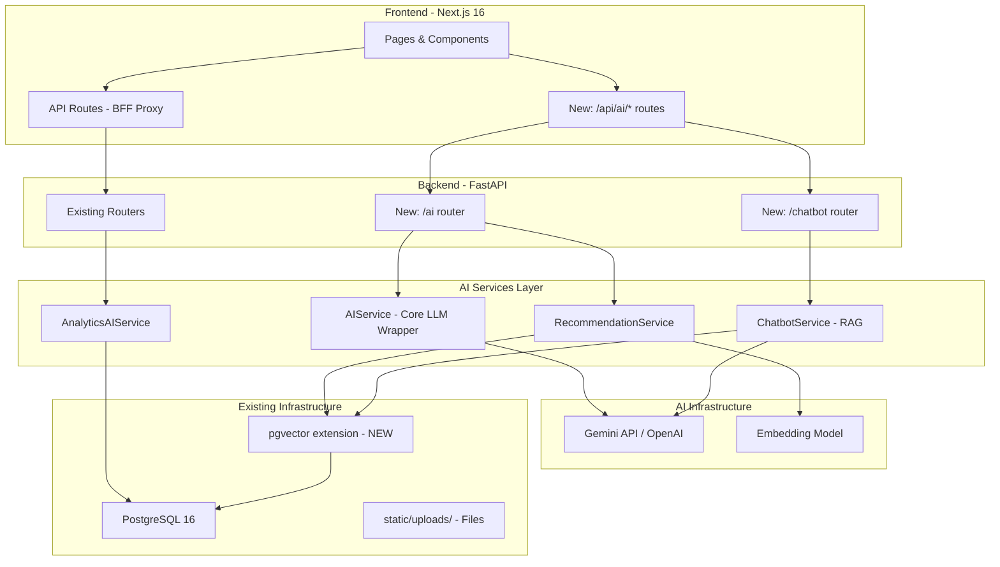

# 🤖 AI Features Proposal — UniResearch

> เอกสารสรุปแผนการเพิ่ม AI Features สำหรับระบบจัดการงานวิจัยมหาวิทยาลัย  
> วิเคราะห์จาก actual codebase: **FastAPI + Next.js 16 + PostgreSQL**

---

## สารบัญ

- [สรุปภาพรวม](#สรุปภาพรวม)
- [Feature 1: AI Writing Assistant](#1--ai-research-writing-assistant)
- [Feature 2: Smart Search & Recommendations](#2--ai-powered-smart-search--recommendations)
- [Feature 3: Peer Review Assistant](#3--ai-peer-review-assistant)
- [Feature 4: AI Dashboard & Analytics](#4--ai-dashboard--analytics)
- [Feature 5: AI Chatbot / Research Q&A](#5--ai-chatbot--research-qa)
- [Feature 6: AI-Enhanced Notifications](#6--ai-enhanced-notifications--alerts)
- [สถาปัตยกรรม](#สถาปัตยกรรม-ai-integration)
- [แผนการพัฒนา](#แผนการพัฒนา-4-phases)
- [Tech Stack](#tech-stack-สำหรับ-ai)
- [ค่าใช้จ่าย](#ประมาณการค่าใช้จ่าย)

---

## สรุปภาพรวม

### ระบบปัจจุบัน

UniResearch คือระบบคลังจัดเก็บและเผยแพร่ผลงานวิชาการส่วนกลางที่มี:

- **Research Lifecycle:** `pending` → `approved` / `rejected` / `needs_revision`
- **4 User Roles:** Guest, Student, Advisor, Admin
- **Peer Review** พร้อมระบบ `ReviewComment` และ `FileRevision`
- **Search** (keyword + filter แบบ SQL `ILIKE`)
- **Dashboard & Analytics** (view count, download count, search logs)
- **BFF Proxy Pattern** (Next.js API Routes → FastAPI backend)

### สรุป AI Features ที่แนะนำ

| ลำดับ | Feature | เพิ่มที่ไหน | Impact | Effort |
|:---:|---|---|:---:|:---:|
| 1 | 📝 AI Writing Assistant | หน้า Submit Research | 🔴 สูงมาก | ⭐⭐ |
| 2 | 🔍 Smart Search & Recommendations | หน้า Research Explorer | 🔴 สูงมาก | ⭐⭐⭐ |
| 3 | 📋 Peer Review Assistant | หน้า Advisor Review | 🟡 สูง | ⭐⭐⭐ |
| 4 | 📊 AI Dashboard & Analytics | Admin Dashboard | 🟡 สูง | ⭐⭐ |
| 5 | 💬 AI Chatbot (RAG) | Floating widget ทุกหน้า | 🟢 ปานกลาง | ⭐⭐⭐ |
| 6 | 🔔 Smart Notifications | ระบบ notification ใหม่ | 🟢 ปานกลาง | ⭐⭐ |

---

## 1. 📝 AI Research Writing Assistant

**ตำแหน่ง:** หน้า Submit Research (`/dashboard/student/submit`, `/advisor/new`)

### ฟีเจอร์ย่อย

| Feature | คำอธิบาย | Integration Point |
|---|---|---|
| ✍️ Auto-generate Abstract | ป้อน title + keywords → AI สร้าง abstract ทั้ง TH/EN | ปุ่มข้างช่อง abstract ใน `submission-form.tsx` |
| 💡 Title Suggestion | แนะนำชื่อเรื่องวิจัยจาก keywords | ปุ่มข้างช่อง title |
| 🏷️ Auto-tagging | แนะนำ category, work_type, keywords จากเนื้อหา | auto-fill หลังกรอก title + abstract |
| 📋 Research Outline | สร้างโครงร่างงานวิจัยจาก topic | modal/panel แยก |
| 🔤 Academic Writing Check | ตรวจไวยากรณ์ + แนะนำ academic style (TH/EN) | ตรวจ abstract ก่อน submit |

### ไฟล์ที่เกี่ยวข้อง

```
Backend (ใหม่):
  app/routers/ai.py                    → AI endpoints
  app/services/ai_service.py           → Core LLM wrapper

Frontend (ใหม่):
  src/features/ai/writing-assistant.tsx → AI writing panel
  src/services/ai.ts                   → AI API service
  app/api/ai/route.ts                  → BFF proxy

Frontend (แก้ไข):
  src/features/research/submission-form.tsx → เพิ่มปุ่ม AI assist
```

---

## 2. 🔍 AI-Powered Smart Search & Recommendations

**ตำแหน่ง:** Research Explorer (`/research`) + Homepage (`/`) + Research Detail (`/research/[id]`)

### ฟีเจอร์ย่อย

| Feature | คำอธิบาย |
|---|---|
| 🧠 Semantic Search | ค้นหาด้วยความหมาย ไม่ใช่แค่ keyword matching (ใช้ Embedding + pgvector) |
| 📊 Similar Research | เมื่อดูงานวิจัย A → แนะนำงานที่เกี่ยวข้อง (cosine similarity) |
| 🎯 Personalized Feed | แนะนำงานวิจัยจาก favorites + view history ของผู้ใช้ |
| ❓ Natural Language Query | ค้นหาด้วยคำถามภาษาธรรมชาติ เช่น "งานวิจัย AI ด้านเกษตร ปี 2568" |

### ไฟล์ที่เกี่ยวข้อง

```
Backend (ใหม่):
  app/services/recommendation_service.py → recommendation engine
  app/models/embedding.py               → research_embeddings table (pgvector)

Backend (แก้ไข):
  app/services/research_service.py       → เพิ่ม semantic_search()

Frontend (ใหม่):
  src/features/ai/similar-research.tsx   → similar research section
  src/features/ai/smart-search.tsx       → semantic search UI

Database:
  CREATE EXTENSION vector;
  สร้างตาราง research_embeddings (id, research_id, vector)
```

### ตัวอย่าง Code

```python
# backend/app/services/research_service.py
async def semantic_search(self, query: str, db: AsyncSession):
    """Search by meaning using vector embeddings"""
    embedding = await self.ai_service.get_embedding(query)
    results = await db.execute(
        select(ResearchWork)
        .join(ResearchEmbedding)
        .order_by(ResearchEmbedding.vector.cosine_distance(embedding))
        .limit(20)
    )
    return results.scalars().all()
```

---

## 3. 📋 AI Peer Review Assistant

**ตำแหน่ง:** Review Workspace (`/advisor/reviews/[id]`, `/admin/reviews/[id]`)

### ฟีเจอร์ย่อย

| Feature | คำอธิบาย |
|---|---|
| 🔎 Pre-Review Analysis | AI วิเคราะห์เบื้องต้น (structure, methodology, references) ก่อน advisor ตัดสิน |
| ✅ Plagiarism Detection | ตรวจซ้ำกับงานวิจัยอื่นในระบบ (cosine similarity ผ่าน pgvector) |
| 🎯 Reviewer Matching | AI แนะนำ advisor ที่เหมาะสมจากสาขาความเชี่ยวชาญ |
| 📝 Review Summary | AI สรุป ReviewComment หลายรอบให้เข้าใจง่าย |

### ไฟล์ที่เกี่ยวข้อง

```
Backend (แก้ไข):
  app/routers/research.py               → เพิ่ม AI review endpoints

Frontend (ใหม่):
  src/features/ai/review-assistant.tsx   → AI analysis panel

Frontend (แก้ไข):
  src/features/review/review-form.tsx    → เพิ่ม AI analysis section
```

---

## 4. 📊 AI Dashboard & Analytics

**ตำแหน่ง:** Admin Analytics (`/admin/analytics`) + Student/Advisor Dashboard

### ฟีเจอร์ย่อย

| Feature | คำอธิบาย | ใช้ข้อมูลจาก |
|---|---|---|
| 📈 Research Trend Analysis | วิเคราะห์ trend หัวข้อวิจัย | `search_logs`, `research_works` |
| 🏆 Research Impact Score | คำนวณคะแนนผลกระทบ | `download_view_logs`, `favorites` |
| 🔮 Submission Forecast | คาดการณ์จำนวนงานวิจัยที่จะส่ง/อนุมัติ | `research_works` timestamps |
| 📉 Bottleneck Alert | แจ้งเตือนงานวิจัย pending นานผิดปกติ | `research_works.created_at` |
| 🗺️ Research Gap Analysis | วิเคราะห์สาขาที่ยังขาดงานวิจัย | `categories`, `departments` |
| 🔑 Trending Keywords | วิเคราะห์ keywords ยอดนิยม | `search_logs` |

### ไฟล์ที่เกี่ยวข้อง

```
Backend (ใหม่):
  app/services/analytics_ai_service.py   → AI analytics

Backend (แก้ไข):
  app/routers/stats.py                  → เพิ่ม AI analytics endpoints

Frontend (แก้ไข):
  src/features/admin/admin-analytics-dashboard.tsx → เพิ่ม AI charts
```

---

## 5. 💬 AI Chatbot / Research Q&A

**ตำแหน่ง:** Floating chat widget — แสดงทุกหน้า

### ฟีเจอร์ย่อย

| Feature | คำอธิบาย |
|---|---|
| 💬 Research Q&A (RAG) | ถามคำถามเกี่ยวกับงานวิจัยในระบบ → AI ตอบพร้อมอ้างอิง |
| 📚 Literature Review Helper | AI สรุป/เปรียบเทียบงานวิจัยหลายชิ้น |
| 🧭 System Guide | ช่วยแนะนำการใช้งานระบบ (ขั้นตอนส่งงาน, วิธี review) |
| 📄 PDF Summarizer | อัปโหลด PDF → AI สรุปให้ |

> **RAG (Retrieval-Augmented Generation):** ใช้ pgvector ค้นหางานวิจัยที่เกี่ยวข้องก่อน แล้วส่ง context ให้ LLM ตอบ → ได้คำตอบที่แม่นยำและมีแหล่งอ้างอิง

### ไฟล์ที่เกี่ยวข้อง

```
Backend (ใหม่):
  app/routers/chatbot.py               → chatbot endpoints
  app/services/chatbot_service.py      → RAG-based chatbot
  app/models/chat_history.py           → chat conversations table

Frontend (ใหม่):
  src/features/ai/chatbot.tsx          → floating chat widget
  app/api/ai/chat/route.ts             → BFF proxy

Frontend (แก้ไข):
  app/layout.tsx                       → เพิ่ม chatbot widget
```

---

## 6. 🔔 AI-Enhanced Notifications & Alerts

**ตำแหน่ง:** ระบบ notification ใหม่ (ปัจจุบันยังไม่มี in-app notification)

### ฟีเจอร์ย่อย

| Feature | คำอธิบาย |
|---|---|
| 🔔 Status Change Alerts | แจ้งเตือนเมื่องานวิจัยเปลี่ยนสถานะ |
| 🎯 Smart Priority | AI จัดลำดับความสำคัญของ notification |
| 📧 AI Digest Summary | AI สรุปกิจกรรมรายวัน/รายสัปดาห์ |
| ⏰ Deadline Predictor | แจ้งเตือนเมื่อ AI คาดว่างาน pending จะไม่ทันกำหนด |

### ไฟล์ที่เกี่ยวข้อง

```
Backend (ใหม่):
  app/models/notification.py           → notifications table
  app/routers/notifications.py         → notification endpoints
  app/services/notification_service.py → AI-enhanced notifications

Frontend (ใหม่):
  src/features/notifications/notification-bell.tsx → nav bell icon
  src/features/notifications/notification-list.tsx → notification dropdown
```

---

## สถาปัตยกรรม AI Integration

### Architecture Diagram



### สรุปไฟล์ทั้งหมดที่ต้องสร้างใหม่

```
backend/app/
├── routers/
│   ├── ai.py                          # 🆕 AI endpoints
│   ├── chatbot.py                     # 🆕 Chatbot endpoints
│   └── notifications.py              # 🆕 Notification endpoints
├── services/
│   ├── ai_service.py                  # 🆕 Core AI service (LLM wrapper + embedding)
│   ├── recommendation_service.py      # 🆕 Similar research & recommendations
│   ├── chatbot_service.py             # 🆕 RAG-based chatbot
│   ├── analytics_ai_service.py        # 🆕 AI-powered analytics
│   └── notification_service.py        # 🆕 AI-enhanced notifications
├── models/
│   ├── embedding.py                   # 🆕 research_embeddings table (pgvector)
│   ├── notification.py                # 🆕 notifications table
│   └── chat_history.py               # 🆕 chat conversations table
└── core/
    └── ai_config.py                   # 🆕 AI provider configuration

frontend/
├── app/api/ai/
│   ├── route.ts                       # 🆕 AI proxy
│   └── chat/route.ts                  # 🆕 Chatbot proxy
├── src/features/ai/
│   ├── writing-assistant.tsx          # 🆕 AI writing panel
│   ├── chatbot.tsx                    # 🆕 Floating AI chatbot
│   ├── similar-research.tsx           # 🆕 Similar research section
│   ├── smart-search.tsx               # 🆕 Semantic search UI
│   └── review-assistant.tsx           # 🆕 AI pre-review panel
├── src/features/notifications/
│   ├── notification-bell.tsx          # 🆕 Nav notification bell
│   └── notification-list.tsx          # 🆕 Notification dropdown
└── src/services/
    └── ai.ts                          # 🆕 AI API service functions
```

---

## แผนการพัฒนา (4 Phases)

### Phase 1: AI Foundation (สัปดาห์ที่ 1-3)

> วาง infrastructure สำหรับ AI ทั้งหมด

- [ ] ติดตั้ง pgvector extension ใน PostgreSQL
- [ ] สร้าง `ai_config.py` — ตั้งค่า LLM provider
- [ ] สร้าง `ai_service.py` — Core wrapper สำหรับ Gemini/OpenAI API
- [ ] สร้าง `embedding.py` model + Alembic migration
- [ ] สร้าง AI router + Next.js proxy route
- [ ] เพิ่ม environment variables (`GEMINI_API_KEY`, `AI_MODEL`, etc.)
- [ ] สร้าง background job สำหรับ generate embeddings ของ research ที่มีอยู่

### Phase 2: Quick Wins — Writing Assistant (สัปดาห์ที่ 4-6)

> Features ที่ให้ impact สูงแต่พัฒนาง่าย

- [ ] ✍️ AI Auto-generate Abstract (TH/EN)
- [ ] 💡 Title Suggestion
- [ ] 🏷️ Auto Category & Keyword Tagging
- [ ] 🔤 Academic Writing Check
- [ ] สร้าง `writing-assistant.tsx` component
- [ ] Integrate เข้ากับ `submission-form.tsx`

### Phase 3: Smart Discovery (สัปดาห์ที่ 7-10)

> Search & Recommendations + Review Assistant

- [ ] 🧠 Semantic Search (pgvector)
- [ ] 📊 Similar Research Finder
- [ ] 🎯 Personalized Recommendations
- [ ] ✅ Plagiarism Detection (cosine similarity)
- [ ] 🔎 Pre-Review Analysis

### Phase 4: Advanced Features (สัปดาห์ที่ 11-16)

> Chatbot & Analytics & Notifications

- [ ] 💬 AI Chatbot (RAG) พร้อม chat history
- [ ] 📈 Research Trend Analysis
- [ ] 🗺️ Research Gap Analysis
- [ ] 🔔 AI-Enhanced Notifications
- [ ] 📄 PDF Summarizer

---

## Tech Stack สำหรับ AI

| Component | แนะนำ | เหตุผล | ทางเลือก |
|---|---|---|---|
| **LLM Provider** | Google Gemini API | คุ้มค่า, รองรับภาษาไทยดี, มี free tier | OpenAI GPT-4o, Claude |
| **Embedding** | Gemini Embedding | ใช้ provider เดียวกัน ลดความซับซ้อน | text-embedding-3-small |
| **Vector DB** | **pgvector** | ใช้ร่วมกับ PostgreSQL ที่มีอยู่แล้ว ไม่ต้องเพิ่ม infrastructure | Pinecone, Qdrant |
| **RAG Framework** | LangChain | ecosystem ใหญ่, community active | LlamaIndex, custom |
| **AI Python SDK** | `google-generativeai` | Official Google SDK | `litellm` (multi-provider) |

> **ทำไมเลือก pgvector?**
> เพราะ UniResearch ใช้ PostgreSQL 16 อยู่แล้ว → แค่เพิ่ม extension `CREATE EXTENSION vector;` ก็ใช้ได้เลย ไม่ต้องเพิ่ม database server ใหม่

---

## ประมาณการค่าใช้จ่าย

### ค่า AI API ต่อเดือน

| Feature | ปริมาณการใช้งานโดยประมาณ | ค่าใช้จ่าย |
|---|---|---|
| Abstract/Title Generation | ~500 requests | ~$5-15 |
| Grammar Check | ~1,000 requests | ~$10-20 |
| Embedding Generation | ~5,000 requests | ~$2-5 |
| Chatbot (RAG) | ~2,000 conversations | ~$20-50 |
| Review Analysis | ~200 requests | ~$5-10 |
| **รวมประมาณ** | | **~$42-100/เดือน** |

### วิธีลดค่าใช้จ่าย

- Cache responses ซ้ำด้วย in-memory cache หรือ DB
- ใช้ Gemini Flash model สำหรับ tasks ง่ายๆ (tagging, grammar) → ถูกกว่า 10x
- ใช้ local embedding model (Sentence Transformers) แทน API calls

---

## Python Dependencies ที่ต้องเพิ่ม

```txt
# requirements.txt (เพิ่ม)
google-generativeai>=0.8.0    # Gemini API SDK
pgvector>=0.3.0               # pgvector SQLAlchemy integration
langchain>=0.3.0              # RAG framework
langchain-google-genai>=2.0   # LangChain + Gemini
tiktoken>=0.7.0               # Token counting
PyPDF2>=3.0.0                 # PDF text extraction
```

## NPM Dependencies ที่ต้องเพิ่ม

```json
{
  "dependencies": {
    "react-markdown": "^9.0.0",
    "remark-gfm": "^4.0.0"
  }
}
```

---

*เอกสารนี้สร้างเมื่อ: สิงหาคม 2569*  
*วิเคราะห์จาก UniResearch codebase: FastAPI + Next.js 16 + PostgreSQL 16*
