# 📖 คลังเอกสารระบบ UniResearch ฉบับรวม (Unified System Documentation)

เอกสารฉบับนี้เป็นการรวบรวมเอกสารการออกแบบ สถาปัตยกรรม ฐานข้อมูล และโครงสร้างพื้นฐานทั้งหมดของระบบ **UniResearch** ไว้ในที่เดียวกัน

## 📌 สารบัญหัวข้อหลัก

1. [README.md](#readmemd)
2. [UniResearch_Project_Requirements.md](#uniresearch-project-requirementsmd)
3. [UniResearch_rqm.md](#uniresearch-rqmmd)
4. [ADVISOR_ANALYSIS.md](#advisor-analysismd)
5. [AI_FEATURES_PROPOSAL.md](#ai-features-proposalmd)
6. [UniResearch_Database_Schema.md](#uniresearch-database-schemamd)
7. [UniResearch_UML_Diagrams.md](#uniresearch-uml-diagramsmd)
8. [INFRASTRUCTURE.md](#infrastructuremd)

---

<a name="readmemd"></a>
# 📄 README.md

# 🏫 UniResearch: ระบบคลังจัดเก็บและเผยแพร่ผลงานวิชาการส่วนกลาง

ยินดีต้อนรับสู่ **UniResearch** แพลตฟอร์มเว็บแอปพลิเคชันและคลังข้อมูลระดับองค์กรที่ออกแบบมาเพื่อจัดเก็บ ค้นหา จัดหมวดหมู่ และบริหารจัดการผลงานวิชาการทั้งหมด (รวมถึงโครงงานนักศึกษา การศึกษาอิสระ วิทยานิพนธ์ สารนิพนธ์ และผลงานวิจัยของอาจารย์)

โปรเจกต์นี้ประกอบด้วยระบบหลังบ้านแบบไม่ประสานเวลา (**FastAPI backend**) และหน้าบ้านสไตล์โมเดิร์น (**Next.js frontend**)

---

## 🗺️ ภาพรวมสถาปัตยกรรมระบบ (System Architecture Overview)

ระบบ UniResearch ถูกออกแบบมาภายใต้โครงสร้างแบบ Decoupled Client-Server (แยกส่วนหน้าบ้านและหลังบ้านออกจากกัน):

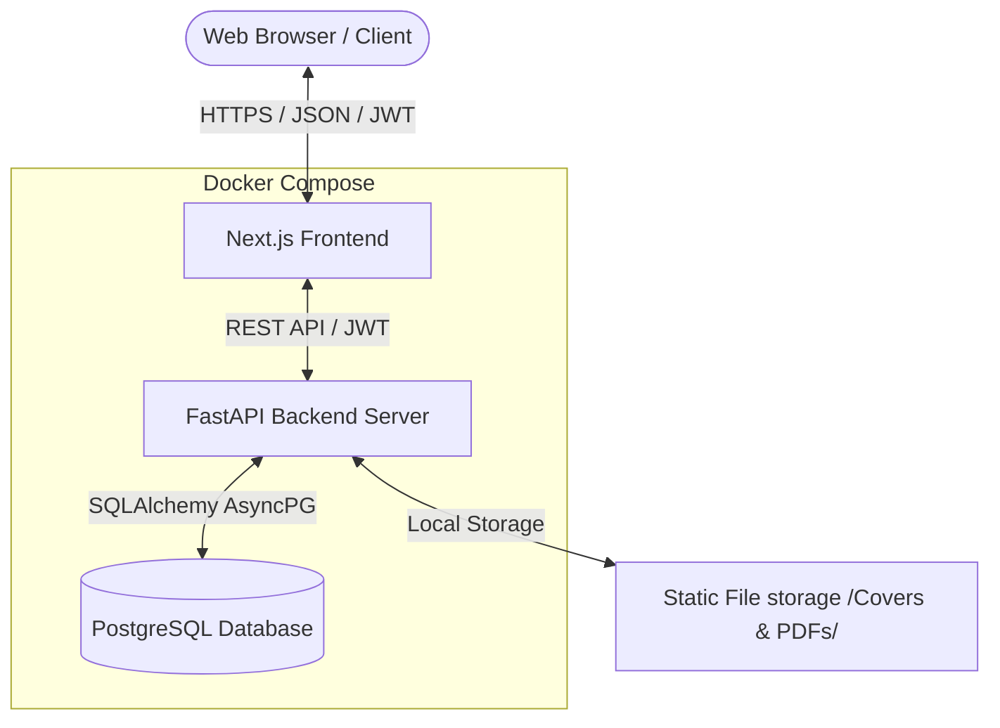

- **Frontend**: แอปพลิเคชัน React ประสิทธิภาพสูง รองรับการแสดงผลทุกหน้าจอ พัฒนาด้วย **Next.js (App Router)** และ TypeScript
- **Backend**: REST API ประสิทธิภาพสูงแบบ Asynchronous พัฒนาด้วย **FastAPI** และ **SQLAlchemy 2.0**
- **Database**: ระบบฐานข้อมูลเชิงสัมพันธ์ **PostgreSQL** และจัดการโครงสร้างตาราง (Migration) ด้วย **Alembic**

---

## ✨ ฟังก์ชันการทำงานหลัก (Core Features)

### 1. ระบบยืนยันตัวตนและการควบคุมสิทธิ์ตามบทบาท (RBAC)
- กำหนดสิทธิ์การเข้าถึงข้อมูลตามบทบาทหลักทั้ง 4 ของระบบ:
  - **Guest / บุคคลทั่วไป**: ค้นหา อ่าน และดูสถิติพื้นฐานของผลงานวิจัยที่ได้รับการอนุมัติเผยแพร่แล้วแบบอ่านอย่างเดียว (Read-only)
  - **Student / นักศึกษา**: ส่งผลงานวิจัยใหม่, อัปโหลดหน้าปกและไฟล์ PDF, ระบุผู้แต่งร่วม และส่งแก้ไขผลงานตามข้อคิดเห็น
  - **Advisor / อาจารย์ที่ปรึกษา (ผู้ประเมิน)**: เข้าถึงคิวงานรอตรวจ (Review Queue), ดาวน์โหลดเอกสารประกอบการประเมิน, บันทึกข้อคิดเห็น และอนุมัติ/ส่งกลับแก้ไข/ปฏิเสธผลงาน
  - **Admin / ผู้ดูแลระบบ**: จัดการข้อมูลผู้ใช้, หมวดหมู่ผลงาน, ตั้งค่าระบบ และเข้าถึงแผงควบคุมสถิติภาพรวมทั้งหมด

### 2. กระบวนการส่งผลงาน (Submission Workflow)
- รองรับผู้จัดทำหลายคน (Co-authors) การเลือกอาจารย์ที่ปรึกษาประจำวิชา และการคัดกรองตามประเภทหมวดหมู่
- **ระบบสลับเวอร์ชันแก้ไข (`FileRevision`)**: ติดตามประวัติไฟล์และเวอร์ชันของผลงานที่มีการปรับปรุงตามคำแนะนำของอาจารย์
- **การจัดการไฟล์**: ระบบอัปโหลดและจัดเก็บเอกสาร PDF และภาพหน้าปกผลงานวิจัยอย่างปลอดภัย

### 3. ขั้นตอนการตรวจสอบและอนุมัติ (Review & Approval Pipeline)
- หน้าจอ Dashboard สำหรับอาจารย์และผู้ดูแลระบบโดยเฉพาะ (`/dashboard/reviewer`) เพื่อติดตามและประเมินผลงานที่รอคิว
- กระบวนการประเมินผลงานในรูปแบบสถานะ: `pending` ➔ `approved` / `rejected` / `needs_revision`
- บันทึกประวัติการตรวจสอบ ความคิดเห็น ชื่อผู้ประเมิน และเวลาที่ประเมินอย่างละเอียด

### 4. ระบบค้นหาอัจฉริยะและสรุปสถิติ (Search & Statistics Dashboard)
- ค้นหาข้อมูลแบบ Full-text ค้นหาจากชื่อเรื่อง บทคัดย่อ หรือคำค้นหาหลัก (Keywords)
- กรองข้อมูลตามหมวดหมู่ วันที่เผยแพร่ และจัดเรียงลำดับตามยอดเข้าชมหรือดาวน์โหลด
- บันทึกข้อมูลการค้นหา (Search Log) ยอดดาวน์โหลด และยอดเข้าชม เพื่อนำมาประมวลผลเป็นสถิติยอดนิยมในแบบเรียลไทม์

---

## 🛠️ เทคโนโลยีหลักที่เลือกใช้ (Tech Stack)

| หมวดหมู่ | เทคโนโลยี | วัตถุประสงค์ในการใช้งาน |
| :--- | :--- | :--- |
| **Frontend** | [Next.js](https://nextjs.org/) (v15+) | เฟรมเวิร์ก React (App Router, Server Components) |
| | [TypeScript](https://www.typescriptlang.org/) | เพิ่มความปลอดภัยและความถูกต้องของชนิดข้อมูลฝั่งหน้าบ้าน |
| | [pnpm](https://pnpm.io/) | ระบบจัดการ Package ที่รวดเร็วและประหยัดพื้นที่จัดเก็บ |
| | [Playwright](https://playwright.dev/) | เครื่องมือสำหรับทำ End-to-end (E2E) Browser Testing |
| **Backend** | [FastAPI](https://fastapi.tiangolo.com/) | เว็บเฟรมเวิร์ก Python สำหรับทำ Async API ที่ประมวลผลได้รวดเร็ว |
| | [SQLAlchemy 2.0](https://www.sqlalchemy.org/) | เครื่องมือจัดการฐานข้อมูลและ ORM แบบ Asynchronous |
| | [Pydantic v2](https://docs.pydantic.dev/) | การแปลงข้อมูล ตรวจสอบความถูกต้อง (Data Validation) และกำหนดโครงสร้างโมเดล |
| | [Alembic](https://alembic.sqlalchemy.org/) | เครื่องมือจัดการและทำ Database Migrations |
| | [pytest](https://docs.pytest.org/) | ชุดเครื่องมือทดสอบประสิทธิภาพการทำงานฝั่งหลังบ้าน |
| **DevOps** | [Docker & Compose](https://www.docker.com/) | ใช้สร้าง Container เพื่อให้ระบบทำงานได้เสถียรในทุกสภาพแวดล้อม |

---

## 📁 โครงสร้างโฟลเดอร์ของโปรเจกต์ (Repository Structure)

```text
UniResearch/
├── docker-compose.yml        # 🐳 ไฟล์หลักสำหรับรันทั้งระบบผ่าน Docker Compose
├── docker-compose.prod.yml   # 🐳 Override สำหรับ Production (multi-worker, standalone)
├── .env.docker               # 🐳 ไฟล์ตัวแปรสภาพแวดล้อมตัวอย่างสำหรับ Docker
├── Makefile                  # 🐳 คำสั่งลัดสำหรับจัดการ Docker (make dev, make logs ฯลฯ)
├── backend/                  # ส่วนงานระบบหลังบ้าน FastAPI
│   ├── app/                  # โค้ดหลักของแอปพลิเคชัน
│   │   ├── core/             # การตั้งค่าระบบ ความปลอดภัย และสิทธิ์ JWT
│   │   ├── db/               # การเชื่อมต่อฐานข้อมูลและการจัดสรร Session (Async)
│   │   ├── models/           # โครงสร้างตารางฐานข้อมูล (SQLAlchemy Models)
│   │   ├── schemas/          # ตัวตรวจสอบข้อมูลรับส่ง (Pydantic Schemas)
│   │   ├── services/         # ส่วนประมวลผลตรรกะทางธุรกิจและการเขียนอ่านฐานข้อมูล
│   │   └── routers/          # เส้นทางของ endpoint API (Controllers)
│   ├── tests/                # ส่วนควบคุม Unit & Integration Tests (pytest)
│   ├── static/               # โฟลเดอร์เก็บไฟล์ PDF และหน้าปกที่อัปโหลดเข้าสู่ระบบ (git-ignored)
│   └── Dockerfile            # ตัวสร้าง Docker Container สำหรับ backend (multi-stage)
├── frontend/                 # ส่วนงานระบบหน้าบ้าน Next.js
│   ├── app/                  # หน้าเว็บของระบบ (App Router) และ API Routes ท้องถิ่น
│   ├── src/                  # ส่วนประกอบของหน้าจอ (Components), Hooks, ตัวช่วย, และฟีเจอร์หลัก
│   ├── tests/                # การทดสอบการทำงานส่วนประกอบหน้าจอ (Frontend Tests)
│   ├── e2e/                  # การทดสอบจำลองเบราว์เซอร์ด้วย Playwright
│   ├── Dockerfile            # ตัวสร้าง Docker Container สำหรับ frontend (multi-stage)
│   ├── package.json          # ไฟล์แสดงการอ้างอิงไลบรารี
│   └── tsconfig.json         # การตั้งค่าโปรเจกต์ TypeScript
└── docs/                     # เอกสารรายละเอียดความต้องการระบบและไดอะแกรมที่เกี่ยวข้อง
```

---

## 🚀 เริ่มต้นใช้งาน (Getting Started)

### ข้อกำหนดเบื้องต้น (Prerequisites)

- [Docker](https://www.docker.com/) (v20+) และ Docker Compose (v2+)
- [Git](https://git-scm.com/)

> สำหรับการรันแบบ Local (ไม่ใช้ Docker) ต้องติดตั้งเพิ่ม: Python 3.11+, Node.js 20+, pnpm, PostgreSQL 15+

### วิธีที่ A: เริ่มต้นด่วนด้วย Docker (แนะนำ)

เพื่อเปิดทำงานระบบทั้งหมด (FastAPI, Next.js และ PostgreSQL) โดยไม่จำเป็นต้องติดตั้งโปรแกรมอื่นเพิ่มเติมลงบนเครื่องคอมพิวเตอร์ของคุณ:

1. **โคลนและเปิดโปรเจกต์:**
   ```bash
   git clone <repository_url> UniResearch
   cd UniResearch
   ```

2. **คัดลอกไฟล์ตัวแปรสภาพแวดล้อม:**
   ```bash
   cp .env.docker .env
   # แก้ไขค่าตามต้องการ (เช่น SECRET_KEY, POSTGRES_PASSWORD)
   ```

3. **เปิดคำสั่ง Docker Compose:**
   ```bash
   # ใช้ Make (แนะนำ)
   make dev-build

   # หรือใช้ Docker Compose โดยตรง
   docker compose up --build
   ```

4. **เข้าใช้งานบริการต่างๆ:**
   | บริการ | URL | หมายเหตุ |
   | :--- | :--- | :--- |
   | หน้าบ้าน (Frontend UI) | [http://localhost:3000](http://localhost:3000) | Next.js App Router |
   | หลังบ้าน (Backend API) | [http://localhost:8000](http://localhost:8000) | FastAPI |
   | เอกสาร API (Swagger UI) | [http://localhost:8000/swagger](http://localhost:8000/swagger) | Interactive API docs (หรือผ่าน [http://localhost:8000/docs](http://localhost:8000/docs) ซึ่งจะ Redirect ไปยัง `/swagger`) |
   | ฐานข้อมูล PostgreSQL | `localhost:5433` | เชื่อมต่อผ่าน psql หรือ DB client |

5. **คำสั่งลัดที่มีประโยชน์ (Make Commands):**
   ```bash
   make help              # แสดงรายการคำสั่งทั้งหมด
   make logs              # ดู log ทุก service
   make logs-backend      # ดู log เฉพาะ backend
   make shell-backend     # เปิด shell ใน backend container
   make shell-db          # เปิด psql ใน database container
   make migrate           # รัน Alembic migrations
   make down              # หยุดทุก service
   make nuke              # ลบทุกอย่าง (containers, volumes, images)
   ```

---

### วิธีที่ B: ติดตั้งและรันระบบแบบ Local Setup (ไม่ใช้ Docker)

#### 1. การตั้งค่าระบบหลังบ้าน (Backend)
1. เข้าไปในโฟลเดอร์ backend:
   ```bash
   cd backend
   ```
2. สร้างและเปิดใช้งาน Virtual Environment ของ Python:
   ```bash
   python3 -m venv venv
   source venv/bin/activate
   ```
3. ติดตั้งไลบรารีที่จำเป็นทั้งหมด:
   ```bash
   pip install -r requirements.txt
   ```
4. คัดลอกและตั้งค่าไฟล์ตัวแปรสภาพแวดล้อม (Environment Variables):
   ```bash
   cp .env.example .env
   # แก้ไขข้อมูลในไฟล์ backend/.env เพื่อกำหนดข้อมูล PostgreSQL หรือกำหนดเป็น SQLite
   ```
5. อัปเกรดฐานข้อมูลผ่าน Alembic:
   ```bash
   alembic upgrade head
   ```
6. เริ่มต้นรันเซิร์ฟเวอร์:
   ```bash
   uvicorn app.main:app --reload
   ```

#### 2. การตั้งค่าระบบหน้าบ้าน (Frontend)
1. เปิดหน้าจอเทอร์มินัลใหม่แล้วเข้าไปในโฟลเดอร์ frontend:
   ```bash
   cd frontend
   ```
2. ติดตั้งไลบรารีด้วยเครื่องมือ `pnpm` (หรือ `npm` / `yarn`):
   ```bash
   pnpm install
   ```
3. สร้างไฟล์สำหรับตัวแปรสภาพแวดล้อม:
   ```bash
   cp .env.example .env
   ```
4. รันระบบหน้าบ้านในโหมดพัฒนา:
   ```bash
   pnpm dev
   ```
5. เปิดเบราว์เซอร์ไปที่ลิงก์ [http://localhost:3000](http://localhost:3000)

### ฐานข้อมูลและการนำเข้าข้อมูล (Database & Data Migration)

ระบบรองรับการนำเข้าข้อมูลบัญชีรายชื่อของนักศึกษาและอาจารย์ที่ปรึกษาจากไฟล์ CSV (`student.csv` และ `advisors.csv`) เข้าสู่ระบบฐานข้อมูลโดยอัตโนมัติ

**วิธีการรันการนำเข้าข้อมูล (Migration):**
- **รันผ่าน Docker Compose (แนะนำ):**
  ```bash
  docker compose exec backend python app/scripts/migrate_csv.py
  ```
- **รันบน Local Environment:**
  ```bash
  cd backend
  source venv/bin/activate
  python app/scripts/migrate_csv.py
  ```

---

## 🧪 การทดสอบระบบ (Testing)

### การทดสอบหลังบ้าน (Backend Unit & Integration Tests)
ตรวจสอบว่ามีการเปิดใช้ Virtual Environment และมีไลบรารีพร้อมใช้งาน จากนั้นพิมพ์คำสั่ง:
```bash
cd backend
PYTHONPATH=. pytest tests/ -v
```

### การทดสอบหน้าบ้าน (Frontend E2E / Unit Tests)
รันคำสั่งสำหรับทดสอบหน้าจอ:
```bash
cd frontend
pnpm test
```

---

## 📄 เอกสารอ้างอิงเพิ่มเติม (Documentation)
หากคุณต้องการศึกษารายละเอียดเชิงลึกเกี่ยวกับการตัดสินใจทางโครงสร้างสถาปัตยกรรม หรือตารางวิเคราะห์สิทธิ์ กรุณาเปิดดูเอกสารดังต่อไปนี้:
- [ข้อกำหนดการออกแบบและความต้องการของระบบ](file:///Users/mac/Desktop/workspace/UniResearch/docs/UniResearch_rqm.md)
- [การวิเคราะห์บทบาทอาจารย์ที่ปรึกษาและขั้นตอนการตรวจสอบงาน](file:///Users/mac/Desktop/workspace/UniResearch/docs/ADVISOR_ANALYSIS.md)
- [เอกสารคู่มือการติดตั้งระบบหลังบ้าน](file:///Users/mac/Desktop/workspace/UniResearch/backend/README.md)
- [เอกสารการออกแบบองค์ประกอบหน้าบ้าน](file:///Users/mac/Desktop/workspace/UniResearch/frontend/DESIGN.md)
- [โครงสร้างฐานข้อมูลและโค้ด DBML](file:///Users/mac/Desktop/workspace/UniResearch/docs/UniResearch_Database_Schema.md)
- [แผนภาพ UML ฉบับเต็ม (Use Case, Class, ER, State, Activity, Sequence, Component)](file:///Users/mac/Desktop/workspace/UniResearch/docs/UniResearch_UML_Diagrams.md)
- [คู่มือการจัดการโครงสร้างพื้นฐานและการติดตั้ง (Terraform, Kubernetes, Prometheus, Grafana)](file:///Users/mac/Desktop/workspace/UniResearch/docs/INFRASTRUCTURE.md)


---


<a name="uniresearch-project-requirementsmd"></a>
# 📄 UniResearch_Project_Requirements.md

# 📋 UniResearch — Project & Requirements Document

> **ชื่อระบบ**: UniResearch — ระบบคลังจัดเก็บและเผยแพร่ผลงานวิชาการส่วนกลาง
> **เวอร์ชันเอกสาร**: 1.0
> **วันที่จัดทำ**: สิงหาคม 2569

---

## สารบัญ

1. [บทนำ (Introduction)](#1-บทนำ-introduction)
2. [ผู้เกี่ยวข้องและบทบาท (Stakeholders & Roles)](#2-ผู้เกี่ยวข้องและบทบาท-stakeholders--roles)
3. [ภาพรวมระบบและสถาปัตยกรรม (System Overview & Architecture)](#3-ภาพรวมระบบและสถาปัตยกรรม-system-overview--architecture)
4. [ความต้องการเชิงหน้าที่ (Functional Requirements)](#4-ความต้องการเชิงหน้าที่-functional-requirements)
5. [เวิร์กโฟลว์สถานะโครงงาน (Research Status Workflow)](#5-เวิร์กโฟลว์สถานะโครงงาน-research-status-workflow)
6. [ความต้องการที่ไม่ใช่เชิงหน้าที่ (Non-Functional Requirements)](#6-ความต้องการที่ไม่ใช่เชิงหน้าที่-non-functional-requirements)
7. [แบบจำลองข้อมูล (Data Model)](#7-แบบจำลองข้อมูล-data-model)
8. [กฎทางธุรกิจและการควบคุมสิทธิ์ (Business Rules & Access Control)](#8-กฎทางธุรกิจและการควบคุมสิทธิ์-business-rules--access-control)
9. [ข้อจำกัดและสมมติฐาน (Constraints & Assumptions)](#9-ข้อจำกัดและสมมติฐาน-constraints--assumptions)
10. [สิ่งส่งมอบและเอกสารอ้างอิง (Deliverables & References)](#10-สิ่งส่งมอบและเอกสารอ้างอิง-deliverables--references)

---

## 1. บทนำ (Introduction)

### 1.1 ที่มาและความสำคัญ (Background & Significance)

ในบริบทของสถาบันอุดมศึกษาในปัจจุบัน การจัดเก็บผลงานวิชาการของนักศึกษาและอาจารย์ เช่น โครงงานพิเศษ (Senior Project) การศึกษาอิสระ (Independent Study) วิทยานิพนธ์ (Thesis) สารนิพนธ์ (Dissertation) ตลอดจนบทความวิจัยของอาจารย์ ถือเป็นภารกิจหลักที่มีความสำคัญอย่างยิ่งต่อการสะสมและถ่ายทอดองค์ความรู้ภายในสถาบัน อย่างไรก็ตาม ในหลายสถาบันการศึกษายังคงพบปัญหาเรื้อรังที่เกิดจากการบริหารจัดการผลงานวิชาการเหล่านี้ อาทิ:

1. **การจัดเก็บแบบกระจัดกระจาย (Fragmented Storage)** — ผลงานวิจัยถูกจัดเก็บกระจายตัวอยู่ในหลายรูปแบบ ทั้งเอกสารกระดาษ, ไฟล์ดิจิทัลบนเครื่องคอมพิวเตอร์ส่วนบุคคลของอาจารย์แต่ละท่าน, แผ่นซีดี/ดีวีดี หรือโฟลเดอร์ภายในเครือข่ายที่ไม่มีการจัดหมวดหมู่อย่างเป็นระบบ ทำให้ยากต่อการค้นหาและเข้าถึง

2. **กระบวนการตรวจสอบและอนุมัติที่ขาดความต่อเนื่อง (Disconnected Review Process)** — การส่งผลงานเพื่อให้อาจารย์ที่ปรึกษาตรวจสอบและอนุมัตินั้น มักดำเนินการผ่านช่องทางที่ไม่เป็นทางการ เช่น อีเมล หรือการส่งเอกสารด้วยตนเอง ส่งผลให้ขาดกลไกในการติดตามสถานะ (Status Tracking) และขาดประวัติการแก้ไข (Revision History) ที่สมบูรณ์

3. **การเผยแพร่ผลงานที่มีข้อจำกัด (Limited Dissemination)** — ผลงานวิจัยที่ผ่านการอนุมัติแล้วไม่ถูกนำมาเผยแพร่อย่างเป็นระบบให้นักศึกษารุ่นหลังหรือบุคคลทั่วไปสามารถค้นคว้าและนำไปใช้ประโยชน์ได้อย่างสะดวก ทำให้ศักยภาพขององค์ความรู้เหล่านี้ไม่ถูกใช้อย่างเต็มประสิทธิภาพ

4. **การขาดข้อมูลสถิติเชิงวิเคราะห์ (Lack of Analytics)** — สถาบันไม่สามารถรวบรวมข้อมูลสถิติที่เป็นประโยชน์ เช่น จำนวนผลงานวิจัยแยกตามสาขาวิชา, แนวโน้มหัวข้อวิจัยที่ได้รับความนิยม, ยอดการเข้าชมและดาวน์โหลด ซึ่งข้อมูลเหล่านี้มีคุณค่าต่อการวางแผนหลักสูตรและกำหนดทิศทางการวิจัยของสถาบัน

ด้วยเหตุผลข้างต้น ระบบ **UniResearch** จึงถูกพัฒนาขึ้นเพื่อเป็น **ระบบคลังจัดเก็บและเผยแพร่ผลงานวิชาการส่วนกลาง** (Centralized Academic Repository System) ที่รวบรวมผลงานวิชาการทุกประเภทไว้ในแพลตฟอร์มเดียว พร้อมมีระบบจัดหมวดหมู่ กระบวนการตรวจสอบอนุมัติที่โปร่งใส ระบบค้นหาอัจฉริยะ และแผงควบคุมข้อมูลสถิติเชิงวิเคราะห์ เพื่อยกระดับการบริหารจัดการผลงานวิชาการให้มีประสิทธิภาพ เป็นระบบ และเกิดประโยชน์สูงสุดแก่ทุกฝ่ายที่เกี่ยวข้อง

---

### 1.2 วัตถุประสงค์ของระบบ (System Objectives)

ระบบ UniResearch ถูกพัฒนาขึ้นโดยมีวัตถุประสงค์หลักดังต่อไปนี้:

1. **เพื่อพัฒนาระบบคลังจัดเก็บผลงานวิชาการส่วนกลาง** ที่สามารถรวบรวม จัดเก็บ และจัดหมวดหมู่ผลงานวิจัยทุกประเภท ได้แก่ โครงงานพิเศษ, การศึกษาอิสระ, วิทยานิพนธ์, สารนิพนธ์ และบทความวิจัยของอาจารย์ ไว้ในแพลตฟอร์มเว็บแอปพลิเคชันเดียว

2. **เพื่อสร้างกระบวนการส่งผลงานและตรวจสอบอนุมัติที่เป็นระบบ (Structured Submission & Review Workflow)** ซึ่งประกอบด้วยขั้นตอนการส่งผลงาน → การตรวจสอบโดยอาจารย์ที่ปรึกษา → การให้ข้อคิดเห็น → การอนุมัติ/ส่งกลับแก้ไข/ปฏิเสธ พร้อมบันทึกประวัติการแก้ไขและเวอร์ชันเอกสารอย่างครบถ้วน

3. **เพื่อพัฒนาระบบควบคุมสิทธิ์การเข้าถึงตามบทบาท (Role-Based Access Control — RBAC)** ที่แยกระดับสิทธิ์การใช้งานอย่างชัดเจนตามบทบาทผู้ใช้งาน 4 กลุ่ม ได้แก่ Guest (บุคคลทั่วไป), Student (นักศึกษา), Advisor (อาจารย์ที่ปรึกษา) และ Admin (ผู้ดูแลระบบ) เพื่อรักษาความปลอดภัยและความถูกต้องของข้อมูล

4. **เพื่อพัฒนาระบบค้นหาอัจฉริยะ (Advanced Search Engine)** ที่รองรับการค้นหาแบบ Full-text จากชื่อเรื่อง บทคัดย่อ และคำสำคัญ พร้อมระบบกรองข้อมูลขั้นสูงตามหมวดหมู่ สาขาวิชา ประเภทผลงาน ปีการศึกษา และอาจารย์ที่ปรึกษา เพื่ออำนวยความสะดวกในการค้นคว้าข้อมูล

5. **เพื่อพัฒนาระบบเผยแพร่ผลงานวิจัยสู่สาธารณะ** ให้บุคคลทั่วไปสามารถเข้าถึง ค้นหา อ่าน และดาวน์โหลดผลงานวิจัยที่ผ่านการอนุมัติแล้ว เพื่อส่งเสริมการเผยแพร่ความรู้และเพิ่มมูลค่าให้กับผลงานวิชาการของสถาบัน

6. **เพื่อพัฒนาระบบแผงควบคุมข้อมูลสถิติ (Analytics Dashboard)** ที่รวบรวมและแสดงผลข้อมูลสถิติเชิงวิเคราะห์ เช่น ยอดเข้าชม, ยอดดาวน์โหลด, คำค้นหายอดนิยม, จำนวนผลงานแยกตามหมวดหมู่ และแนวโน้มผลงานวิจัยแต่ละปีการศึกษา เพื่อสนับสนุนการตัดสินใจเชิงบริหาร

---

### 1.3 ขอบเขตระบบ (System Scope)

#### 1.3.1 ขอบเขตที่อยู่ในระบบ (In-Scope)

| ลำดับ | โมดูล/ฟังก์ชัน | รายละเอียด |
| :---: | :--- | :--- |
| 1 | **ระบบยืนยันตัวตนและจัดการบัญชีผู้ใช้** | สมัครสมาชิก, เข้าสู่ระบบผ่าน JWT Token (Access/Refresh), จัดการโปรไฟล์ส่วนตัว |
| 2 | **ระบบควบคุมสิทธิ์ตามบทบาท (RBAC)** | กำหนดสิทธิ์ 4 บทบาท: Guest, Student, Advisor, Admin พร้อม RBAC Middleware |
| 3 | **ระบบส่งผลงานวิจัย** | เพิ่มผลงานใหม่พร้อมข้อมูลรายละเอียด, ระบุผู้แต่งร่วม (Co-authors), เลือกอาจารย์ที่ปรึกษา, อัปโหลดไฟล์ PDF และภาพหน้าปก |
| 4 | **ระบบตรวจสอบและอนุมัติผลงาน** | คิวงานรอประเมิน (Review Queue), บันทึกข้อคิดเห็น, อนุมัติ/ส่งกลับแก้ไข/ปฏิเสธ พร้อมประวัติการประเมิน |
| 5 | **ระบบเวอร์ชันเอกสาร (File Revision)** | บันทึกประวัติไฟล์ทุกครั้งที่มีการอัปโหลดแก้ไข เพื่อเปรียบเทียบเวอร์ชันย้อนหลัง |
| 6 | **ระบบค้นหาและกรองข้อมูล** | Full-text Search, กรองตามหมวดหมู่/สาขาวิชา/ประเภทผลงาน/ปีการศึกษา, จัดเรียงลำดับ |
| 7 | **หน้าแสดงรายละเอียดผลงาน** | แสดงข้อมูลฉบับเต็ม, ดาวน์โหลด PDF, แสดงผลงานที่เกี่ยวข้อง (Related Works) |
| 8 | **ระบบจัดการหมวดหมู่ผลงาน** | Admin สามารถเพิ่ม/แก้ไข/ลบหมวดหมู่ผลงานวิจัย |
| 9 | **ระบบจัดการผู้ใช้งาน (Admin)** | Admin สามารถดูรายชื่อ, เพิ่ม/ลบ, แก้ไขบทบาทผู้ใช้งานทั้งหมดในระบบ |
| 10 | **ระบบบันทึกรายการโปรด** | ผู้ใช้ที่เข้าสู่ระบบสามารถบันทึกผลงานเป็น Bookmark/Favorite |
| 11 | **ระบบบันทึกสถิติและแดชบอร์ด** | บันทึก View/Download Log, Search Log, แสดง Analytics Dashboard สำหรับ Admin |
| 12 | **ระบบจัดการข้อมูลตัวเลือก** | จัดการรายชื่อสาขาวิชา (Departments) และประเภทผลงาน (Work Types) |

#### 1.3.2 ขอบเขตที่ไม่อยู่ในระบบ (Out-of-Scope)

| ลำดับ | รายการ | เหตุผล |
| :---: | :--- | :--- |
| 1 | ระบบแจ้งเตือนผ่านอีเมล/Push Notification | ยังไม่อยู่ในขอบเขตเฟสแรกของการพัฒนา |
| 2 | ระบบแชทหรือสนทนาภายในระบบ (In-app Chat) | ไม่ใช่ฟังก์ชันหลักของคลังจัดเก็บผลงาน |
| 3 | ระบบชำระเงินหรือธุรกรรมทางการเงิน | ระบบเป็นคลังจัดเก็บเพื่อการศึกษา ไม่มีระบบค่าใช้จ่าย |
| 4 | การเชื่อมต่อกับระบบสารสนเทศภายนอก (เช่น ระบบทะเบียน, LMS) | ต้องมีการศึกษา API ของระบบเป้าหมายเพิ่มเติม |
| 5 | ระบบตรวจจับการคัดลอก (Plagiarism Detection) | ต้องอาศัยเครื่องมือภายนอกที่มีลิขสิทธิ์เฉพาะ |
| 6 | การรองรับหลายภาษาอย่างเต็มรูปแบบ (Full i18n) | เฟสแรกรองรับ 2 ภาษาเฉพาะข้อมูลผลงาน (ไทย/อังกฤษ) ไม่รวม UI Localization |
| 7 | ระบบวิเคราะห์ข้อมูลขั้นสูงด้วย AI/ML | จะพิจารณาพัฒนาในเฟสถัดไป |

#### 1.3.3 ข้อจำกัดของระบบ (Constraints)

- ระบบรองรับเฉพาะไฟล์เอกสารรูปแบบ `.pdf` เท่านั้น
- ไฟล์ภาพหน้าปกรองรับเฉพาะนามสกุล `.jpg`, `.jpeg` และ `.png`
- ระบบฐานข้อมูลที่ใช้คือ **PostgreSQL** ร่วมกับเครื่องมือ Migration ผ่าน **Alembic**
- ระบบถูกออกแบบในรูปแบบ **Decoupled Client-Server Architecture** (Frontend แยกจาก Backend)
- การยืนยันตัวตนใช้ระบบ **JWT (JSON Web Token)** ประกอบด้วย Access Token และ Refresh Token
- รหัสผ่านในระบบถูกเข้ารหัสด้วย **bcrypt hashing algorithm**

---

### 1.4 คำศัพท์และตัวย่อ (Glossary & Abbreviations)

#### ตารางคำศัพท์เฉพาะทาง (Domain Terms)

| คำศัพท์ | คำอธิบาย |
| :--- | :--- |
| ผลงานวิจัย / Research Work | ผลงานวิชาการใดๆ ที่ถูกส่งเข้าสู่ระบบ ครอบคลุมทั้งโครงงานพิเศษ การศึกษาอิสระ วิทยานิพนธ์ สารนิพนธ์ และบทความวิจัย |
| การส่งผลงาน / Submission | กระบวนการที่ผู้ใช้สร้างรายการผลงานใหม่พร้อมอัปโหลดเอกสารเข้าสู่ระบบ |
| การตรวจสอบ / Review | กระบวนการที่อาจารย์ที่ปรึกษาหรือผู้ดูแลระบบตรวจประเมินผลงานที่ส่งเข้ามา |
| คิวงานรอประเมิน / Review Queue | รายการผลงานที่มีสถานะ `pending` และรอให้ผู้ประเมินตรวจสอบ |
| การอนุมัติ / Approval | การเปลี่ยนสถานะผลงานจาก `pending` เป็น `approved` โดยผู้ประเมิน ทำให้ผลงานถูกเผยแพร่สู่สาธารณะ |
| การส่งกลับแก้ไข / Needs Revision | การเปลี่ยนสถานะผลงานเป็น `needs_revision` พร้อมข้อคิดเห็น เพื่อให้ผู้ส่งงานปรับปรุงแก้ไข |
| เวอร์ชันเอกสาร / File Revision | ประวัติไฟล์เอกสารที่ถูกอัปโหลดซ้ำเมื่อมีการแก้ไขตามคำแนะนำ ระบบเก็บทุกเวอร์ชันไว้เพื่อการตรวจสอบย้อนหลัง |
| ผู้แต่งร่วม / Co-author | ผู้ใช้งานที่เป็นผู้จัดทำร่วมของผลงานวิจัยชิ้นเดียวกัน |
| อาจารย์ที่ปรึกษา / Advisor | ผู้ใช้งานบทบาท Advisor ที่ได้รับมอบหมายให้เป็นที่ปรึกษาและผู้ประเมินผลงานวิจัย |
| หมวดหมู่ / Category | การจัดกลุ่มผลงานวิจัยตามสาขาหรือหัวข้อ เช่น AI, Web Application, UX/UI |
| สาขาวิชา / Department | ภาควิชาหรือสาขาวิชาที่เกี่ยวข้องกับผู้ใช้งานหรือผลงานวิจัย |
| ประเภทผลงาน / Work Type | ชนิดของผลงานวิชาการ เช่น ปริญญานิพนธ์ งานวิจัย บทความวิชาการ |
| รายการโปรด / Favorite (Bookmark) | ฟังก์ชันที่ให้ผู้ใช้บันทึกผลงานที่สนใจไว้ในรายการส่วนตัว |

#### ตารางตัวย่อทางเทคนิค (Technical Abbreviations)

| ตัวย่อ | คำเต็ม | คำอธิบาย |
| :--- | :--- | :--- |
| **API** | Application Programming Interface | ส่วนเชื่อมต่อระหว่างระบบหน้าบ้านและหลังบ้านผ่านโปรโตคอล HTTP |
| **REST** | Representational State Transfer | รูปแบบสถาปัตยกรรม API ที่ใช้ HTTP Methods (GET, POST, PUT, DELETE) |
| **JWT** | JSON Web Token | มาตรฐานการยืนยันตัวตนแบบ Token สำหรับการเข้าสู่ระบบและจัดการเซสชัน |
| **RBAC** | Role-Based Access Control | กลไกการควบคุมสิทธิ์การเข้าถึงโดยกำหนดตามบทบาทผู้ใช้งาน |
| **ORM** | Object-Relational Mapping | เทคนิคการแปลงข้อมูลระหว่างฐานข้อมูลเชิงสัมพันธ์กับออบเจกต์ในภาษาโปรแกรม |
| **CRUD** | Create, Read, Update, Delete | ชุดปฏิบัติการพื้นฐานสำหรับจัดการข้อมูลในฐานข้อมูล |
| **DBML** | Database Markup Language | ภาษาสำหรับเขียนโครงสร้างฐานข้อมูลในรูปแบบข้อความเพื่อสร้าง ER Diagram |
| **E2E** | End-to-End (Testing) | การทดสอบระบบจากมุมมองผู้ใช้งานจริงโดยจำลองการใช้งานผ่านเบราว์เซอร์ |
| **PDF** | Portable Document Format | รูปแบบไฟล์มาตรฐานสำหรับเอกสารที่ใช้ในการจัดเก็บผลงานวิจัยฉบับเต็ม |
| **UML** | Unified Modeling Language | มาตรฐานการเขียนแผนภาพเพื่ออธิบายโครงสร้างและพฤติกรรมของระบบ |
| **SSR** | Server-Side Rendering | เทคนิคการสร้างหน้าเว็บที่ฝั่งเซิร์ฟเวอร์ก่อนส่งให้เบราว์เซอร์เพื่อเพิ่มประสิทธิภาพ |
| **SPA** | Single Page Application | แอปพลิเคชันเว็บที่โหลดหน้าเว็บเพียงครั้งเดียวและอัปเดตเนื้อหาแบบไม่ต้องรีเฟรชทั้งหน้า |
| **CORS** | Cross-Origin Resource Sharing | กลไกรักษาความปลอดภัยที่อนุญาตให้ทรัพยากรถูกเรียกใช้ข้ามโดเมน |

---

## 2. ผู้เกี่ยวข้องและบทบาท (Stakeholders & Roles)

ระบบ UniResearch กำหนดบทบาทของผู้ใช้งานออกเป็น 4 กลุ่มหลัก ดังนี้:

| บทบาท | ชื่อในระบบ | คำอธิบาย | ช่องทางการสร้างบัญชี |
| :--- | :---: | :--- | :--- |
| **บุคคลทั่วไป** | `guest` | ผู้เข้าชมเว็บไซต์ที่ไม่ได้เข้าสู่ระบบ สามารถค้นหา อ่าน และดาวน์โหลดผลงานที่เผยแพร่แล้วได้เท่านั้น (Read-only) | ไม่ต้องสร้างบัญชี |
| **นักศึกษา** | `student` | ผู้ใช้งานที่ลงทะเบียนผ่านหน้าสมัครสมาชิก สามารถส่งผลงานวิจัย, อัปโหลดเอกสาร, ระบุผู้แต่งร่วมและอาจารย์ที่ปรึกษา, แก้ไขผลงานของตนเอง และจัดการโปรไฟล์ | สมัครสมาชิกสาธารณะ (`POST /auth/register`) |
| **อาจารย์ที่ปรึกษา** | `advisor` | ผู้ประเมินผลงานวิจัย สามารถเข้าถึงคิวงานรอตรวจ, ดาวน์โหลดเอกสาร, บันทึกข้อคิดเห็น และอนุมัติ/ส่งกลับแก้ไข/ปฏิเสธผลงานที่ตนเป็นที่ปรึกษา | สร้างโดย Admin เท่านั้น |
| **ผู้ดูแลระบบ** | `admin` | ผู้มีสิทธิ์สูงสุดในระบบ สามารถจัดการบัญชีผู้ใช้ทั้งหมด, จัดการหมวดหมู่ผลงาน, ตั้งค่าข้อมูลตัวเลือก, เข้าถึง Analytics Dashboard และลบผลงานออกจากระบบ | สร้างโดย Admin เท่านั้น |

### แผนภาพความสัมพันธ์ระหว่างผู้มีส่วนเกี่ยวข้อง

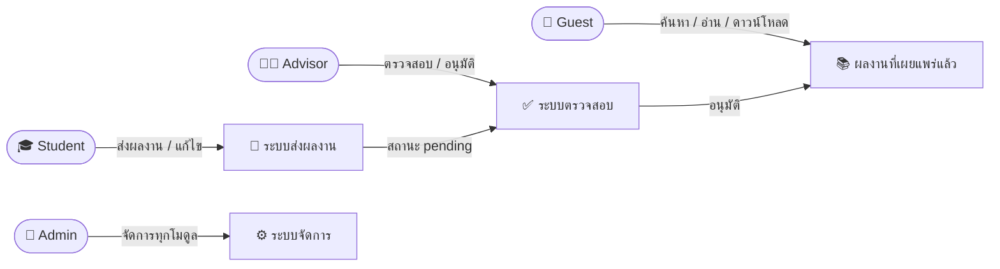

---

## 3. ภาพรวมระบบและสถาปัตยกรรม (System Overview & Architecture)

### 3.1 สถาปัตยกรรมระดับสูง (High-Level Architecture)

ระบบ UniResearch ถูกออกแบบภายใต้สถาปัตยกรรมแบบ **Decoupled Client-Server** ที่แยกส่วนหน้าบ้าน (Frontend) และหลังบ้าน (Backend) ออกจากกันอย่างชัดเจน โดยสื่อสารผ่าน REST API:

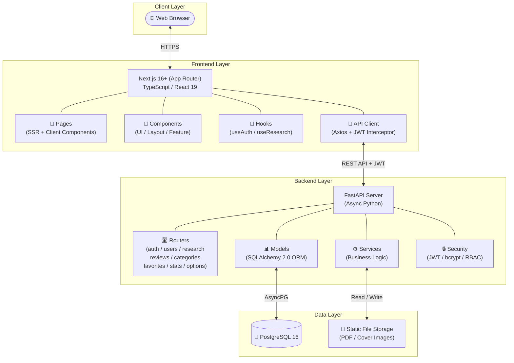

### 3.2 เทคโนโลยีหลักที่เลือกใช้ (Technology Stack)

| หมวดหมู่ | เทคโนโลยี | เวอร์ชัน | วัตถุประสงค์ในการใช้งาน |
| :--- | :--- | :---: | :--- |
| **Frontend** | Next.js (App Router) | 16+ | เฟรมเวิร์ก React สำหรับ SSR และ Client Components |
| | React | 19 | ไลบรารีสร้าง User Interface |
| | TypeScript | 5.x | เพิ่มความปลอดภัยและถูกต้องของชนิดข้อมูล |
| | Zustand | — | State Management แบบเบาและยืดหยุ่น |
| | React Hook Form + Zod | — | การจัดการและตรวจสอบแบบฟอร์ม |
| | Recharts | — | แสดงกราฟและแผนภูมิสำหรับ Dashboard |
| | Axios | — | HTTP Client พร้อม JWT Interceptor |
| | Tailwind CSS | 4.x | Utility-first CSS Framework |
| | Playwright | — | E2E Browser Testing |
| | pnpm | — | Package Manager ที่รวดเร็วและประหยัดพื้นที่ |
| **Backend** | FastAPI | 0.115+ | Async Web Framework สำหรับ REST API |
| | SQLAlchemy | 2.0+ | Asynchronous ORM และ Database Toolkit |
| | Pydantic | 2.x | Data Validation และ Schema Definition |
| | Alembic | 1.13+ | Database Migration Tool |
| | AsyncPG | 0.29+ | Async PostgreSQL Driver |
| | python-jose | 3.3+ | JWT Token Encoding/Decoding |
| | Passlib (bcrypt) | 1.7+ | Password Hashing |
| | python-multipart | — | รองรับ File Upload (multipart/form-data) |
| | aiofiles | — | Async File I/O |
| | pytest + pytest-asyncio | 8.0+ | Unit & Integration Testing |
| **Database** | PostgreSQL | 16 | ฐานข้อมูลเชิงสัมพันธ์หลักของระบบ |
| **DevOps** | Docker & Compose | — | Containerization สำหรับทุกสภาพแวดล้อม |

### 3.3 โครงสร้างโฟลเดอร์ (Repository Structure)

```text
UniResearch/
├── backend/                        # ระบบหลังบ้าน FastAPI
│   ├── app/
│   │   ├── core/                   # config.py (Settings), security.py (JWT/bcrypt/RBAC)
│   │   ├── db/                     # เชื่อมต่อ DB, Async Session
│   │   ├── models/                 # SQLAlchemy Models (user, research, category, interactions, options)
│   │   ├── schemas/                # Pydantic Schemas (Request/Response validation)
│   │   ├── services/               # Business Logic Layer
│   │   ├── routers/                # API Endpoints (auth, users, research, reviews, categories, favorites, stats, options)
│   │   └── main.py                 # FastAPI App Entry Point
│   ├── tests/                      # pytest Unit & Integration Tests
│   ├── static/                     # ไฟล์ PDF และหน้าปกที่อัปโหลด (git-ignored)
│   ├── Dockerfile
│   └── docker-compose.yml          # FastAPI + PostgreSQL + Next.js
├── frontend/                       # ระบบหน้าบ้าน Next.js
│   ├── app/                        # App Router Pages
│   │   ├── auth/                   # login, register
│   │   ├── research/               # ค้นหา, รายละเอียดผลงาน [id]
│   │   ├── dashboard/              # student, reviewer, admin, submit
│   │   ├── profile/                # โปรไฟล์ผู้ใช้
│   │   └── favorites/              # รายการโปรด
│   ├── src/
│   │   ├── components/             # UI, Layout, Research, Dashboard, Auth
│   │   ├── hooks/                  # useAuth, useResearch, useSearch
│   │   ├── lib/                    # API Client (Axios), Auth Utils
│   │   ├── types/                  # TypeScript Type Definitions
│   │   └── features/               # Feature-based Logic (auth, research, admin)
│   ├── e2e/                        # Playwright E2E Tests
│   └── package.json
└── docs/                           # เอกสารความต้องการระบบ, UML Diagrams, RBAC Matrix
```

---

## 4. ความต้องการเชิงหน้าที่ (Functional Requirements)

### FR-1: การจัดการบัญชีและสิทธิ์ผู้ใช้งาน (User Account & Identity Management)

| รหัส | ความต้องการ | รายละเอียด | API Endpoint |
| :--- | :--- | :--- | :--- |
| FR-1.1 | สมัครสมาชิก | ผู้ใช้ทั่วไปสมัครได้ผ่านหน้าเว็บ โดยระบบบังคับบทบาทเริ่มต้นเป็น `student` เท่านั้น เพื่อป้องกันการยกระดับสิทธิ์ | `POST /auth/register` |
| FR-1.2 | เข้าสู่ระบบ | ตรวจสอบสิทธิ์ด้วย JWT Token ส่งกลับ Access Token และ Refresh Token | `POST /auth/login` |
| FR-1.3 | ต่ออายุ Token | ใช้ Refresh Token เพื่อออก Access Token ใหม่โดยไม่ต้องเข้าสู่ระบบซ้ำ | `POST /auth/refresh` |
| FR-1.4 | ดูข้อมูลผู้ใช้ปัจจุบัน | แสดงข้อมูลของผู้ใช้ที่กำลังเข้าสู่ระบบอยู่ | `GET /auth/me` |
| FR-1.5 | จัดการโปรไฟล์ส่วนตัว | ผู้ใช้ทุกบทบาทสามารถดูและแก้ไขข้อมูลโปรไฟล์ตนเอง (ชื่อ, อีเมล, สาขาวิชา, รหัสนักศึกษา) | `GET/PUT /users/me/profile` |
| FR-1.6 | การควบคุมสิทธิ์ตามบทบาท | ระบบแยกบทบาท 4 ระดับ: `guest`, `student`, `advisor`, `admin` โดยมี Middleware ตรวจสอบทุก Request | RBAC Middleware |

### FR-2: การส่งและจัดการผลงานวิจัย (Research Submission & Management)

| รหัส | ความต้องการ | รายละเอียด | API Endpoint |
| :--- | :--- | :--- | :--- |
| FR-2.1 | สร้างผลงานใหม่ | Student/Advisor/Admin สร้างผลงานใหม่ พร้อมระบุชื่อเรื่อง (TH/EN), บทคัดย่อ (TH/EN), ผู้แต่ง, อาจารย์ที่ปรึกษา, หมวดหมู่, สาขา, ประเภท, ปีการศึกษา, คำสำคัญ สถานะเริ่มต้นเป็น `pending` | `POST /research/` |
| FR-2.2 | แก้ไขผลงาน | เจ้าของสามารถแก้ไขได้เฉพาะผลงานที่มีสถานะ `pending` หรือ `needs_revision` | `PUT /research/{id}` |
| FR-2.3 | ลบผลงาน | จำกัดเฉพาะ Admin เท่านั้น | `DELETE /research/{id}` |
| FR-2.4 | อัปโหลดภาพหน้าปก | อัปโหลดไฟล์ภาพหน้าปกผลงาน (.jpg, .jpeg, .png) | `POST /research/{id}/cover` |
| FR-2.5 | อัปโหลดไฟล์ PDF | อัปโหลดเอกสารวิจัยฉบับเต็ม (.pdf) | `POST /research/{id}/pdf` |
| FR-2.6 | ดาวน์โหลด PDF | บุคคลทั่วไปและผู้ใช้ทุกบทบาทสามารถดาวน์โหลดได้ พร้อมบันทึกสถิติ | `GET /research/{id}/download` |
| FR-2.7 | ดูประวัติเวอร์ชันไฟล์ | แสดงรายการ File Revision ย้อนหลังทั้งหมดของผลงาน | `GET /research/{id}/revisions` |
| FR-2.8 | อัปโหลดเวอร์ชันแก้ไข | ส่งไฟล์แก้ไขใหม่เมื่อสถานะเป็น `needs_revision` ระบบเก็บเป็นเวอร์ชันใหม่ | `POST /research/{id}/revisions` |

### FR-3: การตรวจสอบและอนุมัติผลงาน (Review & Approval Workflow)

| รหัส | ความต้องการ | รายละเอียด | API Endpoint |
| :--- | :--- | :--- | :--- |
| FR-3.1 | คิวงานรอประเมิน | Advisor และ Admin เปิดดูรายการผลงานที่มีสถานะ `pending` — Advisor เห็นเฉพาะงานที่ตนเป็นที่ปรึกษา | `GET /reviews/queue` |
| FR-3.2 | ตัดสินผลประเมิน | ผู้ประเมินบันทึกข้อคิดเห็นและเลือก: `approved` (เผยแพร่, ตั้ง `published_at`), `needs_revision` (ส่งกลับแก้ไข), `rejected` (ปฏิเสธ) | `POST /reviews/{research_id}` |
| FR-3.3 | ดูประวัติการประเมิน | แสดงรายการ Review Comments ทั้งหมดของผลงาน พร้อมชื่อผู้ประเมิน, ข้อคิดเห็น, ผลลัพธ์ และเวลา | `GET /reviews/{research_id}` |

### FR-4: การค้นหาและแสดงรายละเอียดผลงาน (Search & Detail View)

| รหัส | ความต้องการ | รายละเอียด | API Endpoint |
| :--- | :--- | :--- | :--- |
| FR-4.1 | ค้นหาขั้นสูง | Full-text Search จากชื่อเรื่อง, บทคัดย่อ, คำสำคัญ พร้อมกรองตาม: `category_id`, `department`, `work_type`, `academic_year`, `advisor`, `status`, `sort_by` | `GET /research/?q=...&...` |
| FR-4.2 | รายละเอียดผลงาน | แสดงข้อมูลฉบับเต็ม พร้อมเพิ่ม `view_count` อัตโนมัติ | `GET /research/{id}` |
| FR-4.3 | ผลงานที่เกี่ยวข้อง | แสดงรายการผลงานที่คำนวณจากหมวดหมู่หรือคำสำคัญเดียวกัน | `GET /research/{id}/related` |
| FR-4.4 | บันทึกคำค้นหา | ทุกการค้นหาถูกบันทึกลง `search_logs` เพื่อวิเคราะห์แนวโน้ม | อัตโนมัติ |

### FR-5: ระบบรายการโปรด (Favorites)

| รหัส | ความต้องการ | รายละเอียด | API Endpoint |
| :--- | :--- | :--- | :--- |
| FR-5.1 | ดูรายการโปรด | ผู้ใช้ที่เข้าสู่ระบบดูรายการผลงานที่บันทึกไว้ | `GET /favorites/` |
| FR-5.2 | เพิ่มรายการโปรด | บันทึกผลงานเป็น Bookmark | `POST /favorites/{research_id}` |
| FR-5.3 | ลบรายการโปรด | ลบออกจากรายการ Bookmark | `DELETE /favorites/{research_id}` |

### FR-6: ระบบสถิติและแดชบอร์ด (Analytics & Dashboard)

| รหัส | ความต้องการ | รายละเอียด | API Endpoint |
| :--- | :--- | :--- | :--- |
| FR-6.1 | ภาพรวมระบบ | สรุปจำนวนผู้ใช้, ผลงาน, แยกตามสถานะ/บทบาท (Admin only) | `GET /stats/overview` |
| FR-6.2 | ผลงานยอดนิยม | จัดอันดับผลงานตามยอดเข้าชมหรือดาวน์โหลดสูงสุด | `GET /stats/top-research` |
| FR-6.3 | คำค้นหายอดนิยม | จัดอันดับคำค้นหาที่ถูกใช้มากที่สุด | `GET /stats/top-searches` |
| FR-6.4 | สถิติตามหมวดหมู่ | จำนวนผลงานแยกตามหมวดหมู่ | `GET /stats/by-category` |
| FR-6.5 | สถิติตามปีการศึกษา | จำนวนผลงานแยกตามปีการศึกษา | `GET /stats/by-year` |

### FR-7: การจัดการข้อมูลหลัก (Master Data Management)

| รหัส | ความต้องการ | รายละเอียด | API Endpoint |
| :--- | :--- | :--- | :--- |
| FR-7.1 | จัดการหมวดหมู่ | Admin เพิ่ม/แก้ไข/ลบหมวดหมู่ผลงาน | `POST/PUT/DELETE /categories/` |
| FR-7.2 | จัดการผู้ใช้ | Admin ดูรายชื่อ/แก้ไข/ลบ/เปลี่ยนบทบาทผู้ใช้ | `GET/PUT/DELETE /users/`, `PUT /users/{id}/role` |
| FR-7.3 | จัดการสาขาวิชา | Admin เพิ่มรายชื่อสาขาวิชา | `GET/POST /options/departments` |
| FR-7.4 | จัดการประเภทผลงาน | Admin เพิ่มประเภทผลงาน | `GET/POST /options/work-types` |

---

## 5. เวิร์กโฟลว์สถานะโครงงาน (Research Status Workflow)

### 5.1 แผนภาพสถานะ (State Diagram)

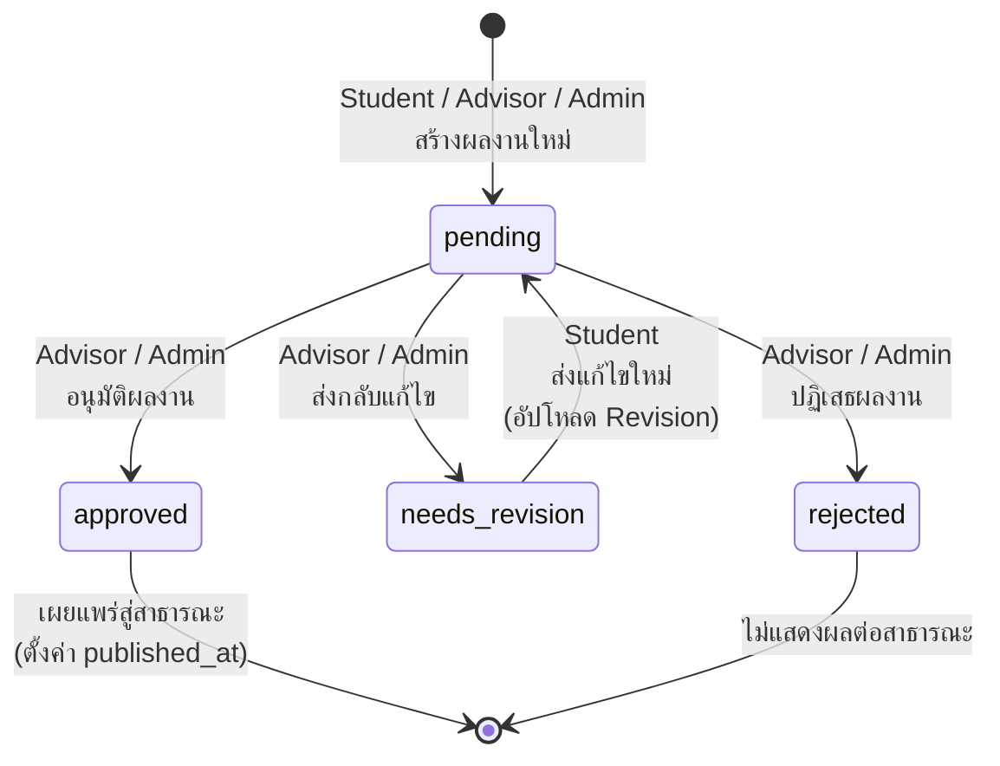

### 5.2 รายละเอียดสถานะ (Status Definitions)

| สถานะ | ค่าในระบบ | คำอธิบาย | ทำอะไรได้ | ใครเห็น |
| :--- | :---: | :--- | :--- | :--- |
| **รอตรวจสอบ** | `pending` | ผลงานถูกส่งเข้ามาใหม่หรือแก้ไขเสร็จแล้วรอประเมิน | Advisor/Admin ตรวจสอบได้ | เจ้าของ, Advisor ที่ปรึกษา, Admin |
| **อนุมัติ** | `approved` | ผลงานผ่านการประเมิน ถูกเผยแพร่สาธารณะ | ดาวน์โหลด, เข้าชมได้ | ทุกคน (รวม Guest) |
| **ส่งกลับแก้ไข** | `needs_revision` | ผลงานต้องปรับปรุงตามข้อคิดเห็นของผู้ประเมิน | เจ้าของแก้ไขและอัปโหลดใหม่ได้ | เจ้าของ, Advisor ที่ปรึกษา, Admin |
| **ปฏิเสธ** | `rejected` | ผลงานไม่ผ่านการประเมิน | ไม่สามารถดำเนินการต่อ | เจ้าของ, Admin |

### 5.3 กระบวนการทำงาน (Activity Flow)

**กระบวนการส่งผลงาน (Submission Flow)**:

```
นักศึกษากรอกข้อมูลผลงาน
    → อัปโหลด PDF และภาพหน้าปก
    → ระบุผู้แต่งร่วมและอาจารย์ที่ปรึกษา
    → ระบบสร้างผลงานสถานะ "pending"
    → ผลงานเข้าสู่คิวงานรอประเมิน
```

**กระบวนการตรวจสอบ (Review Flow)**:

```
อาจารย์เปิดคิวงาน Review Queue
    → เลือกผลงานที่ต้องการตรวจ
    → ดาวน์โหลดเอกสาร PDF เพื่ออ่าน
    → บันทึกข้อคิดเห็น (Review Comment)
    → เลือกผลลัพธ์: อนุมัติ / ส่งกลับแก้ไข / ปฏิเสธ
    → ระบบบันทึกประวัติการประเมินและเปลี่ยนสถานะ
```

**กระบวนการแก้ไขและส่งใหม่ (Revision Flow)**:

```
นักศึกษาดูข้อคิดเห็นจากผู้ประเมิน
    → แก้ไขเอกสารตามคำแนะนำ
    → อัปโหลดไฟล์เวอร์ชันใหม่ (File Revision)
    → ระบบเก็บเวอร์ชันเดิมไว้เปรียบเทียบ
    → สถานะเปลี่ยนกลับเป็น "pending" เข้าสู่คิวงานอีกครั้ง
```

---

## 6. ความต้องการที่ไม่ใช่เชิงหน้าที่ (Non-Functional Requirements)

| รหัส | หมวดหมู่ | ความต้องการ | รายละเอียด |
| :--- | :--- | :--- | :--- |
| **NFR-1** | ความปลอดภัย (Security) | การเข้ารหัสรหัสผ่าน | รหัสผ่านทั้งหมดต้องผ่านการ Hash ด้วย bcrypt ก่อนจัดเก็บในฐานข้อมูล ห้ามจัดเก็บ Plain Text |
| **NFR-2** | ความปลอดภัย (Security) | การตรวจสอบสิทธิ์ API | ทุก API Endpoint ที่เกี่ยวข้องกับการเขียน/แก้ไข/ลบข้อมูลต้องมี RBAC Middleware ตรวจสอบบทบาทผู้ใช้ |
| **NFR-3** | ความปลอดภัย (Security) | การจัดการ Token | Access Token มีอายุ 30 นาที, Refresh Token มีอายุ 7 วัน, ใช้ Algorithm HS256 |
| **NFR-4** | ความปลอดภัย (Security) | การป้องกันการยกระดับสิทธิ์ | API Registration บังคับบทบาทเริ่มต้นเป็น `student` เท่านั้น ไม่ให้ผู้ใช้กำหนดบทบาทเอง |
| **NFR-5** | ความน่าเชื่อถือ (Reliability) | ความสมบูรณ์ของข้อมูล | ใช้ Foreign Key Constraints และ Transactional Operations ป้องกันข้อมูลสูญหาย |
| **NFR-6** | ความน่าเชื่อถือ (Reliability) | Audit Trail | ประวัติการประเมินและ File Revisions ห้ามลบ (No Hard Delete) เพื่อรักษาร่องรอยการตรวจสอบย้อนกลับ |
| **NFR-7** | ประสิทธิภาพ (Performance) | ความเร็วการค้นหา | ระบบค้นหาต้องส่งผลลัพธ์กลับภายใน ≤ 2 วินาที แม้มีปริมาณผลงานจำนวนมาก |
| **NFR-8** | ประสิทธิภาพ (Performance) | Async Processing | Backend ใช้ Asynchronous I/O (FastAPI + AsyncPG) เพื่อรองรับ Concurrent Requests |
| **NFR-9** | ความสามารถในการใช้งาน (Usability) | Responsive Design | หน้าจอระบบต้องแสดงผลได้ถูกต้องทั้งบน Desktop, Tablet และ Mobile |
| **NFR-10** | ความสามารถในการใช้งาน (Usability) | สองภาษา (Bilingual Data) | ข้อมูลผลงาน (ชื่อเรื่อง, บทคัดย่อ) รองรับ 2 ภาษา (ไทย/อังกฤษ) |
| **NFR-11** | การจัดเก็บไฟล์ (Storage) | รูปแบบไฟล์ | เอกสาร: `.pdf` เท่านั้น / ภาพหน้าปก: `.jpg`, `.jpeg`, `.png` เท่านั้น |
| **NFR-12** | การนำไปใช้งาน (Deployability) | Containerization | ระบบทั้งหมดสามารถ Deploy ผ่าน Docker Compose ได้ในคำสั่งเดียว |
| **NFR-13** | ความสามารถในการทดสอบ (Testability) | ชุดทดสอบ | Backend มี pytest (Unit/Integration), Frontend มี Playwright (E2E) |

---

## 7. แบบจำลองข้อมูล (Data Model)

### 7.1 ภาพรวมตาราง (Table Overview)

ฐานข้อมูลประกอบด้วย **12 ตาราง** แบ่งเป็น 4 กลุ่มฟังก์ชัน:

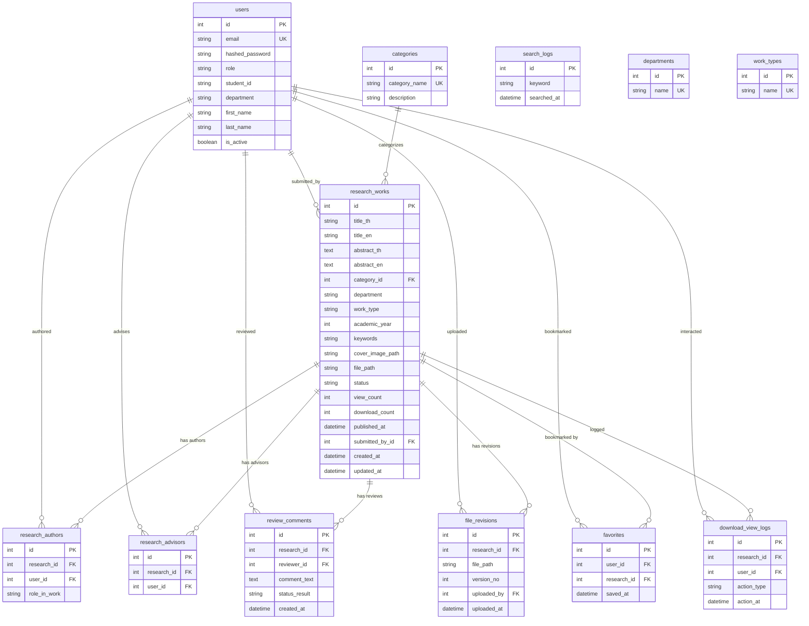

### 7.2 รายละเอียดตารางแยกกลุ่ม

#### กลุ่มที่ 1: ระบบผู้ใช้งานและสิทธิ์ (Identity & Access Control)

| ตาราง | คำอธิบาย | คอลัมน์สำคัญ |
| :--- | :--- | :--- |
| `users` | ข้อมูลบัญชีผู้ใช้ทั้งหมด | `email` (UNIQUE), `role` (guest/student/advisor/admin), `hashed_password` |
| `departments` | รายชื่อสาขาวิชา | `name` (UNIQUE) |
| `work_types` | ประเภทผลงานวิชาการ | `name` (UNIQUE) |

#### กลุ่มที่ 2: ระบบผลงานวิจัย (Research & Submissions)

| ตาราง | คำอธิบาย | คอลัมน์สำคัญ |
| :--- | :--- | :--- |
| `research_works` | ข้อมูลผลงานวิจัยหลัก | `title_th/en`, `abstract_th/en`, `status`, `file_path`, `submitted_by_id` |
| `categories` | หมวดหมู่ผลงาน | `category_name` (UNIQUE) |
| `research_authors` | ตาราง M:N เชื่อมผลงาน↔ผู้แต่ง | `role_in_work` (primary/co-author) |
| `research_advisors` | ตาราง M:N เชื่อมผลงาน↔อาจารย์ที่ปรึกษา | `research_id`, `user_id` |

#### กลุ่มที่ 3: ระบบตรวจสอบและเวอร์ชัน (Review & Version Control)

| ตาราง | คำอธิบาย | คอลัมน์สำคัญ |
| :--- | :--- | :--- |
| `file_revisions` | ประวัติไฟล์เวอร์ชันย้อนหลัง | `version_no`, `file_path`, `uploaded_by` |
| `review_comments` | ประวัติการประเมินผลงาน | `comment_text`, `status_result` (approved/rejected/needs_revision) |

#### กลุ่มที่ 4: การปฏิสัมพันธ์และสถิติ (Interactions & Logging)

| ตาราง | คำอธิบาย | คอลัมน์สำคัญ |
| :--- | :--- | :--- |
| `favorites` | รายการโปรดของผู้ใช้ | `user_id`, `research_id` |
| `download_view_logs` | บันทึกการเข้าชม/ดาวน์โหลด | `action_type` (view/download) |
| `search_logs` | บันทึกคำค้นหา | `keyword`, `searched_at` |

---

## 8. กฎทางธุรกิจและการควบคุมสิทธิ์ (Business Rules & Access Control)

### 8.1 กฎทางธุรกิจ (Business Rules)

| รหัส | กฎ | รายละเอียด |
| :--- | :--- | :--- |
| BR-01 | บทบาทเริ่มต้นจากการสมัคร | การสมัครสมาชิกจากหน้าเว็บจะได้บทบาท `student` เท่านั้น ป้องกัน Privilege Escalation |
| BR-02 | สถานะเริ่มต้นของผลงาน | ผลงานที่ถูกสร้างใหม่จะมีสถานะ `pending` เสมอ ไม่ว่าจะสร้างโดยบทบาทใด |
| BR-03 | เงื่อนไขการแก้ไขผลงาน | เจ้าของสามารถแก้ไขได้เฉพาะเมื่อสถานะเป็น `pending` หรือ `needs_revision` เท่านั้น |
| BR-04 | ขอบเขตการประเมินของ Advisor | Advisor ประเมินได้เฉพาะผลงานที่ตนเองเชื่อมโยงผ่านตาราง `research_advisors` |
| BR-05 | การเผยแพร่สู่สาธารณะ | เฉพาะผลงานสถานะ `approved` เท่านั้นที่จะแสดงผลให้ Guest เห็นได้ |
| BR-06 | การตั้งวันเผยแพร่ | เมื่ออนุมัติผลงาน ระบบจะตั้งค่า `published_at` เป็นวันเวลาปัจจุบันอัตโนมัติ |
| BR-07 | สิทธิ์การลบผลงาน | การลบผลงานถาวร (Hard Delete) สามารถทำได้โดย Admin เท่านั้น |
| BR-08 | การเก็บ Audit Trail | ประวัติการประเมิน (`review_comments`) และเวอร์ชันไฟล์ (`file_revisions`) ห้ามลบ |
| BR-09 | การนับสถิติ | ยอดเข้าชม (`view_count`) เพิ่มทุกครั้งที่เปิดหน้ารายละเอียด / ยอดดาวน์โหลด (`download_count`) เพิ่มทุกครั้งที่ดาวน์โหลด PDF |
| BR-10 | การเก็บเวอร์ชันไฟล์ | ทุกครั้งที่อัปโหลดไฟล์แก้ไขในสถานะ `needs_revision` ระบบจะเพิ่ม `version_no` ขึ้น 1 และเก็บไฟล์เดิมไว้ |

### 8.2 ตารางควบคุมสิทธิ์ตามบทบาท (RBAC Matrix)

> สัญลักษณ์: ✔ = อนุญาต | ✘ = ไม่อนุญาต | ✔* = อนุญาตเฉพาะข้อมูลที่ตนเป็นเจ้าของ/เกี่ยวข้อง

| โมดูล | ฟังก์ชัน | Guest | Student | Advisor | Admin | หมายเหตุ |
| :--- | :--- | :---: | :---: | :---: | :---: | :--- |
| **Authentication** | สมัครสมาชิก | ✔ | ✘ | ✘ | ✘ | สมัครได้เฉพาะบทบาท `student` |
| | เข้าสู่ระบบ / Refresh Token | ✔ | ✔ | ✔ | ✔ | |
| **User Profile** | ดูและแก้ไขโปรไฟล์ตนเอง | ✘ | ✔* | ✔* | ✔ | |
| **User Management** | ดูรายชื่อผู้ใช้ทั้งหมด | ✘ | ✘ | ✘ | ✔ | |
| | เพิ่ม/ลบ/แก้ไขบทบาทผู้ใช้ | ✘ | ✘ | ✘ | ✔ | |
| **Research** | สร้างผลงานใหม่ | ✘ | ✔ | ✔ | ✔ | เริ่มต้นสถานะ `pending` |
| | แก้ไขผลงานตนเอง | ✘ | ✔* | ✔* | ✔ | เฉพาะ pending/needs_revision |
| | อัปโหลดไฟล์ | ✘ | ✔* | ✔* | ✔ | |
| | อัปโหลด File Revision | ✘ | ✔* | ✔* | ✔ | |
| | ลบผลงาน | ✘ | ✘ | ✘ | ✔ | |
| **Search & View** | ค้นหา/ดูผลงาน approved | ✔ | ✔ | ✔ | ✔ | |
| | ดูผลงานสถานะอื่น | ✘ | ✔* | ✔ | ✔ | Student เห็นเฉพาะงานตนเอง |
| | ดาวน์โหลด PDF | ✔ | ✔ | ✔ | ✔ | บันทึกสถิติทุกครั้ง |
| **Review** | ดูคิวงานรอประเมิน | ✘ | ✘ | ✔ | ✔ | |
| | ประเมินผลงาน | ✘ | ✘ | ✔* | ✔ | Advisor เฉพาะงานที่ตนดูแล |
| **Categories** | ดูหมวดหมู่ | ✔ | ✔ | ✔ | ✔ | |
| | เพิ่ม/แก้ไข/ลบหมวดหมู่ | ✘ | ✘ | ✘ | ✔ | |
| **Favorites** | จัดการรายการโปรด | ✘ | ✔ | ✔ | ✔ | |
| **Dashboard** | Admin Dashboard (สถิติรวม) | ✘ | ✘ | ✘ | ✔ | |
| | Advisor Dashboard | ✘ | ✘ | ✔* | ✔ | Advisor ดูรายงานของนักศึกษาในที่ปรึกษา |
| **Options** | ดูรายชื่อสาขา/ประเภทผลงาน | ✔ | ✔ | ✔ | ✔ | |
| | เพิ่มสาขา/ประเภทผลงาน | ✘ | ✘ | ✘ | ✔ | |

---

## 9. ข้อจำกัดและสมมติฐาน (Constraints & Assumptions)

### 9.1 ข้อจำกัดทางเทคนิค (Technical Constraints)

| ลำดับ | ข้อจำกัด | รายละเอียด |
| :---: | :--- | :--- |
| 1 | ฐานข้อมูล | ระบบใช้ PostgreSQL 16 เป็นฐานข้อมูลหลักเท่านั้น (ไม่รองรับ MySQL, MongoDB ฯลฯ) |
| 2 | ไฟล์เอกสาร | รองรับเฉพาะ `.pdf` สำหรับเอกสารวิจัย |
| 3 | ไฟล์ภาพ | รองรับเฉพาะ `.jpg`, `.jpeg`, `.png` สำหรับหน้าปก |
| 4 | การเก็บไฟล์ | เก็บไฟล์บน Local Disk (`static/uploads/`) — ไม่ใช้ Cloud Storage (S3, GCS) ในเฟสแรก |
| 5 | สถาปัตยกรรม | Decoupled Client-Server (Frontend แยกจาก Backend) สื่อสารผ่าน REST API |
| 6 | Authentication | ใช้ JWT เท่านั้น (ไม่รองรับ OAuth2 / SSO ในเฟสแรก) |
| 7 | Token Lifetime | Access Token: 30 นาที, Refresh Token: 7 วัน, Algorithm: HS256 |
| 8 | CORS | เฟสพัฒนาอนุญาตทุก Origin (จะถูกจำกัดในโปรดักชัน) |

### 9.2 สมมติฐาน (Assumptions)

| ลำดับ | สมมติฐาน |
| :---: | :--- |
| 1 | ผู้ใช้งานทุกคนมีการเชื่อมต่ออินเทอร์เน็ตที่เสถียรขณะใช้งานระบบ |
| 2 | ผู้ใช้งานใช้เว็บเบราว์เซอร์รุ่นใหม่ที่รองรับ JavaScript ES6+ (Chrome, Firefox, Safari, Edge) |
| 3 | สถาบันมีเซิร์ฟเวอร์หรือบริการ Cloud ที่สามารถรัน Docker Container ได้ |
| 4 | จำนวนผลงานวิจัยในระบบอยู่ในระดับหลักหมื่นรายการ (ไม่เกิน 100,000 รายการในเฟสแรก) |
| 5 | ผู้ดูแลระบบ (Admin) จะเป็นผู้รับผิดชอบในการสร้างบัญชี Advisor และ Admin ผ่าน Admin Panel |
| 6 | ข้อมูลผลงานวิจัยทุกชิ้นจะต้องมีชื่อเรื่องทั้งภาษาไทยและภาษาอังกฤษ |
| 7 | อาจารย์ที่ปรึกษา 1 ท่านสามารถดูแลผลงานวิจัยได้หลายชิ้น และผลงาน 1 ชิ้นสามารถมีที่ปรึกษาได้หลายท่าน (M:N) |
| 8 | ระบบไม่จำเป็นต้องรองรับการทำงานแบบ Offline |

---

## 10. สิ่งส่งมอบและเอกสารอ้างอิง (Deliverables & References)

### 10.1 สิ่งส่งมอบ (Deliverables)

| ลำดับ | สิ่งส่งมอบ | รายละเอียด | รูปแบบ |
| :---: | :--- | :--- | :--- |
| 1 | ซอร์สโค้ดระบบหลังบ้าน (Backend) | FastAPI REST API พร้อม Models, Schemas, Services, Routers | Python / GitHub |
| 2 | ซอร์สโค้ดระบบหน้าบ้าน (Frontend) | Next.js Web Application พร้อม Components, Hooks, Pages | TypeScript / GitHub |
| 3 | ไฟล์ Docker Compose | Docker configuration สำหรับ Deploy ทั้งระบบ | YAML |
| 4 | ฐานข้อมูลและ Migration Scripts | Alembic migration files สำหรับสร้างโครงสร้างตาราง | Python / SQL |
| 5 | เอกสารข้อกำหนดระบบ | Project & Requirements Document (เอกสารฉบับนี้) | Markdown |
| 6 | เอกสาร Functional & Non-Functional Requirements | FR, NFR และ RBAC Matrix | Markdown / CSV |
| 7 | แผนภาพ UML ฉบับเต็ม | Use Case, Class, ER, State, Activity, Sequence, Component Diagrams | Mermaid / Markdown |
| 8 | เอกสารโครงสร้างฐานข้อมูล (DBML) | Database Schema ในรูปแบบ DBML สำหรับใช้กับ dbdiagram.io | DBML / Markdown |
| 9 | เอกสารวิเคราะห์บทบาทอาจารย์ที่ปรึกษา | Advisor Role Analysis & Review Workflow | Markdown |
| 10 | ชุดทดสอบระบบ | Backend: pytest / Frontend: Playwright E2E Tests | Python / TypeScript |
| 11 | เอกสาร API (Auto-generated) | Swagger UI / ReDoc สำหรับเอกสารอธิบายการใช้งาน API | OpenAPI 3.0 |

### 10.2 เอกสารอ้างอิง (References)

| เอกสาร | ตำแหน่งไฟล์ |
| :--- | :--- |
| ข้อกำหนดการออกแบบและความต้องการของระบบ | `docs/UniResearch_rqm.md` |
| การวิเคราะห์บทบาทอาจารย์ที่ปรึกษา | `docs/ADVISOR_ANALYSIS.md` |
| โครงสร้างฐานข้อมูลและโค้ด DBML | `docs/UniResearch_Database_Schema.md` |
| แผนภาพ UML ฉบับเต็ม | `docs/UniResearch_UML_Diagrams.md` |
| RBAC Matrix (CSV) | `docs/UniResearch_Requirements_Analysis - RBAC Matrix.csv` |
| เอกสาร API (Swagger UI) | `http://localhost:8000/docs` (เมื่อรันระบบ) |
| คู่มือการติดตั้ง Backend | `backend/README.md` |
| เอกสารการออกแบบ Frontend | `frontend/DESIGN.md` |

---

> **หมายเหตุ**: เอกสารฉบับนี้เป็นเอกสารที่มีชีวิต (Living Document) จะถูกปรับปรุงตามการเปลี่ยนแปลงของความต้องการระบบในแต่ละเฟสของการพัฒนา


---


<a name="uniresearch-rqmmd"></a>
# 📄 UniResearch_rqm.md

# UniResearch — Functional Requirements, Non-Functional Requirements และ RBAC Matrix

---

## 1. Functional Requirements (ความต้องการเชิงฟังก์ชัน)

### FR-1: การจัดการบัญชีและสิทธิ์ผู้ใช้งาน (User Account & Identity Management)
- **FR-1.1 สมัครสมาชิก (Registration)**:
  - ผู้ใช้งานทั่วไปสามารถสมัครสมาชิกได้ผ่านระบบหน้าบ้าน (Public Registration)
  - **ข้อจำกัดความปลอดภัย**: ระบบจะบังคับให้บทบาทเริ่มต้นจากการสมัครทั่วไปเป็น **Student** เท่านั้น เพื่อป้องกันไม่ให้ผู้ใช้ภายนอกกำหนดบทบาทเป็น `advisor` หรือ `admin` ได้เอง
  - การลงทะเบียนเป็น **Advisor** และ **Admin** ต้องดำเนินการผ่าน Admin Panel หรือผ่าน API ภายในที่ควบคุมโดยผู้ดูแลระบบเท่านั้น
- **FR-1.2 เข้าสู่ระบบและจัดการเซสชัน (Login & Session Management)**:
  - ผู้ใช้งานสามารถเข้าสู่ระบบผ่านการตรวจสอบสิทธิ์ด้วย JWT Token (Access Token และ Refresh Token)
  - หลังจากเข้าสู่ระบบ ระบบจะส่งผู้ใช้งานไปยังหน้าแดชบอร์ดที่เหมาะสมกับบทบาทของตนเอง เช่น บทบาท Advisor ไปยังคิวประเมินผลงาน
- **FR-1.3 การจัดการโปรไฟล์ของตนเอง (Self Profile Management)**:
  - ผู้ใช้งานทุกบทบาทที่เข้าสู่ระบบสามารถดูข้อมูลส่วนตัวของตนเองได้
  - ผู้ใช้งาน (รวมถึงบทบาท Student) สามารถแก้ไขข้อมูลโปรไฟล์พื้นฐานของตนเองได้ เช่น ชื่อ-นามสกุล, อีเมล, สาขาวิชา, และรหัสนักศึกษา (สำหรับนักศึกษา)
- **FR-1.4 การควบคุมสิทธิ์ตามบทบาท (Role-based Access Control)**:
  - ระบบแยกบทบาทการทำงานออกเป็น 4 ระดับอย่างชัดเจน ได้แก่ `guest` (ผู้เข้าชมทั่วไป), `student` (นักศึกษา/ผู้ส่งงาน), `advisor` (อาจารย์/ผู้ประเมิน), และ `admin` (ผู้ดูแลระบบ)

### FR-2: การส่งและจัดการผลงานวิจัย (Research Submission & Management)
- **FR-2.1 การเพิ่มผลงานใหม่ (Submission)**:
  - ผู้ใช้งานบทบาท Student, Advisor, และ Admin สามารถเพิ่มผลงานใหม่เข้าระบบได้
  - ข้อมูลที่ต้องการเก็บประกอบด้วย: ชื่อเรื่อง (ไทย/อังกฤษ), บทคัดย่อ (ไทย/อังกฤษ), รายชื่อผู้จัดทำ (Authors), รหัสนักศึกษา, อาจารย์ที่ปรึกษา (Advisors), หมวดหมู่ผลงาน, สาขาวิชา, ประเภทผลงาน, ปีการศึกษา, คำสำคัญ (Keywords), ภาพหน้าปก (Cover Image), และไฟล์เอกสารฉบับเต็ม (PDF File)
  - สถานะเริ่มต้นของผลงานที่ถูกสร้างใหม่จะเป็น `pending` (รอตรวจสอบ) เสมอ
- **FR-2.2 การแก้ไขและลบผลงาน (Edit & Delete)**:
  - เจ้าของผลงาน (Student/Advisor ที่เป็นผู้สร้างหรือผู้แต่ง) สามารถแก้ไขรายละเอียดผลงานและอัปโหลดไฟล์ใหม่ได้ในกรณีที่ผลงานยังไม่ได้ถูกอนุมัติ (`pending` หรือ `needs_revision`)
  - **ระบบเวอร์ชันเอกสาร (`FileRevision`)**: ทุกครั้งที่มีการอัปโหลดไฟล์แก้ไขเพิ่มเติมในสถานะ `needs_revision` ระบบจะเก็บประวัติไฟล์แก้ไขเป็นเวอร์ชันย่อยเพื่อช่วยในการตรวจสอบเปรียบเทียบ
  - การลบผลงานแบบถาวร (Delete) จำกัดเฉพาะบทบาท **Admin** เท่านั้น

### FR-3: คลังตรวจสอบและกระบวนการประเมินผลงาน (Review & Approval Workflow)
- **FR-3.1 คิวงานรอประเมิน (Review Queue)**:
  - อาจารย์ (Advisor) และผู้ดูแลระบบ (Admin) สามารถดูรายการผลงานทั้งหมดที่มีสถานะ `pending` เพื่อนำมาประเมินได้
- **FR-3.2 การตัดสินผลการประเมิน (Evaluation Decision)**:
  - ผู้ประเมินสามารถบันทึกข้อคิดเห็น (Review Comment) และเลือกผลการประเมินได้ 3 รูปแบบ:
    - **อนุมัติ (Approved)**: ผลงานเปลี่ยนสถานะเป็น `approved` และจะถูกเผยแพร่สู่สาธารณะโดยตั้งค่าวันเวลาเผยแพร่ (`published_at`)
    - **ส่งกลับแก้ไข (Needs Revision)**: ผลงานเปลี่ยนสถานะเป็น `needs_revision` พร้อมส่งข้อคิดเห็นจุดที่ต้องแก้ไขกลับไปให้ผู้จัดทำ
    - **ปฏิเสธ/ไม่อนุมัติ (Rejected)**: ผลงานเปลี่ยนสถานะเป็น `rejected` และไม่ถูกแสดงผลต่อสาธารณะ
  - **ข้อจำกัดความปลอดภัย**: ผู้ประเมินที่มีบทบาท Advisor จะประเมินได้เฉพาะผลงานที่มีความเชื่อมโยงในฐานะอาจารย์ที่ปรึกษาผลงานชิ้นนั้น (ผ่านตาราง `research_advisors`) หรือตามขอบเขตงานที่ได้รับมอบหมายเท่านั้น

### FR-4: การค้นหาและแสดงรายละเอียดผลงาน (Search & Detail View)
- **FR-4.1 การค้นหาขั้นสูง (Advanced Search & Filtering)**:
  - รองรับการค้นหาแบบ Full-text ค้นหาจากชื่อเรื่อง บทคัดย่อ และคำสำคัญ
  - กรองผลลัพธ์การค้นหาเพิ่มเติมตามหมวดหมู่ผลงาน, สาขาวิชา, ประเภทผลงาน, ปีการศึกษา และชื่ออาจารย์ที่ปรึกษา
- **FR-4.2 การแสดงรายละเอียดผลงาน (Research Detail)**:
  - แสดงข้อมูลรายละเอียดทั้งหมดของผลงานวิจัย รวมถึงช่องทางดาวน์โหลดเอกสาร PDF และรายชื่อผลงานวิจัยที่เกี่ยวข้อง (Related Works) ที่คำนวณจากหมวดหมู่หรือคำสำคัญเดียวกัน
  - **ข้อจำกัดการเข้าถึง**: ผลงานที่อยู่ในสถานะ Draft, Pending, Rejected, หรือ Needs Revision จะไม่ถูกแสดงผลในส่วนการค้นหาหรือหน้ารายละเอียดทั่วไปแก่ผู้ใช้ภายนอก (Guest)

### FR-5: ระบบสถิติและการบันทึกข้อมูลการใช้งาน (Analytics & Logging)
- **FR-5.1 สถิติการดาวน์โหลดและเข้าชม (Downloads & Views Logging)**:
  - ระบบจะตรวจจับและบันทึกประวัติการดาวน์โหลดเอกสาร PDF และยอดการเปิดเข้าชมรายละเอียดผลงานแต่ละชิ้น เพื่อนำมาคำนวณสถิติ
- **FR-5.2 แดชบอร์ดสรุปภาพรวมของระบบ (Admin Dashboard)**:
  - ผู้ดูแลระบบ (Admin) สามารถดูสรุปสถิติจำนวนบัญชีผู้ใช้งาน, สถิติแยกตามบทบาท, ผลงานวิจัยยอดนิยม, ยอดดาวน์โหลดสูงสุด, และคำค้นหาที่ได้รับความนิยมสูงสุดของระบบ (Search Analytics)

---

## 2. Non-Functional Requirements (ความต้องการที่ไม่ใช่เชิงฟังก์ชัน)

- **NFR-1 ความปลอดภัย (Security & Authorization)**:
  - ข้อมูลรหัสผ่านในระบบหลังบ้านต้องถูกเข้ารหัสผ่านแฮชที่ปลอดภัย (เช่น bcrypt)
  - API ทุกตัวที่แก้ไขสถานะหรือสิทธิ์ผู้ใช้ต้องถูกป้องกันด้วยการตรวจสอบบทบาทระดับ API Endpoint (RBAC validation)
- **NFR-2 ความน่าเชื่อถือของข้อมูล (Data Integrity)**:
  - ป้องกันข้อมูลสูญหายโดยการใช้ระบบ Foreign Key Constraints และรองรับ Transactional operations
  - ประวัติการประเมินและการแก้ไขเวอร์ชันของงานวิจัยจะต้องไม่มีการลบข้อมูลประวัติแบบ Hard Delete เพื่อรักษาตรวจสอบย้อนกลับ (Audit trail)
- **NFR-3 ประสิทธิภาพในการค้นหา (Search Performance)**:
  - การค้นหาคำสำคัญต้องรองรับปริมาณงานวิจัยจำนวนมากและส่งผลลัพธ์การค้นหากลับมาภายในระยะเวลาไม่เกิน 2 วินาที
- **NFR-4 การรองรับหน้าจอที่หลากหลาย (Responsive Usability)**:
  - อินเตอร์เฟสระบบหน้าบ้านต้องเข้ากันได้และเปิดใช้งานได้ราบรื่นทั้งในระบบเดสก์ท็อปและอุปกรณ์พกพา (Mobile friendly)
- **NFR-5 การรองรับไฟล์และการจัดเก็บ (Storage & File Types)**:
  - จำกัดรูปแบบการอัปโหลดไฟล์เอกสารฉบับเต็มเฉพาะรูปแบบ `.pdf` และรูปภาพหน้าปกเฉพาะไฟล์นามสกุลมาตรฐาน เช่น `.jpg`, `.jpeg`, และ `.png`

---

## 3. RBAC Matrix (ตารางควบคุมการเข้าใช้งานตามบทบาท)

สัญลักษณ์การเข้าถึง: ✔ = อนุญาตให้เข้าใช้งาน | ✘ = ไม่อนุญาต | ✔* = อนุญาตเฉพาะข้อมูลที่เป็นเจ้าของ/เกี่ยวข้องโดยตรง

| โมดูลงาน (Module) | ฟังก์ชัน / สิทธิ์การใช้งาน | Guest | Student | Advisor | Admin | หมายเหตุ |
| :--- | :--- | :---: | :---: | :---: | :---: | :--- |
| **Authentication** | สมัครสมาชิก (Registration) | ✔ | ✘ | ✘ | ✘ | สมัครได้เฉพาะบทบาท `student` เท่านั้น |
| | เข้าสู่ระบบ / ตรวจสอบสิทธิ์ | ✔ | ✔ | ✔ | ✔ | |
| **User Profile** | ดูรายละเอียดและแก้ไขโปรไฟล์ของตนเอง | ✘ | ✔* | ✔* | ✔ | |
| **User Management**| ดูรายชื่อผู้ใช้งานทั้งหมดในระบบ | ✘ | ✘ | ✘ | ✔ | |
| | เพิ่ม/ลบ หรือแก้ไขบทบาทผู้ใช้อื่น | ✘ | ✘ | ✘ | ✔ | |
| **Research Submission**| สร้างข้อมูลผลงานวิจัยชิ้นใหม่ | ✘ | ✔ | ✔ | ✔ | เริ่มต้นเป็นสถานะ `pending` |
| | แก้ไขข้อมูลผลงานตนเอง (Draft/Revision) | ✘ | ✔* | ✔* | ✔ | |
| | อัปโหลดไฟล์ PDF หรือรูปภาพปก | ✘ | ✔* | ✔* | ✔ | |
| | อัปโหลดประวัติเวอร์ชันไฟล์แก้ไข (Revision) | ✘ | ✔* | ✔* | ✔ | |
| | ลบผลงานวิจัยออกจากระบบ | ✘ | ✘ | ✘ | ✔ | |
| **Search & View** | ค้นหาและดูผลงานที่ได้รับการอนุมัติ | ✔ | ✔ | ✔ | ✔ | แสดงเฉพาะงานสถานะ `approved` เท่านั้น |
| | ค้นหาผลงานสถานะอื่น (Pending/Draft) | ✘ | ✔* | ✔ | ✔ | Student เห็นเฉพาะงานของตนเอง |
| | ดาวน์โหลดไฟล์เอกสารวิจัยฉบับเต็ม | ✔ | ✔ | ✔ | ✔ | มีการบันทึกสถิติการดาวน์โหลด |
| **Review & Approval**| เปิดดูคิวผลงานวิจัยที่รออนุมัติ | ✘ | ✘ | ✔ | ✔ | |
| | ประเมินผลงาน (อนุมัติ/ไม่อนุมัติ/ส่งแก้ไข) | ✘ | ✘ | ✔* | ✔ | Advisor ประเมินเฉพาะงานที่ตนดูแล |
| **Category** | เข้าดูและคัดกรองตามหมวดหมู่ผลงาน | ✔ | ✔ | ✔ | ✔ | |
| | เพิ่ม/ลบ หรือแก้ไขประเภทหมวดหมู่ผลงาน | ✘ | ✘ | ✘ | ✔ | |
| **Dashboard** | เรียกดูแดชบอร์ดสถิติภาพรวมระบบ | ✘ | ✘ | ✘ | ✔ | |
| | เรียกดูแดชบอร์ดเฉพาะกลุ่มผู้ใช้ที่ดูแล | ✘ | ✘ | ✔* | ✔ | Advisor ดูรายงานของนักศึกษาในที่ปรึกษา |


---


<a name="advisor-analysismd"></a>
# 📄 ADVISOR_ANALYSIS.md

# สรุปบทบาท Advisor ในระบบ UniResearch

## ภาพรวม

`advisor` ในระบบมี 2 ความหมายที่เกี่ยวข้องกัน แต่ระบบยังไม่ได้บังคับให้เป็นบุคคลเดียวกัน

1. **อาจารย์ที่ปรึกษาของผลงาน** — เชื่อมกับผลงานผ่านตาราง `research_advisors`
2. **ผู้ตรวจประเมินผลงาน** — มีสิทธิ์บันทึกความคิดเห็นและเปลี่ยนสถานะผลงาน

ปัจจุบัน advisor ทุกคนสามารถตรวจผลงานใดก็ได้ ไม่จำเป็นต้องเป็น advisor ที่ถูกระบุไว้ในผลงานนั้น

## ความสามารถที่ใช้งานได้จริง

| ความสามารถ | สถานะ | รายละเอียด |
|---|---|---|
| เข้าสู่ระบบ | ทำได้ | หลังเข้าสู่ระบบจะถูกส่งไป `/dashboard/reviewer` |
| ดูรายการรอตรวจ | ทำได้ | เห็นผลงานสถานะ `pending` ทั้งระบบ |
| เปิดงานด้วย Research ID | ทำได้ | เข้า `/advisor/reviews/{id}` ได้โดยตรง |
| ดูและค้นหาผลงานทุกสถานะ | ทำได้ | Advisor ไม่ถูกจำกัดไว้เฉพาะผลงานที่อนุมัติแล้ว |
| ดาวน์โหลดเอกสาร | ทำได้ | ต้องเข้าสู่ระบบและผลงานต้องมีไฟล์ |
| อนุมัติผลงาน | ทำได้ | เปลี่ยนสถานะเป็น `approved` พร้อมบันทึกความคิดเห็น |
| ไม่อนุมัติผลงาน | ทำได้ | เปลี่ยนสถานะเป็น `rejected` |
| ส่งกลับแก้ไข | ทำได้บางส่วน | เปลี่ยนสถานะเป็น `needs_revision` แต่ยังไม่มี revision workflow สมบูรณ์ |
| ส่งผลงานใหม่ | ทำได้ | Backend อนุญาต `advisor`, `student` และ `admin` |
| แก้ไขหรือลบผลงาน | มีเงื่อนไข | ทำได้เมื่อเป็นผู้ส่งหรือถูกระบุเป็นผู้เขียน การเป็นที่ปรึกษาอย่างเดียวไม่เพียงพอ |
| ดูรายชื่อนักศึกษาและ advisor | ทำได้ | ใช้ participant API สำหรับเลือกผู้เขียนและที่ปรึกษา |
| จัดการผู้ใช้ หมวดหมู่ และตัวเลือกระบบ | ทำไม่ได้ | จำกัดไว้สำหรับ `admin` |

## ขั้นตอนการทำงาน

```text
นักศึกษาหรือผู้ส่งงาน
    ↓ เลือกอาจารย์ที่ปรึกษา
research_advisors
    ↓
ผลงานเริ่มต้นด้วยสถานะ pending
    ↓
Advisor/Admin เปิด Review Queue
    ↓
ตรวจรายละเอียดและดาวน์โหลดเอกสาร
    ↓
บันทึกความคิดเห็นและผลการประเมิน
    ├─ approved
    ├─ rejected
    └─ needs_revision
    ↓
สร้าง review_comments และเปลี่ยน research_works.status
```

## ส่วนของระบบที่เกี่ยวข้อง

### Backend

- `backend/app/models/user.py` — เก็บ role ของผู้ใช้ เช่น `student`, `advisor`, `admin`
- `backend/app/models/research.py` — เก็บผลงาน ความสัมพันธ์ advisor และประวัติการประเมิน
- `backend/app/routers/deps.py` — ตรวจสอบ JWT ผู้ใช้ที่ active และสิทธิ์ตาม role
- `backend/app/routers/research.py` — กำหนด API สำหรับ participant, pending queue, review, create, update และ delete
- `backend/app/services/research_service.py` — ตรวจ advisor ID สร้างความสัมพันธ์ และบันทึกผลประเมิน
- `backend/app/schemas/research.py` — กำหนดรูปแบบข้อมูลผลงาน advisor และ review comment
- `backend/app/routers/auth.py` และ `backend/app/services/auth_service.py` — สมัครสมาชิก เข้าสู่ระบบ และสร้าง token

### Frontend

- `frontend/app/dashboard/reviewer/page.tsx` — Dashboard และรายการผลงานรอตรวจ
- `frontend/app/advisor/reviews/[id]/page.tsx` — หน้ารายละเอียดสำหรับตรวจประเมิน
- `frontend/src/features/review/review-form.tsx` — ฟอร์มอนุมัติ ปฏิเสธ หรือส่งกลับแก้ไข
- `frontend/app/api/research/[id]/review/route.ts` — ตัวกลางส่งผลประเมินไป Backend
- `frontend/src/features/research/submission-form.tsx` — เลือก advisor ตอนสร้างหรือแก้ไขผลงาน
- `frontend/src/components/shells.tsx` — เลือก Dashboard และเมนูตาม role
- `frontend/app/api/auth/login/route.ts` — ส่ง advisor ไปหน้า reviewer หลัง login

## ข้อจำกัดของระบบปัจจุบัน

- Advisor เห็นผลงาน `pending` ทั้งระบบ ไม่จำกัดเฉพาะงานที่ตนเป็นที่ปรึกษา
- Advisor สามารถตรวจงานใดก็ได้ แม้ไม่ได้อยู่ใน `research_advisors`
- สามารถประเมินงานที่ไม่ได้อยู่สถานะ `pending`
- สามารถประเมินงานเดิมซ้ำได้หลายครั้ง
- ไม่มีระบบมอบหมายผู้ตรวจหรือผู้รับผิดชอบคิว
- `/research/my` ไม่รวมงานที่ผู้ใช้เป็น advisor
- ไม่มีหน้า “งานที่ฉันเป็นที่ปรึกษา” โดยเฉพาะ
- การส่งกลับแก้ไขยังไม่มี revision workflow และ notification
- การอนุมัติเปลี่ยน `status` แต่ไม่ได้ตั้งค่า `published_at`
- Backend ไม่จำกัดค่าของ `status_result`; ข้อจำกัดสามสถานะมีอยู่ที่ Frontend เป็นหลัก
- API รายละเอียดผลงานไม่บังคับ login และส่งประวัติการประเมินกลับมาด้วย จึงอาจเปิดเผยข้อมูลงานที่ยังไม่อนุมัติ

## ประเด็นความปลอดภัยสำคัญ

หน้าเว็บระบุว่าการสมัครทั่วไปสร้างบัญชีนักศึกษา แต่ Backend รับค่า `role` จาก request โดยตรงโดยไม่มี whitelist หรือการอนุมัติจาก admin ผู้เรียก API โดยตรงจึงอาจสมัครเป็น `advisor` หรือ `admin` ได้

ควรแก้ไขเร่งด่วนโดย:

1. บังคับ public registration ให้สร้างเฉพาะ role `student` หรือ role ที่กำหนดตายตัว
2. ให้การสร้าง `advisor` และ `admin` ทำได้ผ่าน Admin API หรือกระบวนการ provisioning เท่านั้น
3. ตรวจความสัมพันธ์ `research_advisors` ก่อนอนุญาตให้ advisor ประเมินผลงาน
4. จำกัด review ให้ทำกับสถานะที่อนุญาต เช่น `pending`
5. กำหนด enum ของ `status_result` ที่ Backend
6. แยกข้อมูลสาธารณะออกจากข้อมูลภายในและประวัติความคิดเห็น

## ข้อสรุปสำหรับใช้อธิบายระบบ

Advisor คือผู้ใช้ที่สามารถดูคิวงานรอตรวจ เปิดดูรายละเอียด ดาวน์โหลดเอกสาร และบันทึกผลอนุมัติ ปฏิเสธ หรือส่งกลับแก้ไขได้ นอกจากนี้ยังสามารถถูกเลือกให้เป็นอาจารย์ที่ปรึกษาของผลงาน

อย่างไรก็ตาม ระบบปัจจุบันยังเป็นการควบคุมสิทธิ์ตาม role แบบกว้าง และยังไม่ได้จำกัดว่า advisor จะตรวจได้เฉพาะผลงานที่ตนรับผิดชอบ จึงยังต้องเพิ่มระบบมอบหมายงาน การตรวจความสัมพันธ์ กระบวนการแก้ไขงาน และการควบคุมสิทธิ์สมัครสมาชิกก่อนใช้ในระบบจริง


---


<a name="ai-features-proposalmd"></a>
# 📄 AI_FEATURES_PROPOSAL.md

# 🤖 AI Features Proposal — UniResearch

> เอกสารสรุปแผนการเพิ่ม AI Features สำหรับระบบจัดการงานวิจัยมหาวิทยาลัย  
> วิเคราะห์จาก actual codebase: **FastAPI + Next.js 16 + PostgreSQL**

---

## สารบัญ

- [สรุปภาพรวม](#สรุปภาพรวม)
- [Feature 1: AI Writing Assistant](#1--ai-research-writing-assistant)
- [Feature 2: Smart Search & Recommendations](#2--ai-powered-smart-search--recommendations)
- [Feature 3: Peer Review Assistant](#3--ai-peer-review-assistant)
- [Feature 4: AI Dashboard & Analytics](#4--ai-dashboard--analytics)
- [Feature 5: AI Chatbot / Research Q&A](#5--ai-chatbot--research-qa)
- [Feature 6: AI-Enhanced Notifications](#6--ai-enhanced-notifications--alerts)
- [สถาปัตยกรรม](#สถาปัตยกรรม-ai-integration)
- [แผนการพัฒนา](#แผนการพัฒนา-4-phases)
- [Tech Stack](#tech-stack-สำหรับ-ai)
- [ค่าใช้จ่าย](#ประมาณการค่าใช้จ่าย)

---

## สรุปภาพรวม

### ระบบปัจจุบัน

UniResearch คือระบบคลังจัดเก็บและเผยแพร่ผลงานวิชาการส่วนกลางที่มี:

- **Research Lifecycle:** `pending` → `approved` / `rejected` / `needs_revision`
- **4 User Roles:** Guest, Student, Advisor, Admin
- **Peer Review** พร้อมระบบ `ReviewComment` และ `FileRevision`
- **Search** (keyword + filter แบบ SQL `ILIKE`)
- **Dashboard & Analytics** (view count, download count, search logs)
- **BFF Proxy Pattern** (Next.js API Routes → FastAPI backend)

### สรุป AI Features ที่แนะนำ

| ลำดับ | Feature | เพิ่มที่ไหน | Impact | Effort |
|:---:|---|---|:---:|:---:|
| 1 | 📝 AI Writing Assistant | หน้า Submit Research | 🔴 สูงมาก | ⭐⭐ |
| 2 | 🔍 Smart Search & Recommendations | หน้า Research Explorer | 🔴 สูงมาก | ⭐⭐⭐ |
| 3 | 📋 Peer Review Assistant | หน้า Advisor Review | 🟡 สูง | ⭐⭐⭐ |
| 4 | 📊 AI Dashboard & Analytics | Admin Dashboard | 🟡 สูง | ⭐⭐ |
| 5 | 💬 AI Chatbot (RAG) | Floating widget ทุกหน้า | 🟢 ปานกลาง | ⭐⭐⭐ |
| 6 | 🔔 Smart Notifications | ระบบ notification ใหม่ | 🟢 ปานกลาง | ⭐⭐ |

---

## 1. 📝 AI Research Writing Assistant

**ตำแหน่ง:** หน้า Submit Research (`/dashboard/student/submit`, `/advisor/new`)

### ฟีเจอร์ย่อย

| Feature | คำอธิบาย | Integration Point |
|---|---|---|
| ✍️ Auto-generate Abstract | ป้อน title + keywords → AI สร้าง abstract ทั้ง TH/EN | ปุ่มข้างช่อง abstract ใน `submission-form.tsx` |
| 💡 Title Suggestion | แนะนำชื่อเรื่องวิจัยจาก keywords | ปุ่มข้างช่อง title |
| 🏷️ Auto-tagging | แนะนำ category, work_type, keywords จากเนื้อหา | auto-fill หลังกรอก title + abstract |
| 📋 Research Outline | สร้างโครงร่างงานวิจัยจาก topic | modal/panel แยก |
| 🔤 Academic Writing Check | ตรวจไวยากรณ์ + แนะนำ academic style (TH/EN) | ตรวจ abstract ก่อน submit |

### ไฟล์ที่เกี่ยวข้อง

```
Backend (ใหม่):
  app/routers/ai.py                    → AI endpoints
  app/services/ai_service.py           → Core LLM wrapper

Frontend (ใหม่):
  src/features/ai/writing-assistant.tsx → AI writing panel
  src/services/ai.ts                   → AI API service
  app/api/ai/route.ts                  → BFF proxy

Frontend (แก้ไข):
  src/features/research/submission-form.tsx → เพิ่มปุ่ม AI assist
```

---

## 2. 🔍 AI-Powered Smart Search & Recommendations

**ตำแหน่ง:** Research Explorer (`/research`) + Homepage (`/`) + Research Detail (`/research/[id]`)

### ฟีเจอร์ย่อย

| Feature | คำอธิบาย |
|---|---|
| 🧠 Semantic Search | ค้นหาด้วยความหมาย ไม่ใช่แค่ keyword matching (ใช้ Embedding + pgvector) |
| 📊 Similar Research | เมื่อดูงานวิจัย A → แนะนำงานที่เกี่ยวข้อง (cosine similarity) |
| 🎯 Personalized Feed | แนะนำงานวิจัยจาก favorites + view history ของผู้ใช้ |
| ❓ Natural Language Query | ค้นหาด้วยคำถามภาษาธรรมชาติ เช่น "งานวิจัย AI ด้านเกษตร ปี 2568" |

### ไฟล์ที่เกี่ยวข้อง

```
Backend (ใหม่):
  app/services/recommendation_service.py → recommendation engine
  app/models/embedding.py               → research_embeddings table (pgvector)

Backend (แก้ไข):
  app/services/research_service.py       → เพิ่ม semantic_search()

Frontend (ใหม่):
  src/features/ai/similar-research.tsx   → similar research section
  src/features/ai/smart-search.tsx       → semantic search UI

Database:
  CREATE EXTENSION vector;
  สร้างตาราง research_embeddings (id, research_id, vector)
```

### ตัวอย่าง Code

```python
# backend/app/services/research_service.py
async def semantic_search(self, query: str, db: AsyncSession):
    """Search by meaning using vector embeddings"""
    embedding = await self.ai_service.get_embedding(query)
    results = await db.execute(
        select(ResearchWork)
        .join(ResearchEmbedding)
        .order_by(ResearchEmbedding.vector.cosine_distance(embedding))
        .limit(20)
    )
    return results.scalars().all()
```

---

## 3. 📋 AI Peer Review Assistant

**ตำแหน่ง:** Review Workspace (`/advisor/reviews/[id]`, `/admin/reviews/[id]`)

### ฟีเจอร์ย่อย

| Feature | คำอธิบาย |
|---|---|
| 🔎 Pre-Review Analysis | AI วิเคราะห์เบื้องต้น (structure, methodology, references) ก่อน advisor ตัดสิน |
| ✅ Plagiarism Detection | ตรวจซ้ำกับงานวิจัยอื่นในระบบ (cosine similarity ผ่าน pgvector) |
| 🎯 Reviewer Matching | AI แนะนำ advisor ที่เหมาะสมจากสาขาความเชี่ยวชาญ |
| 📝 Review Summary | AI สรุป ReviewComment หลายรอบให้เข้าใจง่าย |

### ไฟล์ที่เกี่ยวข้อง

```
Backend (แก้ไข):
  app/routers/research.py               → เพิ่ม AI review endpoints

Frontend (ใหม่):
  src/features/ai/review-assistant.tsx   → AI analysis panel

Frontend (แก้ไข):
  src/features/review/review-form.tsx    → เพิ่ม AI analysis section
```

---

## 4. 📊 AI Dashboard & Analytics

**ตำแหน่ง:** Admin Analytics (`/admin/analytics`) + Student/Advisor Dashboard

### ฟีเจอร์ย่อย

| Feature | คำอธิบาย | ใช้ข้อมูลจาก |
|---|---|---|
| 📈 Research Trend Analysis | วิเคราะห์ trend หัวข้อวิจัย | `search_logs`, `research_works` |
| 🏆 Research Impact Score | คำนวณคะแนนผลกระทบ | `download_view_logs`, `favorites` |
| 🔮 Submission Forecast | คาดการณ์จำนวนงานวิจัยที่จะส่ง/อนุมัติ | `research_works` timestamps |
| 📉 Bottleneck Alert | แจ้งเตือนงานวิจัย pending นานผิดปกติ | `research_works.created_at` |
| 🗺️ Research Gap Analysis | วิเคราะห์สาขาที่ยังขาดงานวิจัย | `categories`, `departments` |
| 🔑 Trending Keywords | วิเคราะห์ keywords ยอดนิยม | `search_logs` |

### ไฟล์ที่เกี่ยวข้อง

```
Backend (ใหม่):
  app/services/analytics_ai_service.py   → AI analytics

Backend (แก้ไข):
  app/routers/stats.py                  → เพิ่ม AI analytics endpoints

Frontend (แก้ไข):
  src/features/admin/admin-analytics-dashboard.tsx → เพิ่ม AI charts
```

---

## 5. 💬 AI Chatbot / Research Q&A

**ตำแหน่ง:** Floating chat widget — แสดงทุกหน้า

### ฟีเจอร์ย่อย

| Feature | คำอธิบาย |
|---|---|
| 💬 Research Q&A (RAG) | ถามคำถามเกี่ยวกับงานวิจัยในระบบ → AI ตอบพร้อมอ้างอิง |
| 📚 Literature Review Helper | AI สรุป/เปรียบเทียบงานวิจัยหลายชิ้น |
| 🧭 System Guide | ช่วยแนะนำการใช้งานระบบ (ขั้นตอนส่งงาน, วิธี review) |
| 📄 PDF Summarizer | อัปโหลด PDF → AI สรุปให้ |

> **RAG (Retrieval-Augmented Generation):** ใช้ pgvector ค้นหางานวิจัยที่เกี่ยวข้องก่อน แล้วส่ง context ให้ LLM ตอบ → ได้คำตอบที่แม่นยำและมีแหล่งอ้างอิง

### ไฟล์ที่เกี่ยวข้อง

```
Backend (ใหม่):
  app/routers/chatbot.py               → chatbot endpoints
  app/services/chatbot_service.py      → RAG-based chatbot
  app/models/chat_history.py           → chat conversations table

Frontend (ใหม่):
  src/features/ai/chatbot.tsx          → floating chat widget
  app/api/ai/chat/route.ts             → BFF proxy

Frontend (แก้ไข):
  app/layout.tsx                       → เพิ่ม chatbot widget
```

---

## 6. 🔔 AI-Enhanced Notifications & Alerts

**ตำแหน่ง:** ระบบ notification ใหม่ (ปัจจุบันยังไม่มี in-app notification)

### ฟีเจอร์ย่อย

| Feature | คำอธิบาย |
|---|---|
| 🔔 Status Change Alerts | แจ้งเตือนเมื่องานวิจัยเปลี่ยนสถานะ |
| 🎯 Smart Priority | AI จัดลำดับความสำคัญของ notification |
| 📧 AI Digest Summary | AI สรุปกิจกรรมรายวัน/รายสัปดาห์ |
| ⏰ Deadline Predictor | แจ้งเตือนเมื่อ AI คาดว่างาน pending จะไม่ทันกำหนด |

### ไฟล์ที่เกี่ยวข้อง

```
Backend (ใหม่):
  app/models/notification.py           → notifications table
  app/routers/notifications.py         → notification endpoints
  app/services/notification_service.py → AI-enhanced notifications

Frontend (ใหม่):
  src/features/notifications/notification-bell.tsx → nav bell icon
  src/features/notifications/notification-list.tsx → notification dropdown
```

---

## สถาปัตยกรรม AI Integration

### Architecture Diagram

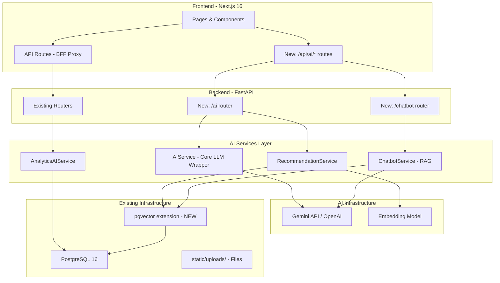

### สรุปไฟล์ทั้งหมดที่ต้องสร้างใหม่

```
backend/app/
├── routers/
│   ├── ai.py                          # 🆕 AI endpoints
│   ├── chatbot.py                     # 🆕 Chatbot endpoints
│   └── notifications.py              # 🆕 Notification endpoints
├── services/
│   ├── ai_service.py                  # 🆕 Core AI service (LLM wrapper + embedding)
│   ├── recommendation_service.py      # 🆕 Similar research & recommendations
│   ├── chatbot_service.py             # 🆕 RAG-based chatbot
│   ├── analytics_ai_service.py        # 🆕 AI-powered analytics
│   └── notification_service.py        # 🆕 AI-enhanced notifications
├── models/
│   ├── embedding.py                   # 🆕 research_embeddings table (pgvector)
│   ├── notification.py                # 🆕 notifications table
│   └── chat_history.py               # 🆕 chat conversations table
└── core/
    └── ai_config.py                   # 🆕 AI provider configuration

frontend/
├── app/api/ai/
│   ├── route.ts                       # 🆕 AI proxy
│   └── chat/route.ts                  # 🆕 Chatbot proxy
├── src/features/ai/
│   ├── writing-assistant.tsx          # 🆕 AI writing panel
│   ├── chatbot.tsx                    # 🆕 Floating AI chatbot
│   ├── similar-research.tsx           # 🆕 Similar research section
│   ├── smart-search.tsx               # 🆕 Semantic search UI
│   └── review-assistant.tsx           # 🆕 AI pre-review panel
├── src/features/notifications/
│   ├── notification-bell.tsx          # 🆕 Nav notification bell
│   └── notification-list.tsx          # 🆕 Notification dropdown
└── src/services/
    └── ai.ts                          # 🆕 AI API service functions
```

---

## แผนการพัฒนา (4 Phases)

### Phase 1: AI Foundation (สัปดาห์ที่ 1-3)

> วาง infrastructure สำหรับ AI ทั้งหมด

- [ ] ติดตั้ง pgvector extension ใน PostgreSQL
- [ ] สร้าง `ai_config.py` — ตั้งค่า LLM provider
- [ ] สร้าง `ai_service.py` — Core wrapper สำหรับ Gemini/OpenAI API
- [ ] สร้าง `embedding.py` model + Alembic migration
- [ ] สร้าง AI router + Next.js proxy route
- [ ] เพิ่ม environment variables (`GEMINI_API_KEY`, `AI_MODEL`, etc.)
- [ ] สร้าง background job สำหรับ generate embeddings ของ research ที่มีอยู่

### Phase 2: Quick Wins — Writing Assistant (สัปดาห์ที่ 4-6)

> Features ที่ให้ impact สูงแต่พัฒนาง่าย

- [ ] ✍️ AI Auto-generate Abstract (TH/EN)
- [ ] 💡 Title Suggestion
- [ ] 🏷️ Auto Category & Keyword Tagging
- [ ] 🔤 Academic Writing Check
- [ ] สร้าง `writing-assistant.tsx` component
- [ ] Integrate เข้ากับ `submission-form.tsx`

### Phase 3: Smart Discovery (สัปดาห์ที่ 7-10)

> Search & Recommendations + Review Assistant

- [ ] 🧠 Semantic Search (pgvector)
- [ ] 📊 Similar Research Finder
- [ ] 🎯 Personalized Recommendations
- [ ] ✅ Plagiarism Detection (cosine similarity)
- [ ] 🔎 Pre-Review Analysis

### Phase 4: Advanced Features (สัปดาห์ที่ 11-16)

> Chatbot & Analytics & Notifications

- [ ] 💬 AI Chatbot (RAG) พร้อม chat history
- [ ] 📈 Research Trend Analysis
- [ ] 🗺️ Research Gap Analysis
- [ ] 🔔 AI-Enhanced Notifications
- [ ] 📄 PDF Summarizer

---

## Tech Stack สำหรับ AI

| Component | แนะนำ | เหตุผล | ทางเลือก |
|---|---|---|---|
| **LLM Provider** | Google Gemini API | คุ้มค่า, รองรับภาษาไทยดี, มี free tier | OpenAI GPT-4o, Claude |
| **Embedding** | Gemini Embedding | ใช้ provider เดียวกัน ลดความซับซ้อน | text-embedding-3-small |
| **Vector DB** | **pgvector** | ใช้ร่วมกับ PostgreSQL ที่มีอยู่แล้ว ไม่ต้องเพิ่ม infrastructure | Pinecone, Qdrant |
| **RAG Framework** | LangChain | ecosystem ใหญ่, community active | LlamaIndex, custom |
| **AI Python SDK** | `google-generativeai` | Official Google SDK | `litellm` (multi-provider) |

> **ทำไมเลือก pgvector?**
> เพราะ UniResearch ใช้ PostgreSQL 16 อยู่แล้ว → แค่เพิ่ม extension `CREATE EXTENSION vector;` ก็ใช้ได้เลย ไม่ต้องเพิ่ม database server ใหม่

---

## ประมาณการค่าใช้จ่าย

### ค่า AI API ต่อเดือน

| Feature | ปริมาณการใช้งานโดยประมาณ | ค่าใช้จ่าย |
|---|---|---|
| Abstract/Title Generation | ~500 requests | ~$5-15 |
| Grammar Check | ~1,000 requests | ~$10-20 |
| Embedding Generation | ~5,000 requests | ~$2-5 |
| Chatbot (RAG) | ~2,000 conversations | ~$20-50 |
| Review Analysis | ~200 requests | ~$5-10 |
| **รวมประมาณ** | | **~$42-100/เดือน** |

### วิธีลดค่าใช้จ่าย

- Cache responses ซ้ำด้วย in-memory cache หรือ DB
- ใช้ Gemini Flash model สำหรับ tasks ง่ายๆ (tagging, grammar) → ถูกกว่า 10x
- ใช้ local embedding model (Sentence Transformers) แทน API calls

---

## Python Dependencies ที่ต้องเพิ่ม

```txt
# requirements.txt (เพิ่ม)
google-generativeai>=0.8.0    # Gemini API SDK
pgvector>=0.3.0               # pgvector SQLAlchemy integration
langchain>=0.3.0              # RAG framework
langchain-google-genai>=2.0   # LangChain + Gemini
tiktoken>=0.7.0               # Token counting
PyPDF2>=3.0.0                 # PDF text extraction
```

## NPM Dependencies ที่ต้องเพิ่ม

```json
{
  "dependencies": {
    "react-markdown": "^9.0.0",
    "remark-gfm": "^4.0.0"
  }
}
```

---

*เอกสารนี้สร้างเมื่อ: สิงหาคม 2569*  
*วิเคราะห์จาก UniResearch codebase: FastAPI + Next.js 16 + PostgreSQL 16*


---


<a name="uniresearch-database-schemamd"></a>
# 📄 UniResearch_Database_Schema.md

# 📊 UniResearch — Database Schema & DBML Diagram

เอกสารฉบับนี้ทำการวิเคราะห์โครงสร้างฐานข้อมูลของระบบ **UniResearch** และเขียนอธิบายความสัมพันธ์ออกมาในรูปแบบ **DBML (Database Markup Language)** ซึ่งคุณสามารถนำโค้ดในหัวข้อที่ 2 ไปกรอกในเว็บ [dbdiagram.io](https://dbdiagram.io) เพื่อสร้างเป็นแผนภาพไดอะแกรมฐานข้อมูล (ER-Diagram) แบบอินเตอร์แอคทีฟได้ทันที

---

## 1. การวิเคราะห์โครงสร้างตาราง (Table Analysis)

ฐานข้อมูลของ UniResearch ประกอบด้วย 12 ตารางหลัก แบ่งออกเป็น 4 กลุ่มฟังก์ชัน ดังนี้:

### กลุ่มที่ 1: ระบบผู้ใช้งานและการระบุสิทธิ์ (Identity & Access Control)
- **`users`**: เก็บข้อมูลผู้ใช้งานระบบ เช่น นักศึกษา อาจารย์ และแอดมิน แยกแยะสิทธิ์ด้วยคอลัมน์ `role`
- **`departments`**: ตารางเก็บรายชื่อสาขาวิชา/ภาควิชาในระบบ (ใช้สนับสนุนข้อมูลตัวเลือก)
- **`work_types`**: ตารางเก็บประเภทของผลงาน เช่น ปริญญานิพนธ์, งานวิจัย, บทความวิชาการ

### กลุ่มที่ 2: ระบบข้อมูลผลงานวิจัยและการส่งข้อมูล (Research & Submissions)
- **`research_works`**: ตารางหลักเก็บข้อมูลงานวิจัยทั้งหมด (ชื่อเรื่อง บทคัดย่อ ไฟล์เอกสาร และสถานะอนุมัติ)
- **`categories`**: ตารางเก็บข้อมูลหมวดหมู่ของผลงานวิจัย เช่น AI, Web Application, UX/UI
- **`research_authors`**: ตารางเชื่อมโยงความสัมพันธ์แบบ Many-to-Many ระหว่างผลงานวิจัยกับผู้ใช้ที่เป็นผู้แต่งผลงาน (`users`)
- **`research_advisors`**: ตารางเชื่อมโยงความสัมพันธ์แบบ Many-to-Many ระหว่างผลงานวิจัยกับอาจารย์ที่ปรึกษาที่เป็นผู้ดูแลผลงาน (`users`)

### กลุ่มที่ 3: ระบบการตรวจและประวัติการส่งงาน (Review & Version Control)
- **`file_revisions`**: บันทึกประวัติการส่งแก้ไขไฟล์เอกสารวิจัยย้อนหลังเมื่อส่งตรวจ
- **`review_comments`**: บันทึกความคิดเห็น ประวัติการตรวจประเมิน และผลลัพธ์จากบทบาทผู้ตรวจประเมิน

### กลุ่มที่ 4: การมีปฏิสัมพันธ์และประวัติการใช้งาน (Interactions & Logging)
- **`favorites`**: ตารางเก็บรายการผลงานที่ผู้ใช้บันทึกไว้เป็นรายการโปรด (Bookmark)
- **`download_view_logs`**: บันทึกประวัติเพื่อทำสถิติจำนวนการดาวน์โหลดและการเข้าเปิดชมผลงานวิจัย
- **`search_logs`**: บันทึกคำค้นหา (Keywords) เพื่อนำไปวิเคราะห์แนวโน้มที่กำลังได้รับความสนใจ

---

## 2. โค้ด DBML สำหรับใช้กับ dbdiagram.io

คัดลอกโค้ดด้านล่างนี้ไปวางในเครื่องมือออกแบบของ [dbdiagram.io](https://dbdiagram.io):

```dbml
// === 1. กลุ่มระบบผู้ใช้และการระบุสิทธิ์ (Identity & Access Control) ===

Table users {
  id int [pk, increment]
  email varchar [unique, not null]
  hashed_password varchar [not null]
  role varchar [default: 'guest', note: 'guest, student, advisor, admin']
  student_id varchar [null]
  department varchar [null]
  first_name varchar [null]
  last_name varchar [null]
  is_active boolean [default: true]
}

Table departments {
  id int [pk, increment]
  name varchar [unique, not null]
}

Table work_types {
  id int [pk, increment]
  name varchar [unique, not null]
}


// === 2. กลุ่มระบบข้อมูลผลงานและการจัดเก็บ (Research & Submissions) ===

Table research_works {
  id int [pk, increment]
  title_th varchar [not null]
  title_en varchar [not null]
  abstract text [null]
  category_id int [ref: > categories.id]
  department varchar [null]
  work_type varchar [null]
  academic_year int [null]
  keywords varchar [null]
  cover_image_path varchar [null]
  file_path varchar [null]
  status varchar [default: 'pending', note: 'pending, approved, rejected, needs_revision']
  view_count int [default: 0]
  download_count int [default: 0]
  published_at datetime [null]
  created_at datetime [default: `now()`]
  updated_at datetime [default: `now()`]
  submitted_by_id int [ref: > users.id]
}

Table categories {
  id int [pk, increment]
  category_name varchar [unique, not null]
  description varchar [null]
}

Table research_authors {
  id int [pk, increment]
  research_id int [ref: > research_works.id]
  user_id int [ref: > users.id]
  role_in_work varchar [default: 'primary', note: 'primary, co-author']
}

Table research_advisors {
  id int [pk, increment]
  research_id int [ref: > research_works.id]
  user_id int [ref: > users.id]
}


// === 3. กลุ่มประวัติการแก้ไขและความคิดเห็น (Review & Version Control) ===

Table file_revisions {
  id int [pk, increment]
  research_id int [ref: > research_works.id]
  file_path varchar [not null]
  version_no int [not null]
  uploaded_by int [ref: > users.id]
  uploaded_at datetime [default: `now()`]
}

Table review_comments {
  id int [pk, increment]
  research_id int [ref: > research_works.id]
  reviewer_id int [ref: > users.id]
  comment_text text [not null]
  status_result varchar [not null, note: 'approved, rejected, needs_revision']
  created_at datetime [default: `now()`]
}


// === 4. กลุ่มการปฏิสัมพันธ์และสถิติ (Interactions & Logging) ===

Table favorites {
  id int [pk, increment]
  user_id int [ref: > users.id]
  research_id int [ref: > research_works.id]
  saved_at datetime [default: `now()`]
}

Table download_view_logs {
  id int [pk, increment]
  research_id int [ref: > research_works.id]
  user_id int [ref: > users.id, null]
  action_type varchar [not null, note: 'view, download']
  action_at datetime [default: `now()`]
}

Table search_logs {
  id int [pk, increment]
  keyword varchar [not null]
  searched_at datetime [default: `now()`]
}
```


---


<a name="uniresearch-uml-diagramsmd"></a>
# 📄 UniResearch_UML_Diagrams.md

# 📊 แผนภาพ UML ฉบับเต็มสำหรับระบบ UniResearch (Full UML Diagrams)

เอกสารฉบับนี้รวบรวมแผนภาพ **UML (Unified Modeling Language)** และแบบจำลองกระบวนการทำงานของระบบ **UniResearch** ครบถ้วนทุกมิติ พัฒนาขึ้นโดยใช้ไวยากรณ์ **Mermaid** ซึ่งสามารถแสดงผลเป็นไดอะแกรมโดยตรงบน GitHub/GitLab หรือนำไปเปิดใช้งานร่วมกับโปรแกรมที่รองรับ Mermaid ทั่วไปได้ทันที

---


---

## 1. Use Case Diagram (แผนภาพยูสเคส)

แสดงบทบาทของผู้ใช้ (Actors) ทั้ง 4 กลุ่มและความสัมพันธ์กับฟังก์ชันหลักของระบบ (Use Cases):

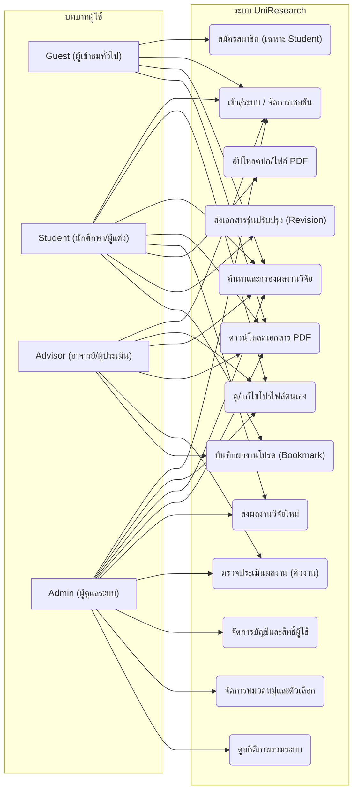

---

## 2. Class Diagram (แผนภาพคลาส)

แสดงคลาสของระบบฝั่งหลังบ้าน (Backend Models) โครงสร้างข้อมูล ชนิดข้อมูล และความสัมพันธ์ระหว่างกัน:

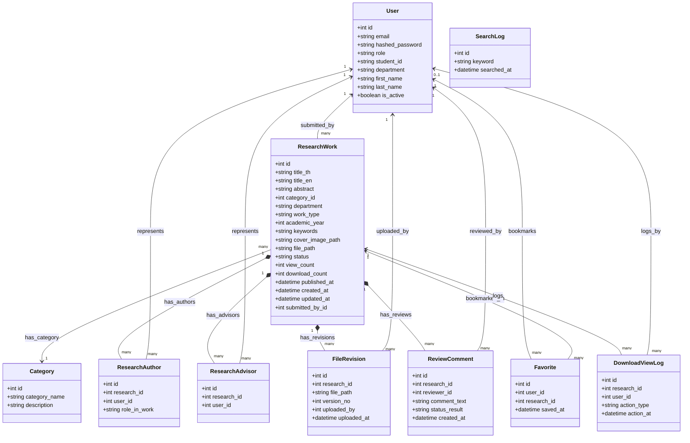

---

## 3. Entity-Relationship Diagram (ER Diagram)

แสดงความเชื่อมโยงเชิงโครงสร้างฐานข้อมูล คีย์หลัก (PK) คีย์นอก (FK) และความสัมพันธ์แบบ Cardinality (1:1, 1:N, N:M) พร้อมรายละเอียดแอตทริบิวต์และประเภทข้อมูล:

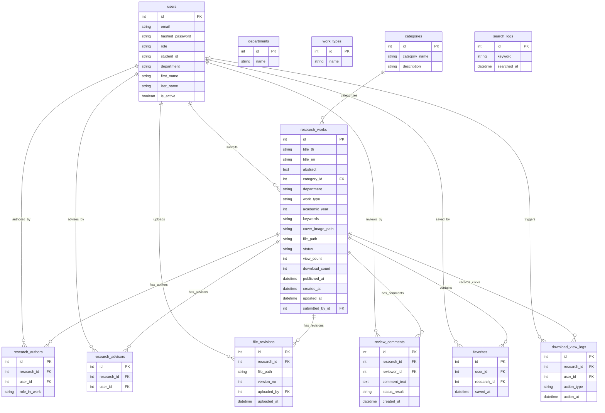

---

## 4. State Diagram (แผนภาพสถานะ)

แสดงวงจรชีวิตของผลงานวิจัย (Research Work Lifecycle) ตั้งแต่การส่งร่างแรกไปจนถึงการอนุมัติเผยแพร่:

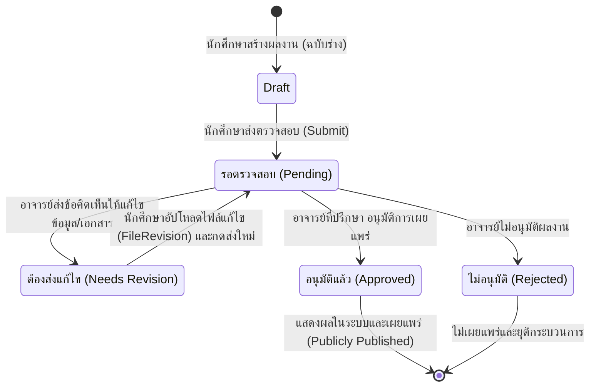

---

## 5. Activity Diagram (แผนภาพกิจกรรม)

แสดงเวิร์กโฟลว์ของกระบวนการอัปโหลด ส่งผลงานวิจัย และการดำเนินงานของผู้ประเมินในการอนุมัติผลงาน:

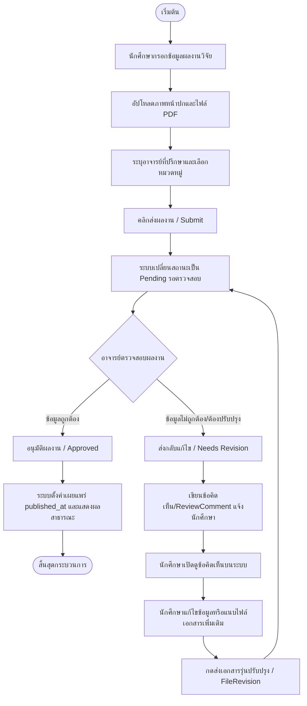

---

## 6. Sequence Diagram (แผนภาพลำดับเหตุการณ์)

แสดงลำดับการส่งและตรวจสอบงานวิจัยระหว่าง นักศึกษา, ระบบหน้าบ้าน (Next.js), ระบบหลังบ้าน (FastAPI REST API), และฐานข้อมูล (PostgreSQL DB):

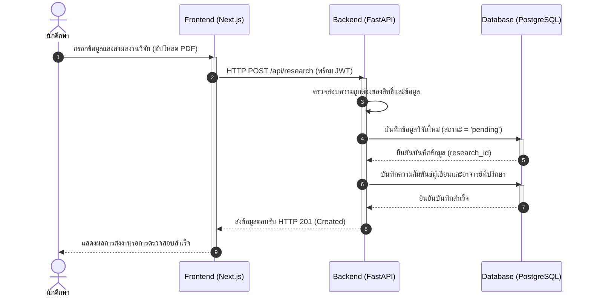

---

## 7. Component Diagram (แผนภาพคอมโพเนนต์)

แสดงสถาปัตยกรรมระดับซอฟต์แวร์ ส่วนประกอบของหน้าบ้าน (Next.js Component Modules) และหลังบ้าน (FastAPI Endpoints / Services / ORM):

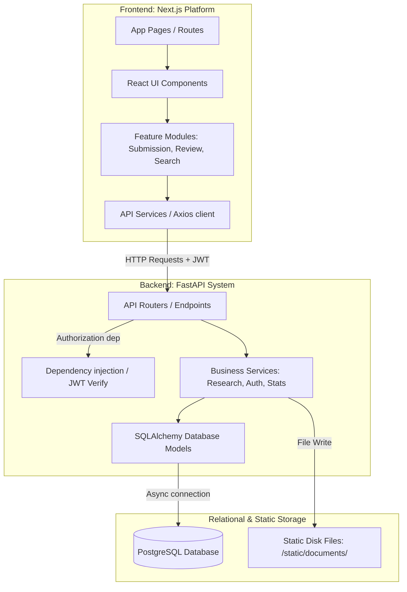


---


<a name="infrastructuremd"></a>
# 📄 INFRASTRUCTURE.md

# 🏗️ UniResearch: เอกสารโครงสร้างพื้นฐานและการติดตั้งใช้งาน (Infrastructure & Deployment Guide)

เอกสารนี้ระบุรายละเอียดเกี่ยวกับโครงสร้างพื้นฐาน (Infrastructure) ของระบบ **UniResearch** ซึ่งครอบคลุมการจัดการทรัพยากรบนระบบคลาวด์ AWS ด้วย Terraform, การจัดลำดับคอนเทนเนอร์ด้วย Kubernetes (K8s), และระบบตรวจสอบประสิทธิภาพ (Monitoring) ด้วย Prometheus และ Grafana

---

## 🗺️ ภาพรวมสถาปัตยกรรมทางกายภาพ (Deployment Architecture)

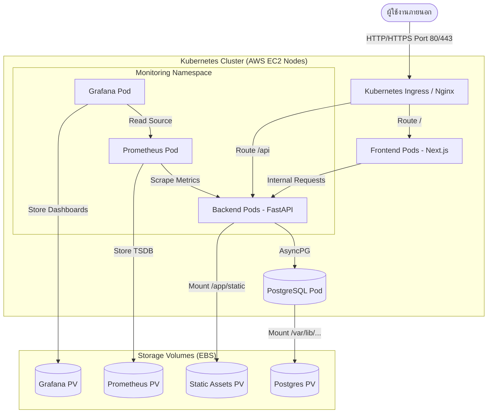

---

## 1. ☁️ โครงสร้างพื้นฐานบน AWS ด้วย Terraform

ไฟล์คอนฟิกูเรชันของ Terraform อยู่ภายใต้โฟลเดอร์ [`infrastructure/terraform/`](file:///Users/mac/Desktop/workspace/UniResearch/infrastructure/terraform) โดยมีหน้าที่สร้าง VPC, Subnet, Security Groups และเครื่อง EC2 Instances สำหรับการติดตั้ง Kubernetes Cluster (เช่น ใช้ Kubespray หรือ RKE2)

### รายละเอียดไฟล์
- [`provider.tf`](file:///Users/mac/Desktop/workspace/UniResearch/infrastructure/terraform/provider.tf): กำหนด AWS Provider (เวอร์ชัน >= 6.0) และภูมิภาคเริ่มต้นที่ `ap-southeast-1` (สิงคโปร์)
- [`network.tf`](file:///Users/mac/Desktop/workspace/UniResearch/infrastructure/terraform/network.tf): สร้าง VPC `10.0.0.0/16` และ Public Subnet `10.0.1.0/24` พร้อมเปิดใช้งาน Public IP อัตโนมัติและเชื่อมต่อกับ Internet Gateway (IGW)
- [`security.tf`](file:///Users/mac/Desktop/workspace/UniResearch/infrastructure/terraform/security.tf): กำหนด Security Group `uniresearch` ที่อนุญาตสิทธิ์เข้าถึงพอร์ต:
  - `22` (SSH) จากทราฟฟิกภายนอก
  - `3000` (Next.js Frontend) จากภายนอก
  - `8000` (FastAPI Backend) จากภายนอก
  - `6443` (Kubernetes API server) ภายใน VPC เท่านั้น
  - `30000-32767` (Kubernetes NodePort) จากภายนอก
  - อนุญาตการเชื่อมต่อทุกพอร์ตภายใน Security Group เดียวกัน (Self)
- [`ec2.tf`](file:///Users/mac/Desktop/workspace/UniResearch/infrastructure/terraform/ec2.tf): สร้างเครื่อง EC2 instance (Ubuntu 24.04 LTS, `c7i-flex.large`, พื้นที่เก็บข้อมูล gp3 ขนาด 50GB):
  - **Control Plane**: จำนวน 1 เครื่อง (`control-plane`)
  - **Worker Node**: จำนวน 2 เครื่อง (`worker-1`, `worker-2`)
- [`variables.tf`](file:///Users/mac/Desktop/workspace/UniResearch/infrastructure/terraform/variables.tf) และ [`outputs.tf`](file:///Users/mac/Desktop/workspace/UniResearch/infrastructure/terraform/outputs.tf): กำหนดตัวแปรและข้อมูลผลลัพธ์ (เช่น Control Plane Public IP และ Worker IPs)

### วิธีการใช้งาน
1. ตรวจสอบให้แน่ใจว่าติดตั้ง SSH key เรียบร้อยที่ `~/.ssh/id_ed25519.pub`
2. ตั้งค่าตัวแปรใน [`terraform.tfvars`](file:///Users/mac/Desktop/workspace/UniResearch/infrastructure/terraform/terraform.tfvars):
   ```hcl
   key_name = "kubespray-key"
   ```
3. รันคำสั่งเปิดใช้งาน:
   ```bash
   cd infrastructure/terraform
   terraform init
   terraform plan
   terraform apply
   ```

---

## 2. ☸️ การจัดระเบียบคอนเทนเนอร์ด้วย Kubernetes (K8s)

รายละเอียด YAML ไฟล์สำหรับการรันระบบแอปพลิเคชันหลักภายใต้ Namespace `uniresearch` อยู่ในโฟลเดอร์ [`infrastructure/k8s/01-app/`](file:///Users/mac/Desktop/workspace/UniResearch/infrastructure/k8s/01-app)

- [`00-namespace.yaml`](file:///Users/mac/Desktop/workspace/UniResearch/infrastructure/k8s/01-app/00-namespace.yaml): สร้าง namespace ชื่อ `uniresearch` เพื่อแยกทรัพยากร
- [`01-postgres.yaml`](file:///Users/mac/Desktop/workspace/UniResearch/infrastructure/k8s/01-app/01-postgres.yaml):
  - สร้าง PersistentVolumeClaim (`postgres-pvc`) ขนาด 10Gi สำหรับเก็บข้อมูล PostgreSQL
  - สร้าง Service และ Deployment รัน PostgreSQL 15-alpine แบบ Stateful
- [`02-backend.yaml`](file:///Users/mac/Desktop/workspace/UniResearch/infrastructure/k8s/01-app/02-backend.yaml):
  - สร้าง PVC (`backend-static-pvc`) ขนาด 5Gi สำหรับเก็บไฟล์อัปโหลด เช่น PDFs และรูปภาพหน้าปก
  - รัน FastAPI Backend จำนวน 2 Replicas เพื่อการกระจายภาระงาน (Load Balancing)
  - ทำการอัปเกรด DB Schema อัตโนมัติในตอนเริ่มต้นด้วยคำสั่ง `alembic upgrade head`
- [`03-frontend.yaml`](file:///Users/mac/Desktop/workspace/UniResearch/infrastructure/k8s/01-app/03-frontend.yaml):
  - รัน Next.js Frontend App จำนวน 2 Replicas
  - เชื่อมต่อกับ Backend ภายในผ่าน `http://backend:8000`
- [`04-ingress.yaml`](file:///Users/mac/Desktop/workspace/UniResearch/infrastructure/k8s/01-app/04-ingress.yaml):
  - กำหนด Ingress Controller (Nginx Class) เพื่อจัดส่งทราฟฟิกภายนอกเข้ามาที่ Cluster
  - แมปโดเมน `uniresearch.local` โดยเส้นทางหลัก `/` จะถูกส่งต่อไปยัง Frontend และ `/api` จะถูกส่งต่อไปยัง Backend
- [`05-hpa.yaml`](file:///Users/mac/Desktop/workspace/UniResearch/infrastructure/k8s/01-app/05-hpa.yaml):
  - กำหนด Horizontal Pod Autoscaler (HPA) สำหรับควบคุมการขยายตัวอัตโนมัติ (Autoscaling)
  - **backend-hpa**: ขนาด 2 ถึง 10 Pods (เริ่มทำงานเมื่อ CPU > 70% หรือ Memory > 80%)
  - **frontend-hpa**: ขนาด 2 ถึง 5 Pods (เริ่มทำงานเมื่อ CPU > 75% หรือ Memory > 80%)
- [`06-metrics.yaml`](file:///Users/mac/Desktop/workspace/UniResearch/infrastructure/k8s/01-app/06-metrics.yaml): ติดตั้ง Kubernetes Metrics Server เพื่อทำหน้าที่รายงานการใช้ทรัพยากร CPU และ Memory สำหรับการทำงานของ HPA
- [`07-nginx_ingress_controller.yaml`](file:///Users/mac/Desktop/workspace/UniResearch/infrastructure/k8s/01-app/07-nginx_ingress_controller.yaml): ติดตั้ง Nginx Ingress Controller เพื่อคอยดักจับและส่งทราฟฟิกภายนอกไปยัง Ingress Resource

---

## 3. 📊 ระบบการติดตามและประเมินประสิทธิภาพ (Monitoring)

ประกอบด้วย Prometheus, Grafana, และ Loki สำหรับตรวจสอบความพร้อมใช้งาน สถิติ เมตริกการทำงาน และล็อกของ Backend REST API และ Kubernetes Resources อยู่ในโฟลเดอร์ [`infrastructure/k8s/02-monitoring/`](file:///Users/mac/Desktop/workspace/UniResearch/infrastructure/k8s/02-monitoring)

- [`00-namespace.yaml`](file:///Users/mac/Desktop/workspace/UniResearch/infrastructure/k8s/02-monitoring/00-namespace.yaml): สร้าง namespace ชื่อ `monitoring` แยกเฉพาะสำหรับระบบติดตาม
- [`01-rbac.yaml`](file:///Users/mac/Desktop/workspace/UniResearch/infrastructure/k8s/02-monitoring/01-rbac.yaml): กำหนดสิทธิ์แบบ ClusterRole และ ClusterRoleBinding ร่วมกับ ServiceAccount เพื่อให้ Prometheus สามารถเข้าดึงข้อมูล Metrics จาก Kubernetes API Server, Nodes, Endpoints และ Pods ได้
- [`02-prometheus.yaml`](file:///Users/mac/Desktop/workspace/UniResearch/infrastructure/k8s/02-monitoring/02-prometheus.yaml):
  - สร้าง ConfigMap (`prometheus-config`) เพื่อเก็บการตั้งค่าการ Scrape Metrics
  - สร้าง PVC (`prometheus-pvc`) ขนาด 20Gi สำหรับเก็บข้อมูล Time-series Database
  - Deployment คอนเทนเนอร์ Prometheus (เวอร์ชัน `v3.5.0`) และผูกกับ ServiceAccount
  - เปิดพอร์ตเข้าใช้งานผ่าน NodePort `30900`
- [`03-grafana.yaml`](file:///Users/mac/Desktop/workspace/UniResearch/infrastructure/k8s/02-monitoring/03-grafana.yaml):
  - สร้าง PVC (`grafana-pvc`) ขนาด 10Gi สำหรับเก็บข้อมูล Dashboard และการตั้งค่าของ Grafana
  - Deployment คอนเทนเนอร์ Grafana (เวอร์ชัน `12.1.1`) โดยตั้งค่าสิทธิ์ผู้ดูแลระบบเริ่มต้น (`admin` / `admin123`)
  - เปิดพอร์ตเข้าใช้งานผ่าน NodePort `30300`
- [`04-loki.yaml`](file:///Users/mac/Desktop/workspace/UniResearch/infrastructure/k8s/02-monitoring/04-loki.yaml):
  - ติดตั้ง Loki สำหรับเก็บรวบรวม Log จาก Pods ต่างๆ ในระบบ
  - กำหนด Service และ StatefulSet สำหรับประมวลผลข้อมูล Log

นอกจากนี้ ระบบยังรองรับการติดตั้งผ่าน Helm Chart (เช่น kube-prometheus-stack และ loki-stack) เพื่อแก้ปัญหา Port Conflict ของ Sidecar และเพิ่มความยืดหยุ่นในการจัดการทรัพยากรบน Production สามารถศึกษาได้ที่ [`infrastructure_operations_guide.md`](file:///Users/mac/Desktop/workspace/UniResearch/infrastructure/infrastructure_operations_guide.md)

---

## 🚀 วิธีการรันระบบทั้งหมดรวดเดียว

คุณสามารถสั่งรันทั้งแอปพลิเคชันหลักและระบบ Monitoring ทั้งหมดได้ผ่านสคริปต์ [deploy.sh](file:///Users/mac/Desktop/workspace/UniResearch/infrastructure/deploy.sh) ที่สร้างขึ้นมาเพื่อความสะดวกในการจัดการบน Production:

```bash
cd infrastructure
./deploy.sh
```

หากต้องการdeployผ่านระบบ Helm Stack (Prometheus, Grafana, Loki, Promtail) ให้ใช้สคริปต์ [deploy-monitoring-helm.sh](file:///Users/mac/Desktop/workspace/UniResearch/infrastructure/deploy-monitoring-helm.sh):

```bash
cd infrastructure
./deploy-monitoring-helm.sh
```

หลังจากติดตั้งแล้ว สามารถเข้าตรวจสอบได้ดังนี้:
- **แอปพลิเคชัน**: เข้าถึงผ่าน Ingress โดเมน `uniresearch.local`
- **Prometheus UI**: `http://<node-ip>:30900`
- **Grafana Dashboard**: `http://<node-ip>:30300` (เข้าสู่ระบบด้วยผู้ใช้ `admin` / รหัสผ่านที่ดึงจาก K8s Secret หรือรหัสผ่านตั้งต้น `admin123` สำหรับ Manual Deploy)
- **Loki logs**: สามารถคิวรีผ่าน Grafana UI Data Source


---

