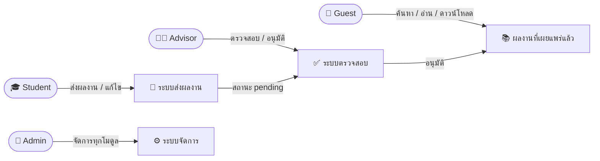
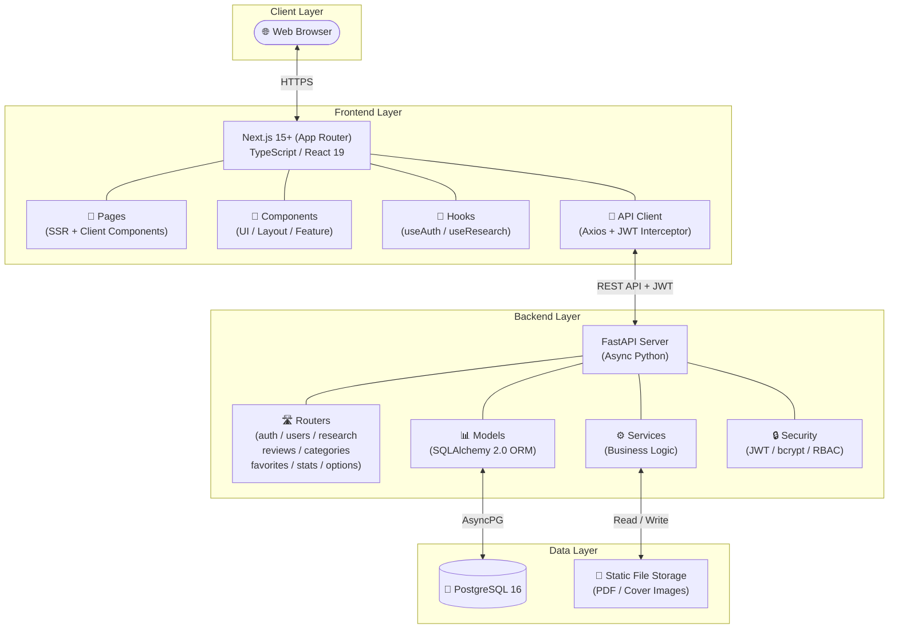
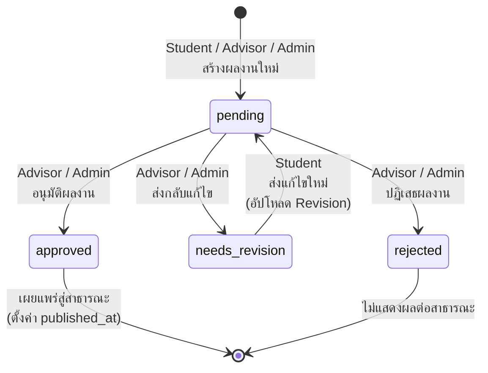
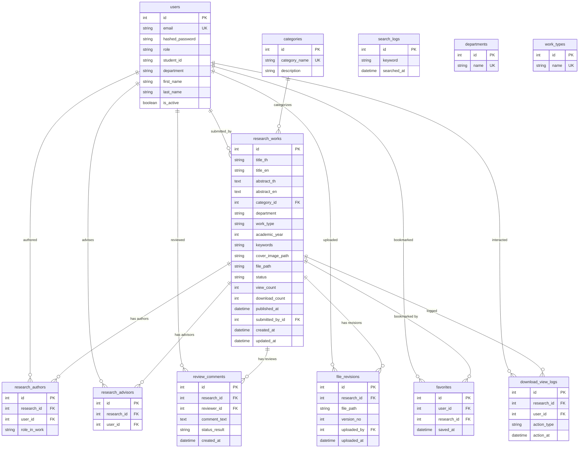

# 📋 UniResearch — Project & Requirements Document

> **ชื่อระบบ**: UniResearch — ระบบคลังจัดเก็บและเผยแพร่ผลงานวิชาการส่วนกลาง
> **เวอร์ชันเอกสาร**: 1.0
> **วันที่จัดทำ**: สิงหาคม 2569

---

## สารบัญ

1. [บทนำ (Introduction)](#1-บทนำ-introduction)
2. [ผู้เกี่ยวข้องและบทบาท (Stakeholders & Roles)](#2-ผู้เกี่ยวข้องและบทบาท-stakeholders--roles)
3. [ภาพรวมระบบและสถาปัตยกรรม (System Overview & Architecture)](#3-ภาพรวมระบบและสถาปัตยกรรม-system-overview--architecture)
4. [ความต้องการเชิงหน้าที่ (Functional Requirements)](#4-ความต้องการเชิงหน้าที่-functional-requirements)
5. [เวิร์กโฟลว์สถานะโครงงาน (Research Status Workflow)](#5-เวิร์กโฟลว์สถานะโครงงาน-research-status-workflow)
6. [ความต้องการที่ไม่ใช่เชิงหน้าที่ (Non-Functional Requirements)](#6-ความต้องการที่ไม่ใช่เชิงหน้าที่-non-functional-requirements)
7. [แบบจำลองข้อมูล (Data Model)](#7-แบบจำลองข้อมูล-data-model)
8. [กฎทางธุรกิจและการควบคุมสิทธิ์ (Business Rules & Access Control)](#8-กฎทางธุรกิจและการควบคุมสิทธิ์-business-rules--access-control)
9. [ข้อจำกัดและสมมติฐาน (Constraints & Assumptions)](#9-ข้อจำกัดและสมมติฐาน-constraints--assumptions)
10. [สิ่งส่งมอบและเอกสารอ้างอิง (Deliverables & References)](#10-สิ่งส่งมอบและเอกสารอ้างอิง-deliverables--references)

---

## 1. บทนำ (Introduction)

### 1.1 ที่มาและความสำคัญ (Background & Significance)

ในบริบทของสถาบันอุดมศึกษาในปัจจุบัน การจัดเก็บผลงานวิชาการของนักศึกษาและอาจารย์ เช่น โครงงานพิเศษ (Senior Project) การศึกษาอิสระ (Independent Study) วิทยานิพนธ์ (Thesis) สารนิพนธ์ (Dissertation) ตลอดจนบทความวิจัยของอาจารย์ ถือเป็นภารกิจหลักที่มีความสำคัญอย่างยิ่งต่อการสะสมและถ่ายทอดองค์ความรู้ภายในสถาบัน อย่างไรก็ตาม ในหลายสถาบันการศึกษายังคงพบปัญหาเรื้อรังที่เกิดจากการบริหารจัดการผลงานวิชาการเหล่านี้ อาทิ:

1. **การจัดเก็บแบบกระจัดกระจาย (Fragmented Storage)** — ผลงานวิจัยถูกจัดเก็บกระจายตัวอยู่ในหลายรูปแบบ ทั้งเอกสารกระดาษ, ไฟล์ดิจิทัลบนเครื่องคอมพิวเตอร์ส่วนบุคคลของอาจารย์แต่ละท่าน, แผ่นซีดี/ดีวีดี หรือโฟลเดอร์ภายในเครือข่ายที่ไม่มีการจัดหมวดหมู่อย่างเป็นระบบ ทำให้ยากต่อการค้นหาและเข้าถึง

2. **กระบวนการตรวจสอบและอนุมัติที่ขาดความต่อเนื่อง (Disconnected Review Process)** — การส่งผลงานเพื่อให้อาจารย์ที่ปรึกษาตรวจสอบและอนุมัตินั้น มักดำเนินการผ่านช่องทางที่ไม่เป็นทางการ เช่น อีเมล หรือการส่งเอกสารด้วยตนเอง ส่งผลให้ขาดกลไกในการติดตามสถานะ (Status Tracking) และขาดประวัติการแก้ไข (Revision History) ที่สมบูรณ์

3. **การเผยแพร่ผลงานที่มีข้อจำกัด (Limited Dissemination)** — ผลงานวิจัยที่ผ่านการอนุมัติแล้วไม่ถูกนำมาเผยแพร่อย่างเป็นระบบให้นักศึกษารุ่นหลังหรือบุคคลทั่วไปสามารถค้นคว้าและนำไปใช้ประโยชน์ได้อย่างสะดวก ทำให้ศักยภาพขององค์ความรู้เหล่านี้ไม่ถูกใช้อย่างเต็มประสิทธิภาพ

4. **การขาดข้อมูลสถิติเชิงวิเคราะห์ (Lack of Analytics)** — สถาบันไม่สามารถรวบรวมข้อมูลสถิติที่เป็นประโยชน์ เช่น จำนวนผลงานวิจัยแยกตามสาขาวิชา, แนวโน้มหัวข้อวิจัยที่ได้รับความนิยม, ยอดการเข้าชมและดาวน์โหลด ซึ่งข้อมูลเหล่านี้มีคุณค่าต่อการวางแผนหลักสูตรและกำหนดทิศทางการวิจัยของสถาบัน

ด้วยเหตุผลข้างต้น ระบบ **UniResearch** จึงถูกพัฒนาขึ้นเพื่อเป็น **ระบบคลังจัดเก็บและเผยแพร่ผลงานวิชาการส่วนกลาง** (Centralized Academic Repository System) ที่รวบรวมผลงานวิชาการทุกประเภทไว้ในแพลตฟอร์มเดียว พร้อมมีระบบจัดหมวดหมู่ กระบวนการตรวจสอบอนุมัติที่โปร่งใส ระบบค้นหาอัจฉริยะ และแผงควบคุมข้อมูลสถิติเชิงวิเคราะห์ เพื่อยกระดับการบริหารจัดการผลงานวิชาการให้มีประสิทธิภาพ เป็นระบบ และเกิดประโยชน์สูงสุดแก่ทุกฝ่ายที่เกี่ยวข้อง

---

### 1.2 วัตถุประสงค์ของระบบ (System Objectives)

ระบบ UniResearch ถูกพัฒนาขึ้นโดยมีวัตถุประสงค์หลักดังต่อไปนี้:

1. **เพื่อพัฒนาระบบคลังจัดเก็บผลงานวิชาการส่วนกลาง** ที่สามารถรวบรวม จัดเก็บ และจัดหมวดหมู่ผลงานวิจัยทุกประเภท ได้แก่ โครงงานพิเศษ, การศึกษาอิสระ, วิทยานิพนธ์, สารนิพนธ์ และบทความวิจัยของอาจารย์ ไว้ในแพลตฟอร์มเว็บแอปพลิเคชันเดียว

2. **เพื่อสร้างกระบวนการส่งผลงานและตรวจสอบอนุมัติที่เป็นระบบ (Structured Submission & Review Workflow)** ซึ่งประกอบด้วยขั้นตอนการส่งผลงาน → การตรวจสอบโดยอาจารย์ที่ปรึกษา → การให้ข้อคิดเห็น → การอนุมัติ/ส่งกลับแก้ไข/ปฏิเสธ พร้อมบันทึกประวัติการแก้ไขและเวอร์ชันเอกสารอย่างครบถ้วน

3. **เพื่อพัฒนาระบบควบคุมสิทธิ์การเข้าถึงตามบทบาท (Role-Based Access Control — RBAC)** ที่แยกระดับสิทธิ์การใช้งานอย่างชัดเจนตามบทบาทผู้ใช้งาน 4 กลุ่ม ได้แก่ Guest (บุคคลทั่วไป), Student (นักศึกษา), Advisor (อาจารย์ที่ปรึกษา) และ Admin (ผู้ดูแลระบบ) เพื่อรักษาความปลอดภัยและความถูกต้องของข้อมูล

4. **เพื่อพัฒนาระบบค้นหาอัจฉริยะ (Advanced Search Engine)** ที่รองรับการค้นหาแบบ Full-text จากชื่อเรื่อง บทคัดย่อ และคำสำคัญ พร้อมระบบกรองข้อมูลขั้นสูงตามหมวดหมู่ สาขาวิชา ประเภทผลงาน ปีการศึกษา และอาจารย์ที่ปรึกษา เพื่ออำนวยความสะดวกในการค้นคว้าข้อมูล

5. **เพื่อพัฒนาระบบเผยแพร่ผลงานวิจัยสู่สาธารณะ** ให้บุคคลทั่วไปสามารถเข้าถึง ค้นหา อ่าน และดาวน์โหลดผลงานวิจัยที่ผ่านการอนุมัติแล้ว เพื่อส่งเสริมการเผยแพร่ความรู้และเพิ่มมูลค่าให้กับผลงานวิชาการของสถาบัน

6. **เพื่อพัฒนาระบบแผงควบคุมข้อมูลสถิติ (Analytics Dashboard)** ที่รวบรวมและแสดงผลข้อมูลสถิติเชิงวิเคราะห์ เช่น ยอดเข้าชม, ยอดดาวน์โหลด, คำค้นหายอดนิยม, จำนวนผลงานแยกตามหมวดหมู่ และแนวโน้มผลงานวิจัยแต่ละปีการศึกษา เพื่อสนับสนุนการตัดสินใจเชิงบริหาร

---

### 1.3 ขอบเขตระบบ (System Scope)

#### 1.3.1 ขอบเขตที่อยู่ในระบบ (In-Scope)

| ลำดับ | โมดูล/ฟังก์ชัน | รายละเอียด |
| :---: | :--- | :--- |
| 1 | **ระบบยืนยันตัวตนและจัดการบัญชีผู้ใช้** | สมัครสมาชิก, เข้าสู่ระบบผ่าน JWT Token (Access/Refresh), จัดการโปรไฟล์ส่วนตัว |
| 2 | **ระบบควบคุมสิทธิ์ตามบทบาท (RBAC)** | กำหนดสิทธิ์ 4 บทบาท: Guest, Student, Advisor, Admin พร้อม RBAC Middleware |
| 3 | **ระบบส่งผลงานวิจัย** | เพิ่มผลงานใหม่พร้อมข้อมูลรายละเอียด, ระบุผู้แต่งร่วม (Co-authors), เลือกอาจารย์ที่ปรึกษา, อัปโหลดไฟล์ PDF และภาพหน้าปก |
| 4 | **ระบบตรวจสอบและอนุมัติผลงาน** | คิวงานรอประเมิน (Review Queue), บันทึกข้อคิดเห็น, อนุมัติ/ส่งกลับแก้ไข/ปฏิเสธ พร้อมประวัติการประเมิน |
| 5 | **ระบบเวอร์ชันเอกสาร (File Revision)** | บันทึกประวัติไฟล์ทุกครั้งที่มีการอัปโหลดแก้ไข เพื่อเปรียบเทียบเวอร์ชันย้อนหลัง |
| 6 | **ระบบค้นหาและกรองข้อมูล** | Full-text Search, กรองตามหมวดหมู่/สาขาวิชา/ประเภทผลงาน/ปีการศึกษา, จัดเรียงลำดับ |
| 7 | **หน้าแสดงรายละเอียดผลงาน** | แสดงข้อมูลฉบับเต็ม, ดาวน์โหลด PDF, แสดงผลงานที่เกี่ยวข้อง (Related Works) |
| 8 | **ระบบจัดการหมวดหมู่ผลงาน** | Admin สามารถเพิ่ม/แก้ไข/ลบหมวดหมู่ผลงานวิจัย |
| 9 | **ระบบจัดการผู้ใช้งาน (Admin)** | Admin สามารถดูรายชื่อ, เพิ่ม/ลบ, แก้ไขบทบาทผู้ใช้งานทั้งหมดในระบบ |
| 10 | **ระบบบันทึกรายการโปรด** | ผู้ใช้ที่เข้าสู่ระบบสามารถบันทึกผลงานเป็น Bookmark/Favorite |
| 11 | **ระบบบันทึกสถิติและแดชบอร์ด** | บันทึก View/Download Log, Search Log, แสดง Analytics Dashboard สำหรับ Admin |
| 12 | **ระบบจัดการข้อมูลตัวเลือก** | จัดการรายชื่อสาขาวิชา (Departments) และประเภทผลงาน (Work Types) |
| 13 | **ระบบผู้ช่วยถามตอบอัจฉริยะ (RAG Chatbot)** | ค้นหาบทความวิจัยใกล้เคียงด้วย Cosine Distance ผ่านเวกเตอร์และตอบคำถามเชิงวิชาการด้วย AI |

#### 1.3.2 ขอบเขตที่ไม่อยู่ในระบบ (Out-of-Scope)

| ลำดับ | รายการ | เหตุผล |
| :---: | :--- | :--- |
| 1 | ระบบแจ้งเตือนผ่านอีเมล/Push Notification | ยังไม่อยู่ในขอบเขตเฟสแรกของการพัฒนา |
| 2 | ระบบแชทระหว่างผู้ใช้งานด้วยกัน (Peer-to-Peer Chat) | ไม่ใช่ฟังก์ชันหลักของคลังจัดเก็บผลงาน |
| 3 | ระบบชำระเงินหรือธุรกรรมทางการเงิน | ระบบเป็นคลังจัดเก็บเพื่อการศึกษา ไม่มีระบบค่าใช้จ่าย |
| 4 | การเชื่อมต่อกับระบบสารสนเทศภายนอก (เช่น ระบบทะเบียน, LMS) | ต้องมีการศึกษา API ของระบบเป้าหมายเพิ่มเติม |
| 5 | การรองรับหลายภาษาอย่างเต็มรูปแบบ (Full i18n) | เฟสแรกรองรับ 2 ภาษาเฉพาะข้อมูลผลงาน (ไทย/อังกฤษ) ไม่รวม UI Localization |
| 6 | การแสดงผลข้อมูลสถิติเชิงคาดการณ์ขั้นสูง | พิจารณาพัฒนาในลำดับถัดไป |

#### 1.3.3 ข้อจำกัดของระบบ (Constraints)

- ระบบรองรับเฉพาะไฟล์เอกสารรูปแบบ `.pdf` เท่านั้น
- ไฟล์ภาพหน้าปกรองรับเฉพาะนามสกุล `.jpg`, `.jpeg` และ `.png`
- ระบบฐานข้อมูลที่ใช้คือ **PostgreSQL** ร่วมกับเครื่องมือ Migration ผ่าน **Alembic**
- ระบบถูกออกแบบในรูปแบบ **Decoupled Client-Server Architecture** (Frontend แยกจาก Backend)
- การยืนยันตัวตนใช้ระบบ **JWT (JSON Web Token)** ประกอบด้วย Access Token และ Refresh Token
- รหัสผ่านในระบบถูกเข้ารหัสด้วย **bcrypt hashing algorithm**

---

### 1.4 คำศัพท์และตัวย่อ (Glossary & Abbreviations)

#### ตารางคำศัพท์เฉพาะทาง (Domain Terms)

| คำศัพท์ | คำอธิบาย |
| :--- | :--- |
| ผลงานวิจัย / Research Work | ผลงานวิชาการใดๆ ที่ถูกส่งเข้าสู่ระบบ ครอบคลุมทั้งโครงงานพิเศษ การศึกษาอิสระ วิทยานิพนธ์ สารนิพนธ์ และบทความวิจัย |
| การส่งผลงาน / Submission | กระบวนการที่ผู้ใช้สร้างรายการผลงานใหม่พร้อมอัปโหลดเอกสารเข้าสู่ระบบ |
| การตรวจสอบ / Review | กระบวนการที่อาจารย์ที่ปรึกษาหรือผู้ดูแลระบบตรวจประเมินผลงานที่ส่งเข้ามา |
| คิวงานรอประเมิน / Review Queue | รายการผลงานที่มีสถานะ `pending` และรอให้ผู้ประเมินตรวจสอบ |
| การอนุมัติ / Approval | การเปลี่ยนสถานะผลงานจาก `pending` เป็น `approved` โดยผู้ประเมิน ทำให้ผลงานถูกเผยแพร่สู่สาธารณะ |
| การส่งกลับแก้ไข / Needs Revision | การเปลี่ยนสถานะผลงานเป็น `needs_revision` พร้อมข้อคิดเห็น เพื่อให้ผู้ส่งงานปรับปรุงแก้ไข |
| เวอร์ชันเอกสาร / File Revision | ประวัติไฟล์เอกสารที่ถูกอัปโหลดซ้ำเมื่อมีการแก้ไขตามคำแนะนำ ระบบเก็บทุกเวอร์ชันไว้เพื่อการตรวจสอบย้อนหลัง |
| ผู้แต่งร่วม / Co-author | ผู้ใช้งานที่เป็นผู้จัดทำร่วมของผลงานวิจัยชิ้นเดียวกัน |
| อาจารย์ที่ปรึกษา / Advisor | ผู้ใช้งานบทบาท Advisor ที่ได้รับมอบหมายให้เป็นที่ปรึกษาและผู้ประเมินผลงานวิจัย |
| หมวดหมู่ / Category | การจัดกลุ่มผลงานวิจัยตามสาขาหรือหัวข้อ เช่น AI, Web Application, UX/UI |
| สาขาวิชา / Department | ภาควิชาหรือสาขาวิชาที่เกี่ยวข้องกับผู้ใช้งานหรือผลงานวิจัย |
| ประเภทผลงาน / Work Type | ชนิดของผลงานวิชาการ เช่น ปริญญานิพนธ์ งานวิจัย บทความวิชาการ |
| รายการโปรด / Favorite (Bookmark) | ฟังก์ชันที่ให้ผู้ใช้บันทึกผลงานที่สนใจไว้ในรายการส่วนตัว |

#### ตารางตัวย่อทางเทคนิค (Technical Abbreviations)

| ตัวย่อ | คำเต็ม | คำอธิบาย |
| :--- | :--- | :--- |
| **API** | Application Programming Interface | ส่วนเชื่อมต่อระหว่างระบบหน้าบ้านและหลังบ้านผ่านโปรโตคอล HTTP |
| **REST** | Representational State Transfer | รูปแบบสถาปัตยกรรม API ที่ใช้ HTTP Methods (GET, POST, PUT, DELETE) |
| **JWT** | JSON Web Token | มาตรฐานการยืนยันตัวตนแบบ Token สำหรับการเข้าสู่ระบบและจัดการเซสชัน |
| **RBAC** | Role-Based Access Control | กลไกการควบคุมสิทธิ์การเข้าถึงโดยกำหนดตามบทบาทผู้ใช้งาน |
| **ORM** | Object-Relational Mapping | เทคนิคการแปลงข้อมูลระหว่างฐานข้อมูลเชิงสัมพันธ์กับออบเจกต์ในภาษาโปรแกรม |
| **CRUD** | Create, Read, Update, Delete | ชุดปฏิบัติการพื้นฐานสำหรับจัดการข้อมูลในฐานข้อมูล |
| **DBML** | Database Markup Language | ภาษาสำหรับเขียนโครงสร้างฐานข้อมูลในรูปแบบข้อความเพื่อสร้าง ER Diagram |
| **E2E** | End-to-End (Testing) | การทดสอบระบบจากมุมมองผู้ใช้งานจริงโดยจำลองการใช้งานผ่านเบราว์เซอร์ |
| **PDF** | Portable Document Format | รูปแบบไฟล์มาตรฐานสำหรับเอกสารที่ใช้ในการจัดเก็บผลงานวิจัยฉบับเต็ม |
| **UML** | Unified Modeling Language | มาตรฐานการเขียนแผนภาพเพื่ออธิบายโครงสร้างและพฤติกรรมของระบบ |
| **SSR** | Server-Side Rendering | เทคนิคการสร้างหน้าเว็บที่ฝั่งเซิร์ฟเวอร์ก่อนส่งให้เบราว์เซอร์เพื่อเพิ่มประสิทธิภาพ |
| **SPA** | Single Page Application | แอปพลิเคชันเว็บที่โหลดหน้าเว็บเพียงครั้งเดียวและอัปเดตเนื้อหาแบบไม่ต้องรีเฟรชทั้งหน้า |
| **CORS** | Cross-Origin Resource Sharing | กลไกรักษาความปลอดภัยที่อนุญาตให้ทรัพยากรถูกเรียกใช้ข้ามโดเมน |

---

## 2. ผู้เกี่ยวข้องและบทบาท (Stakeholders & Roles)

ระบบ UniResearch กำหนดบทบาทของผู้ใช้งานออกเป็น 4 กลุ่มหลัก ดังนี้:

| บทบาท | ชื่อในระบบ | คำอธิบาย | ช่องทางการสร้างบัญชี |
| :--- | :---: | :--- | :--- |
| **บุคคลทั่วไป** | `guest` | ผู้เข้าชมเว็บไซต์ที่ไม่ได้เข้าสู่ระบบ สามารถค้นหา อ่าน และดาวน์โหลดผลงานที่เผยแพร่แล้วได้เท่านั้น (Read-only) | ไม่ต้องสร้างบัญชี |
| **นักศึกษา** | `student` | ผู้ใช้งานที่ลงทะเบียนผ่านหน้าสมัครสมาชิก สามารถส่งผลงานวิจัย, อัปโหลดเอกสาร, ระบุผู้แต่งร่วมและอาจารย์ที่ปรึกษา, แก้ไขผลงานของตนเอง และจัดการโปรไฟล์ | สมัครสมาชิกสาธารณะ (`POST /auth/register`) |
| **อาจารย์ที่ปรึกษา** | `advisor` | ผู้ประเมินผลงานวิจัย สามารถเข้าถึงคิวงานรอตรวจ, ดาวน์โหลดเอกสาร, บันทึกข้อคิดเห็น และอนุมัติ/ส่งกลับแก้ไข/ปฏิเสธผลงานที่ตนเป็นที่ปรึกษา | สร้างโดย Admin เท่านั้น |
| **ผู้ดูแลระบบ** | `admin` | ผู้มีสิทธิ์สูงสุดในระบบ สามารถจัดการบัญชีผู้ใช้ทั้งหมด, จัดการหมวดหมู่ผลงาน, ตั้งค่าข้อมูลตัวเลือก, เข้าถึง Analytics Dashboard และลบผลงานออกจากระบบ | สร้างโดย Admin เท่านั้น |

### แผนภาพความสัมพันธ์ระหว่างผู้มีส่วนเกี่ยวข้อง



---

## 3. ภาพรวมระบบและสถาปัตยกรรม (System Overview & Architecture)

### 3.1 สถาปัตยกรรมระดับสูง (High-Level Architecture)

ระบบ UniResearch ถูกออกแบบภายใต้สถาปัตยกรรมแบบ **Decoupled Client-Server** ที่แยกส่วนหน้าบ้าน (Frontend) และหลังบ้าน (Backend) ออกจากกันอย่างชัดเจน โดยสื่อสารผ่าน REST API:



### 3.2 เทคโนโลยีหลักที่เลือกใช้ (Technology Stack)

| หมวดหมู่ | เทคโนโลยี | เวอร์ชัน | วัตถุประสงค์ในการใช้งาน |
| :--- | :--- | :---: | :--- |
| **Frontend** | Next.js (App Router) | 15+ | เฟรมเวิร์ก React สำหรับ SSR และ Client Components |
| | React | 19 | ไลบรารีสร้าง User Interface |
| | TypeScript | 5.x | เพิ่มความปลอดภัยและถูกต้องของชนิดข้อมูล |
| | Zustand | — | State Management แบบเบาและยืดหยุ่น |
| | React Hook Form + Zod | — | การจัดการและตรวจสอบแบบฟอร์ม |
| | Recharts | — | แสดงกราฟและแผนภูมิสำหรับ Dashboard |
| | Axios | — | HTTP Client พร้อม JWT Interceptor |
| | Tailwind CSS | 4.x | Utility-first CSS Framework |
| | Playwright | — | E2E Browser Testing |
| | pnpm | — | Package Manager ที่รวดเร็วและประหยัดพื้นที่ |
| **Backend** | FastAPI | 0.115+ | Async Web Framework สำหรับ REST API |
| | SQLAlchemy | 2.0+ | Asynchronous ORM และ Database Toolkit |
| | Pydantic | 2.x | Data Validation และ Schema Definition |
| | Alembic | 1.13+ | Database Migration Tool |
| | AsyncPG | 0.29+ | Async PostgreSQL Driver |
| | python-jose | 3.3+ | JWT Token Encoding/Decoding |
| | Passlib (bcrypt) | 1.7+ | Password Hashing |
| | python-multipart | — | รองรับ File Upload (multipart/form-data) |
| | aiofiles | — | Async File I/O |
| | pytest + pytest-asyncio | 8.0+ | Unit & Integration Testing |
| **Database** | PostgreSQL | 16 | ฐานข้อมูลเชิงสัมพันธ์หลักของระบบ |
| **DevOps** | Docker & Compose | — | Containerization สำหรับทุกสภาพแวดล้อม |

### 3.3 โครงสร้างโฟลเดอร์ (Repository Structure)

```text
UniResearch/
├── backend/                        # ระบบหลังบ้าน FastAPI
│   ├── app/
│   │   ├── core/                   # config.py (Settings), security.py (JWT/bcrypt/RBAC)
│   │   ├── db/                     # เชื่อมต่อ DB, Async Session
│   │   ├── models/                 # SQLAlchemy Models (user, research, category, interactions, options)
│   │   ├── schemas/                # Pydantic Schemas (Request/Response validation)
│   │   ├── services/               # Business Logic Layer
│   │   ├── routers/                # API Endpoints (auth, users, research, reviews, categories, favorites, stats, options)
│   │   └── main.py                 # FastAPI App Entry Point
│   ├── tests/                      # pytest Unit & Integration Tests
│   ├── static/                     # ไฟล์ PDF และหน้าปกที่อัปโหลด (git-ignored)
│   ├── Dockerfile
│   └── docker-compose.yml          # FastAPI + PostgreSQL + Next.js
├── frontend/                       # ระบบหน้าบ้าน Next.js
│   ├── app/                        # App Router Pages
│   │   ├── auth/                   # login, register
│   │   ├── research/               # ค้นหา, รายละเอียดผลงาน [id]
│   │   ├── dashboard/              # student, reviewer, admin, submit
│   │   ├── profile/                # โปรไฟล์ผู้ใช้
│   │   └── favorites/              # รายการโปรด
│   ├── src/
│   │   ├── components/             # UI, Layout, Research, Dashboard, Auth
│   │   ├── hooks/                  # useAuth, useResearch, useSearch
│   │   ├── lib/                    # API Client (Axios), Auth Utils
│   │   ├── types/                  # TypeScript Type Definitions
│   │   └── features/               # Feature-based Logic (auth, research, admin)
│   ├── e2e/                        # Playwright E2E Tests
│   └── package.json
└── docs/                           # เอกสารความต้องการระบบ, UML Diagrams, RBAC Matrix
```

---

## 4. ความต้องการเชิงหน้าที่ (Functional Requirements)

### FR-1: การจัดการบัญชีและสิทธิ์ผู้ใช้งาน (User Account & Identity Management)

| รหัส | ความต้องการ | รายละเอียด | API Endpoint |
| :--- | :--- | :--- | :--- |
| FR-1.1 | สมัครสมาชิก | ผู้ใช้ทั่วไปสมัครได้ผ่านหน้าเว็บ โดยระบบบังคับบทบาทเริ่มต้นเป็น `student` เท่านั้น เพื่อป้องกันการยกระดับสิทธิ์ | `POST /auth/register` |
| FR-1.2 | เข้าสู่ระบบ | ตรวจสอบสิทธิ์ด้วย JWT Token ส่งกลับ Access Token และ Refresh Token | `POST /auth/login` |
| FR-1.3 | ต่ออายุ Token | ใช้ Refresh Token เพื่อออก Access Token ใหม่โดยไม่ต้องเข้าสู่ระบบซ้ำ | `POST /auth/refresh` |
| FR-1.4 | ดูข้อมูลผู้ใช้ปัจจุบัน | แสดงข้อมูลของผู้ใช้ที่กำลังเข้าสู่ระบบอยู่ | `GET /auth/me` |
| FR-1.5 | จัดการโปรไฟล์ส่วนตัว | ผู้ใช้ทุกบทบาทสามารถดูและแก้ไขข้อมูลโปรไฟล์ตนเอง (ชื่อ, อีเมล, สาขาวิชา, รหัสนักศึกษา) | `GET/PUT /users/me/profile` |
| FR-1.6 | การควบคุมสิทธิ์ตามบทบาท | ระบบแยกบทบาท 4 ระดับ: `guest`, `student`, `advisor`, `admin` โดยมี Middleware ตรวจสอบทุก Request | RBAC Middleware |

### FR-2: การส่งและจัดการผลงานวิจัย (Research Submission & Management)

| รหัส | ความต้องการ | รายละเอียด | API Endpoint |
| :--- | :--- | :--- | :--- |
| FR-2.1 | สร้างผลงานใหม่ | Student/Advisor/Admin สร้างผลงานใหม่ พร้อมระบุชื่อเรื่อง (TH/EN), บทคัดย่อ (TH/EN), ผู้แต่ง, อาจารย์ที่ปรึกษา, หมวดหมู่, สาขา, ประเภท, ปีการศึกษา, คำสำคัญ สถานะเริ่มต้นเป็น `pending` | `POST /research/` |
| FR-2.2 | แก้ไขผลงาน | เจ้าของสามารถแก้ไขได้เฉพาะผลงานที่มีสถานะ `pending` หรือ `needs_revision` | `PUT /research/{id}` |
| FR-2.3 | ลบผลงาน | จำกัดเฉพาะ Admin เท่านั้น | `DELETE /research/{id}` |
| FR-2.4 | อัปโหลดภาพหน้าปก | อัปโหลดไฟล์ภาพหน้าปกผลงาน (.jpg, .jpeg, .png) | `POST /research/{id}/cover` |
| FR-2.5 | อัปโหลดไฟล์ PDF | อัปโหลดเอกสารวิจัยฉบับเต็ม (.pdf) | `POST /research/{id}/pdf` |
| FR-2.6 | ดาวน์โหลด PDF | บุคคลทั่วไปและผู้ใช้ทุกบทบาทสามารถดาวน์โหลดได้ พร้อมบันทึกสถิติ | `GET /research/{id}/download` |
| FR-2.7 | ดูประวัติเวอร์ชันไฟล์ | แสดงรายการ File Revision ย้อนหลังทั้งหมดของผลงาน | `GET /research/{id}/revisions` |
| FR-2.8 | อัปโหลดเวอร์ชันแก้ไข | ส่งไฟล์แก้ไขใหม่เมื่อสถานะเป็น `needs_revision` ระบบเก็บเป็นเวอร์ชันใหม่ | `POST /research/{id}/revisions` |

### FR-3: การตรวจสอบและอนุมัติผลงาน (Review & Approval Workflow)

| รหัส | ความต้องการ | รายละเอียด | API Endpoint |
| :--- | :--- | :--- | :--- |
| FR-3.1 | คิวงานรอประเมิน | Advisor และ Admin เปิดดูรายการผลงานที่มีสถานะ `pending` — Advisor เห็นเฉพาะงานที่ตนเป็นที่ปรึกษา | `GET /reviews/queue` |
| FR-3.2 | ตัดสินผลประเมิน | ผู้ประเมินบันทึกข้อคิดเห็นและเลือก: `approved` (เผยแพร่, ตั้ง `published_at`), `needs_revision` (ส่งกลับแก้ไข), `rejected` (ปฏิเสธ) | `POST /reviews/{research_id}` |
| FR-3.3 | ดูประวัติการประเมิน | แสดงรายการ Review Comments ทั้งหมดของผลงาน พร้อมชื่อผู้ประเมิน, ข้อคิดเห็น, ผลลัพธ์ และเวลา | `GET /reviews/{research_id}` |

### FR-4: การค้นหาและแสดงรายละเอียดผลงาน (Search & Detail View)

| รหัส | ความต้องการ | รายละเอียด | API Endpoint |
| :--- | :--- | :--- | :--- |
| FR-4.1 | ค้นหาขั้นสูง | Full-text Search จากชื่อเรื่อง, บทคัดย่อ, คำสำคัญ พร้อมกรองตาม: `category_id`, `department`, `work_type`, `academic_year`, `advisor`, `status`, `sort_by` | `GET /research/?q=...&...` |
| FR-4.2 | รายละเอียดผลงาน | แสดงข้อมูลฉบับเต็ม พร้อมเพิ่ม `view_count` อัตโนมัติ | `GET /research/{id}` |
| FR-4.3 | ผลงานที่เกี่ยวข้อง | แสดงรายการผลงานที่คำนวณจากหมวดหมู่หรือคำสำคัญเดียวกัน | `GET /research/{id}/related` |
| FR-4.4 | บันทึกคำค้นหา | ทุกการค้นหาถูกบันทึกลง `search_logs` เพื่อวิเคราะห์แนวโน้ม | อัตโนมัติ |

### FR-5: ระบบรายการโปรด (Favorites)

| รหัส | ความต้องการ | รายละเอียด | API Endpoint |
| :--- | :--- | :--- | :--- |
| FR-5.1 | ดูรายการโปรด | ผู้ใช้ที่เข้าสู่ระบบดูรายการผลงานที่บันทึกไว้ | `GET /favorites/` |
| FR-5.2 | เพิ่มรายการโปรด | บันทึกผลงานเป็น Bookmark | `POST /favorites/{research_id}` |
| FR-5.3 | ลบรายการโปรด | ลบออกจากรายการ Bookmark | `DELETE /favorites/{research_id}` |

### FR-6: ระบบสถิติและแดชบอร์ด (Analytics & Dashboard)

| รหัส | ความต้องการ | รายละเอียด | API Endpoint |
| :--- | :--- | :--- | :--- |
| FR-6.1 | ภาพรวมระบบ | สรุปจำนวนผู้ใช้, ผลงาน, แยกตามสถานะ/บทบาท (Admin only) | `GET /stats/overview` |
| FR-6.2 | ผลงานยอดนิยม | จัดอันดับผลงานตามยอดเข้าชมหรือดาวน์โหลดสูงสุด | `GET /stats/top-research` |
| FR-6.3 | คำค้นหายอดนิยม | จัดอันดับคำค้นหาที่ถูกใช้มากที่สุด | `GET /stats/top-searches` |
| FR-6.4 | สถิติตามหมวดหมู่ | จำนวนผลงานแยกตามหมวดหมู่ | `GET /stats/by-category` |
| FR-6.5 | สถิติตามปีการศึกษา | จำนวนผลงานแยกตามปีการศึกษา | `GET /stats/by-year` |

### FR-7: การจัดการข้อมูลหลัก (Master Data Management)

| รหัส | ความต้องการ | รายละเอียด | API Endpoint |
| :--- | :--- | :--- | :--- |
| FR-7.1 | จัดการหมวดหมู่ | Admin เพิ่ม/แก้ไข/ลบหมวดหมู่ผลงาน | `POST/PUT/DELETE /categories/` |
| FR-7.2 | จัดการผู้ใช้ | Admin ดูรายชื่อ/แก้ไข/ลบ/เปลี่ยนบทบาทผู้ใช้ | `GET/PUT/DELETE /users/`, `PUT /users/{id}/role` |
| FR-7.3 | จัดการสาขาวิชา | Admin เพิ่มรายชื่อสาขาวิชา | `GET/POST /options/departments` |
| FR-7.4 | จัดการประเภทผลงาน | Admin เพิ่มประเภทผลงาน | `GET/POST /options/work-types` |

---

## 5. เวิร์กโฟลว์สถานะโครงงาน (Research Status Workflow)

### 5.1 แผนภาพสถานะ (State Diagram)



### 5.2 รายละเอียดสถานะ (Status Definitions)

| สถานะ | ค่าในระบบ | คำอธิบาย | ทำอะไรได้ | ใครเห็น |
| :--- | :---: | :--- | :--- | :--- |
| **รอตรวจสอบ** | `pending` | ผลงานถูกส่งเข้ามาใหม่หรือแก้ไขเสร็จแล้วรอประเมิน | Advisor/Admin ตรวจสอบได้ | เจ้าของ, Advisor ที่ปรึกษา, Admin |
| **อนุมัติ** | `approved` | ผลงานผ่านการประเมิน ถูกเผยแพร่สาธารณะ | ดาวน์โหลด, เข้าชมได้ | ทุกคน (รวม Guest) |
| **ส่งกลับแก้ไข** | `needs_revision` | ผลงานต้องปรับปรุงตามข้อคิดเห็นของผู้ประเมิน | เจ้าของแก้ไขและอัปโหลดใหม่ได้ | เจ้าของ, Advisor ที่ปรึกษา, Admin |
| **ปฏิเสธ** | `rejected` | ผลงานไม่ผ่านการประเมิน | ไม่สามารถดำเนินการต่อ | เจ้าของ, Admin |

### 5.3 กระบวนการทำงาน (Activity Flow)

**กระบวนการส่งผลงาน (Submission Flow)**:

```
นักศึกษากรอกข้อมูลผลงาน
    → อัปโหลด PDF และภาพหน้าปก
    → ระบุผู้แต่งร่วมและอาจารย์ที่ปรึกษา
    → ระบบสร้างผลงานสถานะ "pending"
    → ผลงานเข้าสู่คิวงานรอประเมิน
```

**กระบวนการตรวจสอบ (Review Flow)**:

```
อาจารย์เปิดคิวงาน Review Queue
    → เลือกผลงานที่ต้องการตรวจ
    → ดาวน์โหลดเอกสาร PDF เพื่ออ่าน
    → บันทึกข้อคิดเห็น (Review Comment)
    → เลือกผลลัพธ์: อนุมัติ / ส่งกลับแก้ไข / ปฏิเสธ
    → ระบบบันทึกประวัติการประเมินและเปลี่ยนสถานะ
```

**กระบวนการแก้ไขและส่งใหม่ (Revision Flow)**:

```
นักศึกษาดูข้อคิดเห็นจากผู้ประเมิน
    → แก้ไขเอกสารตามคำแนะนำ
    → อัปโหลดไฟล์เวอร์ชันใหม่ (File Revision)
    → ระบบเก็บเวอร์ชันเดิมไว้เปรียบเทียบ
    → สถานะเปลี่ยนกลับเป็น "pending" เข้าสู่คิวงานอีกครั้ง
```

---

## 6. ความต้องการที่ไม่ใช่เชิงหน้าที่ (Non-Functional Requirements)

| รหัส | หมวดหมู่ | ความต้องการ | รายละเอียด |
| :--- | :--- | :--- | :--- |
| **NFR-1** | ความปลอดภัย (Security) | การเข้ารหัสรหัสผ่าน | รหัสผ่านทั้งหมดต้องผ่านการ Hash ด้วย bcrypt ก่อนจัดเก็บในฐานข้อมูล ห้ามจัดเก็บ Plain Text |
| **NFR-2** | ความปลอดภัย (Security) | การตรวจสอบสิทธิ์ API | ทุก API Endpoint ที่เกี่ยวข้องกับการเขียน/แก้ไข/ลบข้อมูลต้องมี RBAC Middleware ตรวจสอบบทบาทผู้ใช้ |
| **NFR-3** | ความปลอดภัย (Security) | การจัดการ Token | Access Token มีอายุ 30 นาที, Refresh Token มีอายุ 7 วัน, ใช้ Algorithm HS256 |
| **NFR-4** | ความปลอดภัย (Security) | การป้องกันการยกระดับสิทธิ์ | API Registration บังคับบทบาทเริ่มต้นเป็น `student` เท่านั้น ไม่ให้ผู้ใช้กำหนดบทบาทเอง |
| **NFR-5** | ความน่าเชื่อถือ (Reliability) | ความสมบูรณ์ของข้อมูล | ใช้ Foreign Key Constraints และ Transactional Operations ป้องกันข้อมูลสูญหาย |
| **NFR-6** | ความน่าเชื่อถือ (Reliability) | Audit Trail | ประวัติการประเมินและ File Revisions ห้ามลบ (No Hard Delete) เพื่อรักษาร่องรอยการตรวจสอบย้อนกลับ |
| **NFR-7** | ประสิทธิภาพ (Performance) | ความเร็วการค้นหา | ระบบค้นหาต้องส่งผลลัพธ์กลับภายใน ≤ 2 วินาที แม้มีปริมาณผลงานจำนวนมาก |
| **NFR-8** | ประสิทธิภาพ (Performance) | Async Processing | Backend ใช้ Asynchronous I/O (FastAPI + AsyncPG) เพื่อรองรับ Concurrent Requests |
| **NFR-9** | ความสามารถในการใช้งาน (Usability) | Responsive Design | หน้าจอระบบต้องแสดงผลได้ถูกต้องทั้งบน Desktop, Tablet และ Mobile |
| **NFR-10** | ความสามารถในการใช้งาน (Usability) | สองภาษา (Bilingual Data) | ข้อมูลผลงาน (ชื่อเรื่อง, บทคัดย่อ) รองรับ 2 ภาษา (ไทย/อังกฤษ) |
| **NFR-11** | การจัดเก็บไฟล์ (Storage) | รูปแบบไฟล์ | เอกสาร: `.pdf` เท่านั้น / ภาพหน้าปก: `.jpg`, `.jpeg`, `.png` เท่านั้น |
| **NFR-12** | การนำไปใช้งาน (Deployability) | Containerization | ระบบทั้งหมดสามารถ Deploy ผ่าน Docker Compose ได้ในคำสั่งเดียว |
| **NFR-13** | ความสามารถในการทดสอบ (Testability) | ชุดทดสอบ | Backend มี pytest (Unit/Integration), Frontend มี Playwright (E2E) |

---

## 7. แบบจำลองข้อมูล (Data Model)

### 7.1 ภาพรวมตาราง (Table Overview)

ฐานข้อมูลประกอบด้วย **12 ตาราง** แบ่งเป็น 4 กลุ่มฟังก์ชัน:



### 7.2 รายละเอียดตารางแยกกลุ่ม

#### กลุ่มที่ 1: ระบบผู้ใช้งานและสิทธิ์ (Identity & Access Control)

| ตาราง | คำอธิบาย | คอลัมน์สำคัญ |
| :--- | :--- | :--- |
| `users` | ข้อมูลบัญชีผู้ใช้ทั้งหมด | `email` (UNIQUE), `role` (guest/student/advisor/admin), `hashed_password` |
| `departments` | รายชื่อสาขาวิชา | `name` (UNIQUE) |
| `work_types` | ประเภทผลงานวิชาการ | `name` (UNIQUE) |

#### กลุ่มที่ 2: ระบบผลงานวิจัย (Research & Submissions)

| ตาราง | คำอธิบาย | คอลัมน์สำคัญ |
| :--- | :--- | :--- |
| `research_works` | ข้อมูลผลงานวิจัยหลัก | `title_th/en`, `abstract_th/en`, `status`, `file_path`, `submitted_by_id` |
| `categories` | หมวดหมู่ผลงาน | `category_name` (UNIQUE) |
| `research_authors` | ตาราง M:N เชื่อมผลงาน↔ผู้แต่ง | `role_in_work` (primary/co-author) |
| `research_advisors` | ตาราง M:N เชื่อมผลงาน↔อาจารย์ที่ปรึกษา | `research_id`, `user_id` |

#### กลุ่มที่ 3: ระบบตรวจสอบและเวอร์ชัน (Review & Version Control)

| ตาราง | คำอธิบาย | คอลัมน์สำคัญ |
| :--- | :--- | :--- |
| `file_revisions` | ประวัติไฟล์เวอร์ชันย้อนหลัง | `version_no`, `file_path`, `uploaded_by` |
| `review_comments` | ประวัติการประเมินผลงาน | `comment_text`, `status_result` (approved/rejected/needs_revision) |

#### กลุ่มที่ 4: การปฏิสัมพันธ์และสถิติ (Interactions & Logging)

| ตาราง | คำอธิบาย | คอลัมน์สำคัญ |
| :--- | :--- | :--- |
| `favorites` | รายการโปรดของผู้ใช้ | `user_id`, `research_id` |
| `download_view_logs` | บันทึกการเข้าชม/ดาวน์โหลด | `action_type` (view/download) |
| `search_logs` | บันทึกคำค้นหา | `keyword`, `searched_at` |

---

## 8. กฎทางธุรกิจและการควบคุมสิทธิ์ (Business Rules & Access Control)

### 8.1 กฎทางธุรกิจ (Business Rules)

| รหัส | กฎ | รายละเอียด |
| :--- | :--- | :--- |
| BR-01 | บทบาทเริ่มต้นจากการสมัคร | การสมัครสมาชิกจากหน้าเว็บจะได้บทบาท `student` เท่านั้น ป้องกัน Privilege Escalation |
| BR-02 | สถานะเริ่มต้นของผลงาน | ผลงานที่ถูกสร้างใหม่จะมีสถานะ `pending` เสมอ ไม่ว่าจะสร้างโดยบทบาทใด |
| BR-03 | เงื่อนไขการแก้ไขผลงาน | เจ้าของสามารถแก้ไขได้เฉพาะเมื่อสถานะเป็น `pending` หรือ `needs_revision` เท่านั้น |
| BR-04 | ขอบเขตการประเมินของ Advisor | Advisor ประเมินได้เฉพาะผลงานที่ตนเองเชื่อมโยงผ่านตาราง `research_advisors` |
| BR-05 | การเผยแพร่สู่สาธารณะ | เฉพาะผลงานสถานะ `approved` เท่านั้นที่จะแสดงผลให้ Guest เห็นได้ |
| BR-06 | การตั้งวันเผยแพร่ | เมื่ออนุมัติผลงาน ระบบจะตั้งค่า `published_at` เป็นวันเวลาปัจจุบันอัตโนมัติ |
| BR-07 | สิทธิ์การลบผลงาน | การลบผลงานถาวร (Hard Delete) สามารถทำได้โดย Admin เท่านั้น |
| BR-08 | การเก็บ Audit Trail | ประวัติการประเมิน (`review_comments`) และเวอร์ชันไฟล์ (`file_revisions`) ห้ามลบ |
| BR-09 | การนับสถิติ | ยอดเข้าชม (`view_count`) เพิ่มทุกครั้งที่เปิดหน้ารายละเอียด / ยอดดาวน์โหลด (`download_count`) เพิ่มทุกครั้งที่ดาวน์โหลด PDF |
| BR-10 | การเก็บเวอร์ชันไฟล์ | ทุกครั้งที่อัปโหลดไฟล์แก้ไขในสถานะ `needs_revision` ระบบจะเพิ่ม `version_no` ขึ้น 1 และเก็บไฟล์เดิมไว้ |

### 8.2 ตารางควบคุมสิทธิ์ตามบทบาท (RBAC Matrix)

> สัญลักษณ์: ✔ = อนุญาต | ✘ = ไม่อนุญาต | ✔* = อนุญาตเฉพาะข้อมูลที่ตนเป็นเจ้าของ/เกี่ยวข้อง

| โมดูล | ฟังก์ชัน | Guest | Student | Advisor | Admin | หมายเหตุ |
| :--- | :--- | :---: | :---: | :---: | :---: | :--- |
| **Authentication** | สมัครสมาชิก | ✔ | ✘ | ✘ | ✘ | สมัครได้เฉพาะบทบาท `student` |
| | เข้าสู่ระบบ / Refresh Token | ✔ | ✔ | ✔ | ✔ | |
| **User Profile** | ดูและแก้ไขโปรไฟล์ตนเอง | ✘ | ✔* | ✔* | ✔ | |
| **User Management** | ดูรายชื่อผู้ใช้ทั้งหมด | ✘ | ✘ | ✘ | ✔ | |
| | เพิ่ม/ลบ/แก้ไขบทบาทผู้ใช้ | ✘ | ✘ | ✘ | ✔ | |
| **Research** | สร้างผลงานใหม่ | ✘ | ✔ | ✔ | ✔ | เริ่มต้นสถานะ `pending` |
| | แก้ไขผลงานตนเอง | ✘ | ✔* | ✔* | ✔ | เฉพาะ pending/needs_revision |
| | อัปโหลดไฟล์ | ✘ | ✔* | ✔* | ✔ | |
| | อัปโหลด File Revision | ✘ | ✔* | ✔* | ✔ | |
| | ลบผลงาน | ✘ | ✘ | ✘ | ✔ | |
| **Search & View** | ค้นหา/ดูผลงาน approved | ✔ | ✔ | ✔ | ✔ | |
| | ดูผลงานสถานะอื่น | ✘ | ✔* | ✔ | ✔ | Student เห็นเฉพาะงานตนเอง |
| | ดาวน์โหลด PDF | ✔ | ✔ | ✔ | ✔ | บันทึกสถิติทุกครั้ง |
| **Review** | ดูคิวงานรอประเมิน | ✘ | ✘ | ✔ | ✔ | |
| | ประเมินผลงาน | ✘ | ✘ | ✔* | ✔ | Advisor เฉพาะงานที่ตนดูแล |
| **Categories** | ดูหมวดหมู่ | ✔ | ✔ | ✔ | ✔ | |
| | เพิ่ม/แก้ไข/ลบหมวดหมู่ | ✘ | ✘ | ✘ | ✔ | |
| **Favorites** | จัดการรายการโปรด | ✘ | ✔ | ✔ | ✔ | |
| **Dashboard** | Admin Dashboard (สถิติรวม) | ✘ | ✘ | ✘ | ✔ | |
| | Advisor Dashboard | ✘ | ✘ | ✔* | ✔ | Advisor ดูรายงานของนักศึกษาในที่ปรึกษา |
| **Options** | ดูรายชื่อสาขา/ประเภทผลงาน | ✔ | ✔ | ✔ | ✔ | |
| | เพิ่มสาขา/ประเภทผลงาน | ✘ | ✘ | ✘ | ✔ | |

---

## 9. ข้อจำกัดและสมมติฐาน (Constraints & Assumptions)

### 9.1 ข้อจำกัดทางเทคนิค (Technical Constraints)

| ลำดับ | ข้อจำกัด | รายละเอียด |
| :---: | :--- | :--- |
| 1 | ฐานข้อมูล | ระบบใช้ PostgreSQL 16 เป็นฐานข้อมูลหลักเท่านั้น (ไม่รองรับ MySQL, MongoDB ฯลฯ) |
| 2 | ไฟล์เอกสาร | รองรับเฉพาะ `.pdf` สำหรับเอกสารวิจัย |
| 3 | ไฟล์ภาพ | รองรับเฉพาะ `.jpg`, `.jpeg`, `.png` สำหรับหน้าปก |
| 4 | การเก็บไฟล์ | เก็บไฟล์บน Local Disk (`static/uploads/`) — ไม่ใช้ Cloud Storage (S3, GCS) ในเฟสแรก |
| 5 | สถาปัตยกรรม | Decoupled Client-Server (Frontend แยกจาก Backend) สื่อสารผ่าน REST API |
| 6 | Authentication | ใช้ JWT เท่านั้น (ไม่รองรับ OAuth2 / SSO ในเฟสแรก) |
| 7 | Token Lifetime | Access Token: 30 นาที, Refresh Token: 7 วัน, Algorithm: HS256 |
| 8 | CORS | เฟสพัฒนาอนุญาตทุก Origin (จะถูกจำกัดในโปรดักชัน) |

### 9.2 สมมติฐาน (Assumptions)

| ลำดับ | สมมติฐาน |
| :---: | :--- |
| 1 | ผู้ใช้งานทุกคนมีการเชื่อมต่ออินเทอร์เน็ตที่เสถียรขณะใช้งานระบบ |
| 2 | ผู้ใช้งานใช้เว็บเบราว์เซอร์รุ่นใหม่ที่รองรับ JavaScript ES6+ (Chrome, Firefox, Safari, Edge) |
| 3 | สถาบันมีเซิร์ฟเวอร์หรือบริการ Cloud ที่สามารถรัน Docker Container ได้ |
| 4 | จำนวนผลงานวิจัยในระบบอยู่ในระดับหลักหมื่นรายการ (ไม่เกิน 100,000 รายการในเฟสแรก) |
| 5 | ผู้ดูแลระบบ (Admin) จะเป็นผู้รับผิดชอบในการสร้างบัญชี Advisor และ Admin ผ่าน Admin Panel |
| 6 | ข้อมูลผลงานวิจัยทุกชิ้นจะต้องมีชื่อเรื่องทั้งภาษาไทยและภาษาอังกฤษ |
| 7 | อาจารย์ที่ปรึกษา 1 ท่านสามารถดูแลผลงานวิจัยได้หลายชิ้น และผลงาน 1 ชิ้นสามารถมีที่ปรึกษาได้หลายท่าน (M:N) |
| 8 | ระบบไม่จำเป็นต้องรองรับการทำงานแบบ Offline |

---

## 10. สิ่งส่งมอบและเอกสารอ้างอิง (Deliverables & References)

### 10.1 สิ่งส่งมอบ (Deliverables)

| ลำดับ | สิ่งส่งมอบ | รายละเอียด | รูปแบบ |
| :---: | :--- | :--- | :--- |
| 1 | ซอร์สโค้ดระบบหลังบ้าน (Backend) | FastAPI REST API พร้อม Models, Schemas, Services, Routers | Python / GitHub |
| 2 | ซอร์สโค้ดระบบหน้าบ้าน (Frontend) | Next.js Web Application พร้อม Components, Hooks, Pages | TypeScript / GitHub |
| 3 | ไฟล์ Docker Compose | Docker configuration สำหรับ Deploy ทั้งระบบ | YAML |
| 4 | ฐานข้อมูลและ Migration Scripts | Alembic migration files สำหรับสร้างโครงสร้างตาราง | Python / SQL |
| 5 | เอกสารข้อกำหนดระบบ | Project & Requirements Document (เอกสารฉบับนี้) | Markdown |
| 6 | เอกสาร Functional & Non-Functional Requirements | FR, NFR และ RBAC Matrix | Markdown / CSV |
| 7 | แผนภาพ UML ฉบับเต็ม | Use Case, Class, ER, State, Activity, Sequence, Component Diagrams | Mermaid / Markdown |
| 8 | เอกสารโครงสร้างฐานข้อมูล (DBML) | Database Schema ในรูปแบบ DBML สำหรับใช้กับ dbdiagram.io | DBML / Markdown |
| 9 | เอกสารวิเคราะห์บทบาทอาจารย์ที่ปรึกษา | Advisor Role Analysis & Review Workflow | Markdown |
| 10 | ชุดทดสอบระบบ | Backend: pytest / Frontend: Playwright E2E Tests | Python / TypeScript |
| 11 | เอกสาร API (Auto-generated) | Swagger UI / ReDoc สำหรับเอกสารอธิบายการใช้งาน API | OpenAPI 3.0 |

### 10.2 เอกสารอ้างอิง (References)

| เอกสาร | ตำแหน่งไฟล์ |
| :--- | :--- |
| ข้อกำหนดการออกแบบและความต้องการของระบบ | `docs/UniResearch_rqm.md` |
| การวิเคราะห์บทบาทอาจารย์ที่ปรึกษา | `docs/ADVISOR_ANALYSIS.md` |
| โครงสร้างฐานข้อมูลและโค้ด DBML | `docs/UniResearch_Database_Schema.md` |
| แผนภาพ UML ฉบับเต็ม | `docs/UniResearch_UML_Diagrams.md` |
| RBAC Matrix (CSV) | `docs/UniResearch_Requirements_Analysis - RBAC Matrix.csv` |
| เอกสาร API (Swagger UI) | `http://localhost:8000/docs` (เมื่อรันระบบ) |
| คู่มือการติดตั้ง Backend | `backend/README.md` |
| เอกสารการออกแบบ Frontend | `frontend/DESIGN.md` |

---

> **หมายเหตุ**: เอกสารฉบับนี้เป็นเอกสารที่มีชีวิต (Living Document) จะถูกปรับปรุงตามการเปลี่ยนแปลงของความต้องการระบบในแต่ละเฟสของการพัฒนา