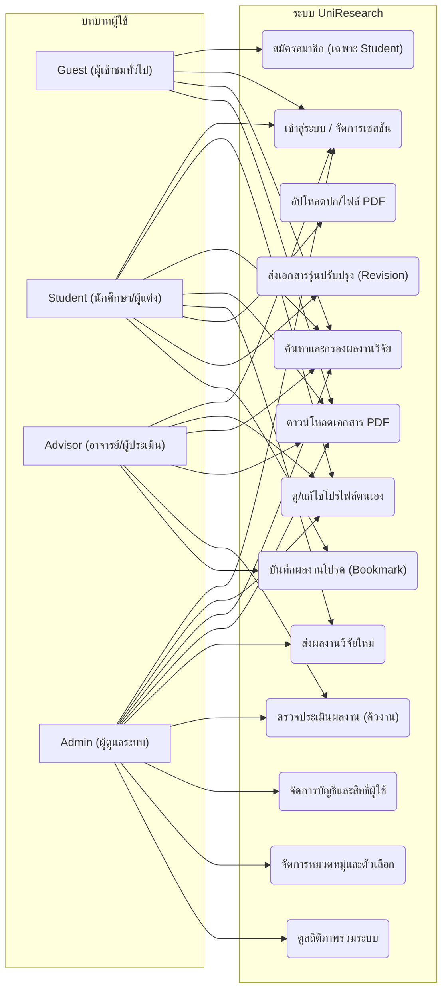
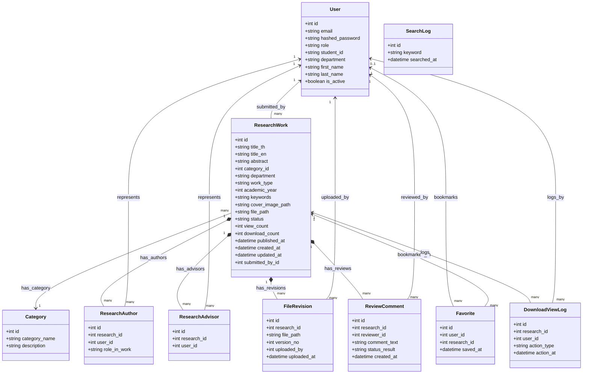
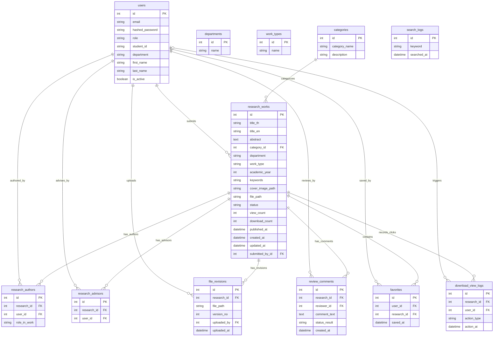
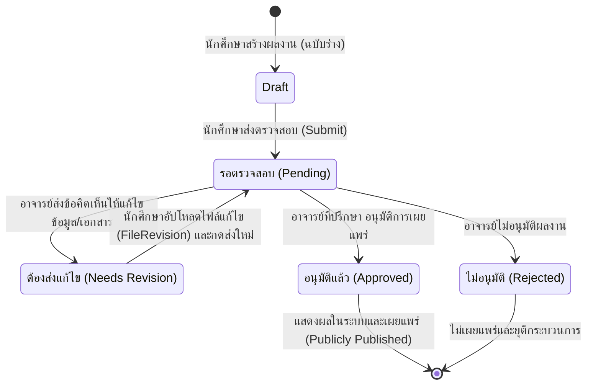
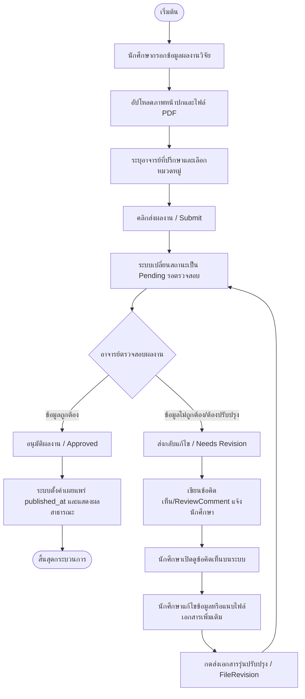
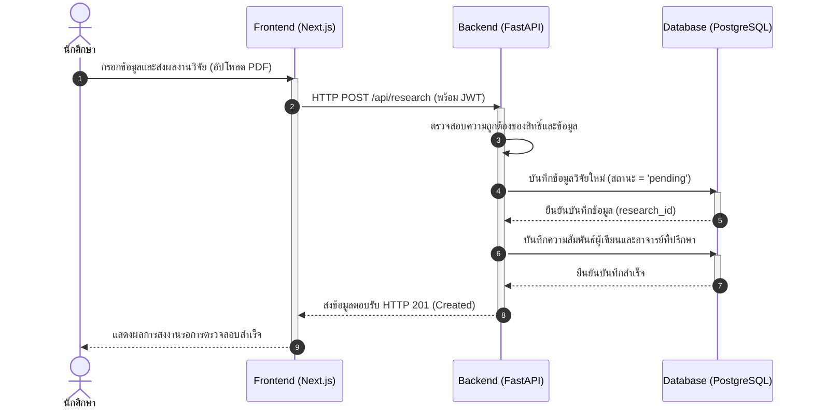
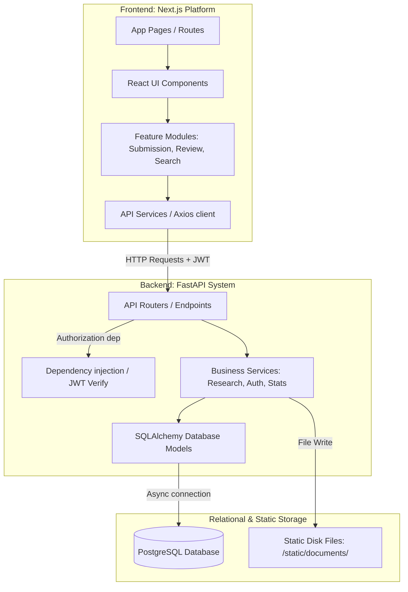

# 📊 แผนภาพ UML ฉบับเต็มสำหรับระบบ UniResearch (Full UML Diagrams)

เอกสารฉบับนี้รวบรวมแผนภาพ **UML (Unified Modeling Language)** และแบบจำลองกระบวนการทำงานของระบบ **UniResearch** ครบถ้วนทุกมิติ พัฒนาขึ้นโดยใช้ไวยากรณ์ **Mermaid** ซึ่งสามารถแสดงผลเป็นไดอะแกรมโดยตรงบน GitHub/GitLab หรือนำไปเปิดใช้งานร่วมกับโปรแกรมที่รองรับ Mermaid ทั่วไปได้ทันที

---

---

## 1. Use Case Diagram (แผนภาพยูสเคส)

แสดงบทบาทของผู้ใช้ (Actors) ทั้ง 4 กลุ่มและความสัมพันธ์กับฟังก์ชันหลักของระบบ (Use Cases):

---

## 2. Class Diagram (แผนภาพคลาส)

แสดงคลาสของระบบฝั่งหลังบ้าน (Backend Models) โครงสร้างข้อมูล ชนิดข้อมูล และความสัมพันธ์ระหว่างกัน:

---

## 3. Entity-Relationship Diagram (ER Diagram)

แสดงความเชื่อมโยงเชิงโครงสร้างฐานข้อมูล คีย์หลัก (PK) คีย์นอก (FK) และความสัมพันธ์แบบ Cardinality (1:1, 1:N, N:M) พร้อมรายละเอียดแอตทริบิวต์และประเภทข้อมูล:

---

## 4. State Diagram (แผนภาพสถานะ)

แสดงวงจรชีวิตของผลงานวิจัย (Research Work Lifecycle) ตั้งแต่การส่งร่างแรกไปจนถึงการอนุมัติเผยแพร่:

---

## 5. Activity Diagram (แผนภาพกิจกรรม)

แสดงเวิร์กโฟลว์ของกระบวนการอัปโหลด ส่งผลงานวิจัย และการดำเนินงานของผู้ประเมินในการอนุมัติผลงาน:

---

## 6. Sequence Diagram (แผนภาพลำดับเหตุการณ์)

แสดงลำดับการส่งและตรวจสอบงานวิจัยระหว่าง นักศึกษา, ระบบหน้าบ้าน (Next.js), ระบบหลังบ้าน (FastAPI REST API), และฐานข้อมูล (PostgreSQL DB):

---

## 7. Component Diagram (แผนภาพคอมโพเนนต์)

แสดงสถาปัตยกรรมระดับซอฟต์แวร์ ส่วนประกอบของหน้าบ้าน (Next.js Component Modules) และหลังบ้าน (FastAPI Endpoints / Services / ORM):

