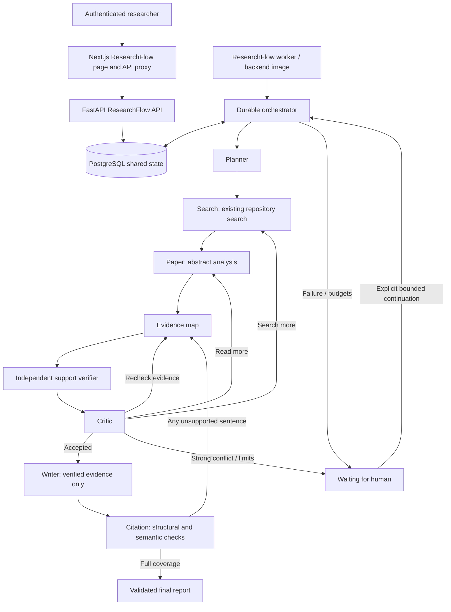
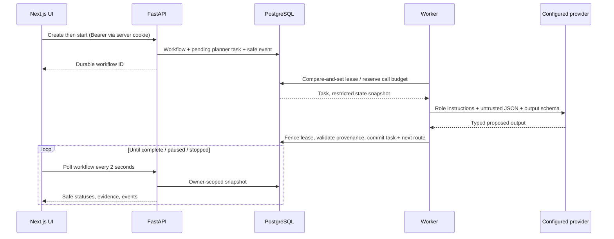

# ResearchFlow architecture

ResearchFlow is a durable orchestration module inside UniResearch. Logical LLM agents
share a provider interface; they are not separate chatbots or services. The
orchestrator owns state transitions, tools, budgets and validation. LLMs propose
structured results and never execute tools or SQL.

## Durable execution and deployment

API calls enqueue durable work. `python -m app.services.research_flow.worker`
runs one stage at a time, with no Redis dependency. Multiple worker processes can
use the same database. A compare-and-set lease permits only one worker to claim a
workflow; its token fences stale output and cancellation. Each provider call has a
timeout shorter than its lease. Interrupted RUNNING tasks consume another retry
when their lease expires. Failed provider calls retain conservative token reservations.

Successful task output, evidence mutations, events and scheduling commit in one
transaction. Invalid outputs roll back their state changes through a savepoint.
Stop and human commands lock the workflow; a stopped workflow rejects an in-flight
result. Each new task points to its completed predecessor. Independent workflows
can run concurrently through multiple worker replicas; stages within one workflow
are deliberately serialized to simplify consistency and bound cost.

For existing databases, run `cd backend && alembic upgrade head`. Fresh deployments
first run `python -m app.scripts.bootstrap_db`, which initializes the existing
legacy schema and pgvector extension. Compose does this before migrations and now
fails startup if migration fails. Worker startup may precede schema readiness; its
poll loop retries sanitized database failures. Worker readiness monitoring and a
Kubernetes worker Deployment are deployment follow-ups; a worker must be run in
non-Compose installations too.

No existing research tables/API contracts are changed. `search_research` has optional
`limit` and `log_search` arguments; default callers retain their behavior. ResearchFlow
uses approved works only, bounded SQL candidates and existing ranking. SQL echo was
disabled to avoid logging private state. The new Alembic root revision only manages
ResearchFlow tables; it is not a historical baseline of all UniResearch tables.

## Providers and configuration

`LLMProvider.generate` returns structured data, model and token usage. Gemini reuses
the existing configuration/SDK; MockProvider is injectable only in tests. Unsupported
provider names fail explicitly. `RESEARCH_FLOW_AGENT_MODELS` is a JSON map of role to
model name, defaulting to `AI_MODEL`. Adding another provider does not require changing
routing. An OpenAI implementation is not included in this revision.

See `backend/research-flow.env.example`. All new settings have the RESEARCH_FLOW_
prefix. QUICK/STANDARD/DEEP source caps default to 5/10/20; minimum supporting document
counts are 2/3/5. Global paper cap is 20. Duration is 900 seconds per explicitly
started/continued cycle, 3 research iterations, 3 search rounds, 2 retries per task,
40 cumulative LLM attempts, 100,000 cumulative tokens and 4,096 output tokens per call.
Calls reserve input character count and output ceiling before I/O; successful calls
replace estimates with reported usage. Unknown usage retains estimates. Budgets are
not monetary estimates. Contexts above 40,000 JSON characters pause rather than silently
truncating the agent context. Sources retain bounded abstract excerpts. Paper analysis runs in configurable batches
of three sources; each batch is an observable task. Large later synthesis contexts
can still pause for human review.

## Confidence heuristic

Let C = supported report sentence coverage, E = verified claim coverage,
A = fraction of verified evidence links that support rather than contradict,
Q = mean quality of cited sources, I = min(distinct cited document IDs / 5, 1),
R = 1 only when Critic status is ACCEPT.

`confidence = C × (0.30E + 0.20A + 0.20Q + 0.20I + 0.10R)`

Repository abstracts receive Q=0.5 because they are moderated/approved entries with
traceable text but unverified full text/publication metadata. This is a transparent
policy weight, not measured journal quality. Document count is an independence proxy;
shared datasets/authors may violate independence. No recency factor is used because
academic_year is not a reliable publication date. Human adequacy override receives
no critic acceptance credit. Score/components are shown only with a completed report
and labeled as a heuristic, never a probability of correctness.

## Current source boundary

Only approved UniResearch abstracts are searched. No papers, DOI or metadata are
invented. Missing fields remain null. The system makes no full-text reading claim.
Semantic support checks are fallible model judgments; exact quote/source membership
and complete citation coverage are deterministic checks, not proof of entailment.
Independent human evaluation is required before relying on research conclusions.
