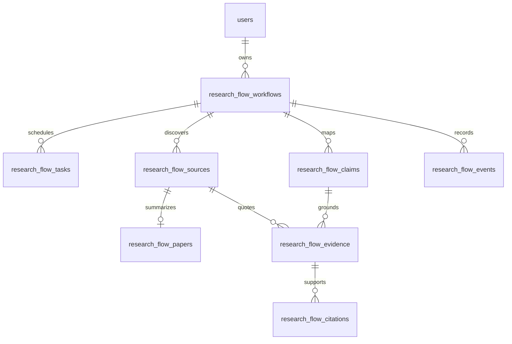

# Persisted shared state

Eight new normalized tables use UUID string IDs except monotonic integer event IDs.
The workflow references users.id; other workflow entities reference the workflow.
Task dependencies, source/paper relationships, and claim/evidence/citation links are
foreign keys. Source document IDs are snapshots rather than foreign keys so original
research deletion does not destroy provenance. Workflow/source document and
workflow/paper source pairs have uniqueness constraints.

| Entity | Persisted fields |
|---|---|
| Workflow | owner, question/depth/status, next role, plan/draft/critic payloads, metrics/limitations, iteration/search counters, calls/tokens, confidence, deadline/readiness/lease, timestamps |
| Task | role/status, dependency, safe input descriptor, validated output, retries/error category, model/tokens/duration, start/end |
| Source | document ID, title/authors, publication/year/DOI when known, URL/provider, retrievedAt, chunk/page, retrieval score, source quality, bounded excerpt |
| Paper | source ID and explicit quoted fields plus separate interpretation |
| Claim | claim text, evidence strength, verified flag |
| Evidence | claim/source IDs, relation, exact quote, locator, support-verification flag |
| Citation | sentence index → claim/source/evidence IDs |
| Event | sequence ID, event type, safe summary, task ID and time |

JSON is used for bounded role-specific structured payloads (plan, draft, summaries,
metrics, task outputs), not the entire research state. Core entities/relationships
are separately queryable. Claims/evidence are replaced transactionally on a fresh
evidence pass; prior successful agent outputs provide an audit trail. Citation rows
only represent validated sentences. Foreign keys to claims/sources plus ownership
checks and deterministic same-workflow identifier validation prevent cross-workflow
linking. Lease fields are internal and excluded from API responses.

Traceability: report sentence → sentence_index citation → claim → evidence quote →
source snapshot → original /research/{documentId} with abstract locator. Snapshots
preserve quoted text if the original record changes. Retrieved excerpts are the first
min(6000, max_context_chars/max_papers) characters of the abstract (default 2000).
Page/year/DOI/publication remain null because this repository has no verified full-text
or publication metadata pipeline. Existing academic_year is intentionally not treated
as publication year.

Migration: backend/alembic/versions/20261007_research_flow.py. Upgrade creates only
new tables/indexes; check-existing supports adoption after legacy create_all. Downgrade
removes these tables and their data, leaving legacy tables intact. Back up before a
production downgrade. Subsequent schema evolution should use new migrations; do not
edit this frozen revision. Existing-table adoption does not repair schema drift.
